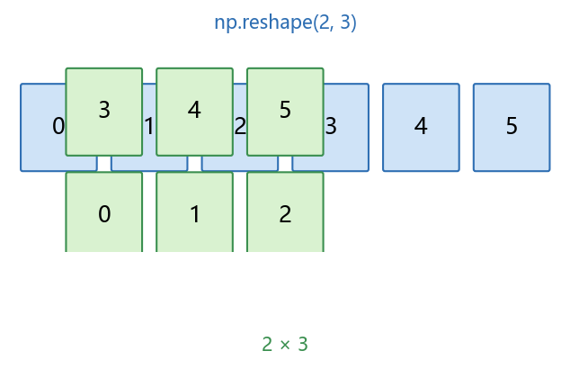
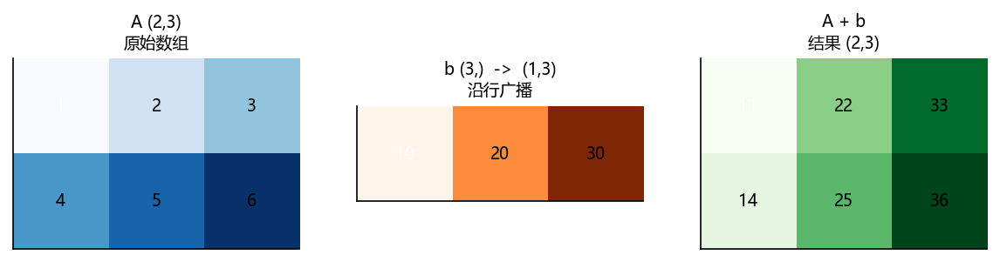

# 01 数组基础：创建、属性、索引、广播与随机数

> 本节目标：把 Python 列表升级为 NumPy 数组，并掌握创建、属性、索引切片、视图/拷贝、广播与随机数。
> 配套图：`images/reshape.png`、`images/broadcast.png`（由 `build/make_chap1_figures.py` 生成）。

## 本节目标

- 理解 `ndarray` 是什么，以及它与 Python 列表的区别；
- 会创建常见数组（`array`、`zeros`、`ones`、`full`、`arange`、`linspace`、`diag`、`eye`）；
- 掌握 `shape`、`ndim`、`dtype`、`size`、`itemsize` 等属性；
- 掌握索引、切片、花式索引、布尔掩码；
- 理解**视图（view）与拷贝（copy）**，知道 `reshape` `ravel` `flatten` `copy` 的区别；
- 掌握广播规则，能手工判断形状是否兼容；
- 使用新版随机数生成器 `Generator`（`default_rng`）生成可复现随机数。

## 先修

- Python 列表、元组、循环、函数；了解变量类型的含义。

---

## 1.1 为什么用 NumPy

Python 列表方便但“慢”，且不能直接做向量化运算。NumPy 的 `ndarray` 由 C 实现，元素类型统一，支持逐元素运算与广播，这正是科学计算需要的能力。

| 特性 | Python list | NumPy ndarray |
| ---- | ---- | ---- |
| 元素类型 | 可混合 | 必须统一（dtype） |
| 逐元素运算 | 需循环/列表推导 | 直接 `a + b` |
| 内存 | 对象指针数组 | 连续内存块 |
| 速度 | 慢 | 快（向量化） |

## 1.2 创建数组

### 1.2.1 从列表/元组创建

```python
import numpy as np
np.set_printoptions(precision=4, suppress=True)

x = np.array([1, 2, 3, 4, 5])        # 一维数组
y = np.array([[1, 2, 3], [4, 5, 6]]) # 二维数组（矩阵）
print(x, x.shape, x.dtype)
print(y, y.shape, y.ndim)
print(type(x))
```

```text
[1 2 3 4 5] (5,) int64
[[1 2 3]
 [4 5 6]] (2, 3) 2
<class 'numpy.ndarray'>
```

> **注意**：子数组长度必须一致；`np.array([[1,2],[3]])` 会报错或产生 object 数组。

### 1.2.2 指定数据类型

```python
x = np.array([1, 2, 3], dtype=np.int32)
print(x.dtype, x.itemsize)   # int32 4

x2 = x.astype(np.float64)
print(x2.dtype, x2.itemsize) # float64 8

lst = x.tolist()      # 或 list(x)
arr = np.array(lst)
```

**内存开销**：`astype` 默认返回新数组（拷贝）；如仅查看数值但不改，可避免不必要的转换。

### 1.2.3 快速创建

```python
np.zeros((2, 3))            # 全 0，形状 (2,3)
np.ones((2, 3))             # 全 1
np.full((2, 3), 42)         # 全 42
np.arange(0, 11, 2)         # [ 0  2  4  6  8 10]
np.linspace(0, 10, 5)       # [ 0.  2.5  5.  7.5 10. ]
np.diag([1, 2, 3])          # 对角线矩阵
np.eye(3)                   # 3x3 单位矩阵
np.eye(3, 4)                # 3x4，主对角线为 1
np.eye(3, k=1)              # 主对角线上方一条对角线为 1
```

```python
print(np.arange(5))          # [0 1 2 3 4]
print(np.linspace(0, 1, 3))  # [0.  0.5 1. ]
print(np.diag([1, 2, 3]))
```

```text
[0 1 2 3 4]
[0.  0.5 1. ]
[[1 0 0]
 [0 2 0]
 [0 0 3]]
```

> 提醒：`zeros`/`ones`/`full` 的形状参数是**元组**（两个括号）；`arange` 类似 `range`，终点是开区间。

### 1.2.4 数组属性

```python
a = np.arange(24).reshape(2, 3, 4)
print("shape:", a.shape)   # 各维长度
print("ndim :", a.ndim)    # 维数 3
print("size :", a.size)    # 元素总数 24
print("dtype:", a.dtype)   # 数据类型
print("itemsize:", a.itemsize)  # 单元素字节数
```

---

## 1.3 变形、转置与拼接

### 1.3.1 reshape

```python
arr = np.arange(6)
print(arr.reshape((2, 3)))   # 或 arr.reshape(2, 3)
print(arr.reshape((3, -1)))  # -1 自动推断：3×2
print(arr.reshape(-1))       # 展平为一维
```



- 总元素数必须相等；
- `reshape` 在内存连续时通常返回**视图**（共享内存）；需要独立副本时用 `arr.reshape(...).copy()`。

### 1.3.2 展平：ravel vs flatten

```python
a = np.array([[1, 2, 3], [4, 5, 6]])
a.ravel()    # 视图（尽可能不拷贝）
a.flatten()  # 总是拷贝
a.reshape(-1)  # 展平
```

### 1.3.3 转置

```python
a = np.arange(6).reshape(2, 3)
a.T          # 转置 (3,2)
np.transpose(a)            # 等价
np.transpose(a, axes=(1, 0))  # 高维时可指定轴的顺序
```

### 1.3.4 拼接与堆叠

```python
a = np.array([[1, 2], [3, 4]])
b = np.array([[5, 6]])
np.concatenate((a, b), axis=0)      # 沿 0 轴拼接: (3,2)
np.concatenate((a, a), axis=1)      # 沿 1 轴拼接: (2,4)
np.vstack((a, b))                   # 垂直堆叠
np.hstack((a, a))                   # 水平堆叠
np.stack(([1, 2], [3, 4]), axis=0)  # 新增维度堆叠 (2,2)
np.column_stack(([1, 2], [3, 4]))   # 一维数组按列堆叠 (2,2)
```

### 1.3.5 增删元素

```python
a = np.array([1, 2, 3])
np.append(a, 4)              # 返回新数组 [1 2 3 4]
np.delete(a, 1)              # 返回新数组 [1 3]
a[[0, 2]]                    # 花式索引取第 0、2 个
a[a != 3]                    # 布尔掩码过滤
```

> 频繁 `append`/`delete` 会反复拷贝，性能差；大数据请先想好形状或用列表收集。

---

## 1.4 索引与切片

### 1.4.1 基本索引与切片（视图）

```python
a = np.arange(10)
a[0]        # 标量
a[2:5]      # 视图，切片
a[::-1]     # 反转
```

二维数组：

```python
m = np.arange(12).reshape(3, 4)
m[0, 1]      # 第 0 行第 1 列
m[:, 1]      # 第 1 列（视图）
m[1:3, 1:3]  # 子矩阵（视图）
```

### 1.4.2 花式索引（fancy indexing，拷贝）

```python
m = np.arange(12).reshape(3, 4)
print(m[[0, 2], [1, 3]])     # 取 (0,1) 和 (2,3) → [1 11]
print(m[np.ix_([0, 2], [1, 3])])  # 行×列交叉 → 2×2
```

```text
[ 1 11]
[[ 1  3]
 [ 9 11]]
```

### 1.4.3 布尔掩码

```python
x = np.array([1, -2, 3, -4, 5])
mask = x > 0
print(mask)        # [ True False  True False  True]
print(x[mask])     # [1 3 5]
print(np.where(x > 0, x, 0))   # 正数保留，否则 0
```

> 布尔索引返回**拷贝**；条件组合用 `&`、`|`、`~` 且必须加括号，例如 `x[(x > 0) & (x < 4)]`。

---

## 1.5 视图与拷贝（重点）

```python
a = np.arange(6)
b = a.reshape(2, 3)      # 通常为视图
b[0, 0] = 99
print(a[0])              # 99 —— 共享内存！

c = a.copy()             # 独立拷贝
c[0] = -1
print(a[0])              # 仍为 99

print(a.base is None)            # 原始数组 base 为 None
print(b.base is a)               # True → b 是 a 的视图
```

经验法则：

| 操作 | 是否共享内存 |
| ---- | ---- |
| 基本切片 | 视图 |
| `reshape`（连续内存） | 视图（否则拷贝） |
| `ravel` | 视图（尽可能） |
| `flatten` | 拷贝 |
| 花式索引 / 布尔索引 | 拷贝 |
| `copy()` | 拷贝 |

---

## 1.6 广播机制（broadcasting）

**规则**：从最后一个维度往前比较 ——（1）两维相等；（2）或其中一维为 1（可“拉伸”）；（3）或该维不存在（自动补 1）。都不满足则报错。

```python
A = np.array([[1, 2, 3], [4, 5, 6]])   # (2,3)
b = np.array([10, 20, 30])             # (3,) → 看作 (1,3)
print(A + b)
```

```text
[[11 22 33]
 [14 25 36]]
```



- `(2,3) + (3,)` √，结果为 `(2,3)`；
- `(3,) + (4,)` ×（末尾不等且无 1）；
- `(4,1) + (1,3)` √，结果 `(4,3)`；
- `(4,1,6) + (3,6)` √，结果 `(4,3,6)`（把 `(3,6)` 补成 `(1,3,6)`）。

**调试技巧**：报错时打印两个数组的 `shape`，用 `np.newaxis`（即 `None`）手动补维。

---

## 1.7 随机数生成与抽样

### 1.7.1 新版推荐：Generator

```python
rng = np.random.default_rng(42)      # 固定种子，结果可复现
rng.random((2, 3))                   # [0,1) 均匀
rng.integers(1, 10, size=5)          # 整数 [1,10)
rng.uniform(-1, 1, size=4)           # 均匀分布
rng.normal(2, 0.5, size=6)           # 正态 N(2, 0.5^2)
```

### 1.7.2 旧接口（仍可用，但不建议用于新代码）

```python
np.random.seed(42)
np.random.rand(2, 3)     # [0,1)
np.random.randint(1, 10) # 整数
np.random.randn(5)       # 标准正态
np.random.normal(2, 0.5, 5)
```

**选型**：新代码优先 `default_rng`（更快、线程安全、接口清晰）。

---

## 案例卡 1：学生成绩表——创建、切片、花式索引与视图陷阱

### 目标

把一张“学生 × 科目”成绩表放入 `ndarray`，用切片、花式索引、布尔筛选快速完成任务，并观察视图与拷贝的区别。

### 代码

```python
import numpy as np
np.set_printoptions(precision=4, suppress=True)

# 4 名学生，3 门课（语文 / 数学 / 英语）
scores = np.array([
    [85, 92, 78],
    [67, 73, 60],
    [95, 88, 90],
    [72, 80, 83],
])

print("形状:", scores.shape)              # (4, 3)
print("第 2 名学生:", scores[1])          # 行索引 1
print("第 1、3 名学生:", scores[[0, 2]])  # 花式索引：拷贝
print("数学成绩:", scores[:, 1])          # 列切片
print("数学 < 75 的学生:", scores[scores[:, 1] < 75])

# 基础切片返回视图：改视图会改原表
view = scores[0:2, :]
view[0, 0] = 99
print("基础切片改动原表（第 0 行第 0 列）:", scores[0, 0])

# copy() 才是独立副本
copy_ = scores.copy()
copy_[0, 0] = 50
print("copy 后原表不变:", scores[0, 0])

# 花式索引返回拷贝：改“取出的行”不影响原表
row = scores[[0]]
row[0, 0] = 1
print("花式索引是拷贝，改行不影响原表:", scores[0, 0])
```

### 运行结果（已运行核验）

```text
形状: (4, 3)
第 2 名学生: [67 73 60]
第 1、3 名学生: [[85 92 78]
 [95 88 90]]
数学成绩: [92 73 88 80]
数学 < 75 的学生: [[67 73 60]]
基础切片改动原表（第 0 行第 0 列）: 99
copy 后原表不变: 99
花式索引是拷贝，改行不影响原表: 99
```

### 讲解

1. `scores.shape` 是 `(4, 3)`，第一维是“行/学生”，第二维是“列/科目”。
2. `scores[1]` 取第 2 名学生（索引从 0 开始），`scores[:, 1]` 取“数学”整列。
3. `scores[[0, 2]]` 用整数列表做**花式索引**：返回**拷贝**，所以之后改取出的行不会影响原表。
4. `scores[scores[:, 1] < 75]` 是**布尔掩码**：先算每行“数学 < 75”的真假，再留下对应行。
5. **最易踩坑**：`scores[0:2, :]` 是**基础切片**，返回视图；`view[0, 0] = 99` 会直接把原表改成 99。要独立副本显式 `.copy()`。

### 主要用法 / API

| 需求 | 写法 |
| ---- | ---- |
| 取第 i 行 | `arr[i]` |
| 取第 j 列 | `arr[:, j]` |
| 取指定行/列组合 | 花式索引 `arr[[i1, i2], [j1, j2]]`；交叉组合用 `np.ix_` |
| 条件筛选 | `arr[mask]`；多条件 `arr[(cond1) & (cond2)]` |
| 独立副本 | `arr.copy()`（或 `arr[  ].copy()`） |
| 判断是否共享内存 | `arr.base is not None` 或 `np.may_share_memory(a, b)` |

### 常见错误

- 用 `and`/`or` 连接数组条件 → 必须 `&`/`|` 且加括号；
- 以为切片是拷贝，导致“改了一下原数据全变了”；
- 把 `len(arr)` 当维数：二维数组 `len` 只给第一维长度，用 `arr.ndim`/`arr.shape`。

### 拓展

- 给成绩低于 60 的所有课程置 0（答案：`scores[scores < 60] = 0`）；
- 用 `np.argsort` 给三位学生按“数学”排名。

---

## 案例卡 2：对每列做 z-score 标准化——广播

### 目标

对成绩矩阵做“每列独立标准化”：`z = (x - 列均值) / 列标准差`，体会广播：均值/标准差是长度为 3 的向量，自动与 `(3,3)` 矩阵对齐。

### 代码

```python
import numpy as np
np.set_printoptions(precision=4, suppress=True)

data = np.array([
    [90.0, 80.0, 70.0],
    [70.0, 60.0, 50.0],
    [50.0, 40.0, 30.0],
])

mean = data.mean(axis=0)   # 每列均值：axis=0 表示“沿第 0 轴折叠”
std = data.std(axis=0)     # 每列标准差
z = (data - mean) / std    # 广播：(3,3) - (3,) → (3,3)

print("均值:", mean)
print("标准差:", std)
print("标准化后:")
print(z)
```

### 运行结果（已运行核验）

```text
均值: [70. 60. 50.]
标准差: [16.3299 16.3299 16.3299]
标准化后:
[[ 1.2247  1.2247  1.2247]
 [ 0.      0.      0.    ]
 [-1.2247 -1.2247 -1.2247]]
```

### 讲解

- `data.mean(axis=0)` 返回 3 个数（每列一个）；`axis=0` 记住口诀：**“消除第 0 维，保留第 1 维”**，所以结果是每列的结果。
- `(data - mean)` 中 `mean` 形状为 `(3,)`，广播时被当作 `(1,3)`，自动拉伸到 `(3,3)`。
- z-score 后每列均值 ≈ 0、标准差 ≈ 1，后续做 PCA、聚类、回归前常做这一步。

### 主要用法 / API

- `np.mean(a, axis=k)`、`np.std(a, axis=k)`；
- `(a - mean) / std` 就是向量化标准化；
- 若想返回“整矩阵展平后的均值”，不要传 `axis`。

### 常见错误

- `axis=0` 和 `axis=1` 记反 → 用“消除哪一维”记忆；
- 使用 `data.std()`（不带 axis）得到单一标准差，不是每列标准差；
- 忘记 `np.set_printoptions` 导致输出小数位过多，书本/作业里建议在开头设置一次。

### 拓展

- 对“每个学生独立标准化”（每行）应如何改？（提示：`axis=1`）
- 把标准差为 0 的列单独处理，避免除以 0。

---

## 案例卡 3：蒙特卡洛估算圆周率——向量化随机数

### 目标

在单位正方形内随机撒点，落在单位圆内的比例 ≈ $\pi/4$。用 `default_rng` + 向量化布尔掩码，百万个点也可以瞬间算完。

### 代码

```python
import numpy as np

rng = np.random.default_rng(42)   # 固定种子，结果可复现
n = 1_000_000
pts = rng.random((n, 2))          # n 个 (x, y)，x,y in [0,1)

inside = (pts[:, 0] ** 2 + pts[:, 1] ** 2) <= 1   # 点到原点距离 ≤ 1
pi_est = 4 * inside.mean()        # 面积比：圆面积 / 正方形面积 = pi/4

print("inside 比例:", inside.mean())
print("pi 估计:", pi_est)
print("pi 真值:", np.pi)
```

### 运行结果（已运行核验）

```text
inside 比例: 0.785745
pi 估计: 3.14298
pi 真值: 3.141592653589793
```

### 讲解

- `rng.random((n, 2))` 生成 `n` 行 2 列；`[:, 0]` 是 x 坐标、`[:, 1]` 是 y 坐标。
- `inside` 是布尔数组：每个点“在圆内”为 True，`inside.mean()` 即比例。
- 随机数要**固定种子**才能复现同一结果，课堂演示、作业批改都建议这么做。

### 主要用法 / API

- `np.random.default_rng(seed)` → 固定种子；
- `rng.random((n, 2))` → 均匀分布 `[0, 1)`；
- `rng.integers` / `rng.normal` / `rng.uniform` / `rng.choice` 等。

### 常见错误

- 用旧接口 `np.random.seed` + `np.random.rand`（新版不推荐，但仍可用）；
- 不设种子 → 每次结果不同，作业无法复现；
- 把“圆内”写成 `< 1` 而不是 `<= 1`（对连续点无影响，但边界点语义不同）。

### 拓展

- 撒 100 万点是否一定比 1 万点更接近 pi？试试不同 `n`；
- 用 3D 蒙特卡洛估算球体积，验证“高维时样本需求激增”。

---

## 常见误区

1. **`*` 不等于矩阵乘法**：`A * B` 是逐元素乘法；矩阵乘法用 `A @ B` 或 `np.matmul`。
2. **忘记 `zeros/ones/full` 要传元组**：`np.zeros(2, 3)` 会报错，应为 `np.zeros((2, 3))`。
3. **以为 `reshape` 一定返回拷贝**：连续内存下是视图；改视图会影响原数组。
4. **误用 `len(a)`**：一维数组返回长度，二维返回行数；看形状用 `a.shape`。
5. **广播不通用**：`(3,) + (4,)` 不会自动“截断对齐”。
6. **随机数不设种子**：不设种子结果每次不同，课堂演示/作业请用 `default_rng(seed)`。

## 思考题

1. `np.arange(10)[::2]` 与 `np.arange(10).reshape(5,2)[:,0]` 是否共享内存？用 `.base` 验证。
2. 解释 `np.ix_` 与同时传入两个顺序索引的区别。
3. 举一个形状满足广播规则却“符合直觉但结果错误”的例子（提示：`(3,1)` 与 `(3,)`）。

## 动手练习（详见 lab）

- 创建 3×4 矩阵，用布尔掩码把负数置 0；
- 用 `np.arange` 生成 0–100 的偶数，转成 10×5 矩阵；
- 复现“对每列做不同缩放”的广播例子；
- 用 `default_rng(0)` 生成 100 个标准正态数并统计均值/方差。

## 延伸阅读

- NumPy 官方绝对入门：[链接](https://numpy.org/doc/stable/user/absolute_beginners.html)
- NumPy 官方广播机制：[链接](https://numpy.org/doc/stable/user/basics.broadcasting.html)
- SciPy Lecture Notes – NumPy：[链接](https://scipy-lectures.org/intro/numpy/index.html)
