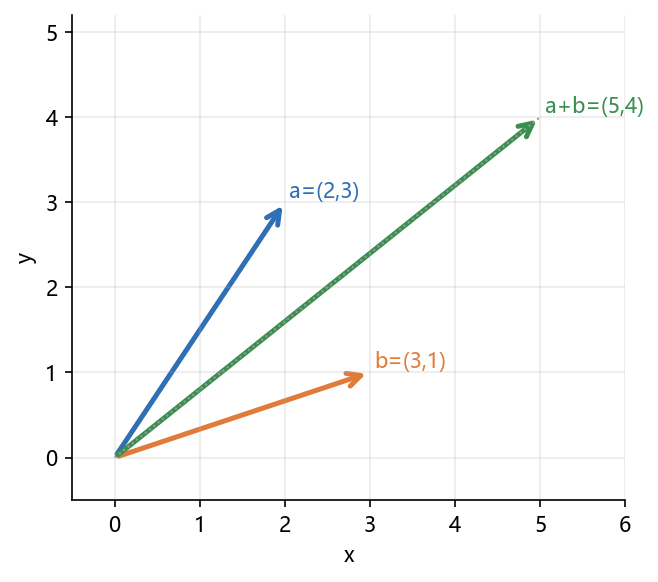

# 02 数组运算：向量、矩阵、逻辑筛选与统计

> 本节对应原版 1.2 的内容，并增补学习目标、常见误区、思考题与延伸阅读。
> 配套图：`images/vector_ops.png`。

## 本节目标

- 区分**逐元素运算**与**线性代数运算**（`*` vs `@` / `dot`）；
- 会用布尔掩码与 `np.where` 做筛选与替换；
- 掌握 `sum/mean/std/min/max` 沿 `axis` 方向统计；
- 会用 `sort/argsort` 排序与排名；
- 会用 `savetxt/loadtxt`、`save/load`、`savez_compressed` 保存与读取数组。

## 先修

- 01 数组基础（创建、索引、广播）。

---

## 2.1 向量的运算

### 2.1.1 逐元素操作

```python
import numpy as np

v = np.array([2, 3])
w = np.array([3, 1])
print(v + w)     # [5 4]
print(v - w)     # [-1  2]
print(2 * v)     # [4 6]
print(v * w)     # 逐元素乘 [6 3]
print(v / w)     # 逐元素除 [0.66666667 3.        ]
print(v ** 2)    # 逐元素平方 [4 9]
```



### 2.1.2 数量积（点积）与叉积

```python
a = np.array([1, 2])
b = np.array([3, 4])
print(np.dot(a, b))      # 1*3 + 2*4 = 11
print(a @ b)             # 向量点积同样可用 @

c = np.array([1, 2, 3])
d = np.array([4, 5, 6])
print(np.cross(c, d))    # [-3  6 -3]
```

### 2.1.3 向量的范数

```python
x = np.array([3, 4])
np.linalg.norm(x)        # 5.0（默认 2-范数）
np.linalg.norm(x, ord=1) # 7.0（1-范数）
```

### 2.1.4 排序

```python
a = np.array([3, 1, 2])
np.sort(a)          # 返回新数组 [1 2 3]
a.sort()            # 原地排序
np.argsort(a)       # 排序后原索引
```

---

## 2.2 向量/矩阵的逻辑运算——筛选

```python
x = np.array([1, -2, 3, -4, 5])

# 布尔掩码
print(x[x > 0])          # [1 3 5]
print(x[(x > 1) & (x < 5)])  # [3]

# np.where：条件成立取第一项，否则取第二项
print(np.where(x > 0, x, 0))   # [1 0 3 0 5]
```

二维按行筛选：

```python
m = np.array([[1, 9], [6, 2], [7, 8]])
print(m[(m[:, 0] > 3) & (m[:, 1] < 9)])   # [[6 2] [7 8]]
```

> 组合条件必须加括号，且不能用 `and` / `or`，要用 `&` / `|` / `~`。

---

## 2.3 矩阵的运算

### 2.3.1 算术运算

```python
A = np.array([[1, 2], [3, 4]])
B = np.array([[5, 6], [7, 8]])

print(A + B)      # 矩阵加法 [[ 6  8][10 12]]
print(A - B)      # 矩阵减法
print(A * B)      # 注意：逐元素乘 [[ 5 12][21 32]]
print(A @ B)      # √ 矩阵乘 [[19 22][43 50]]
print(np.matmul(A, B))   # 同 @
```

**为什么 `*` 不是矩阵乘**：NumPy 中 `*` 是 `ufunc` 的逐元素运算；要数学上的矩阵乘法，用 `@`（或 `np.dot` / `np.matmul`，二者在 2D 下等价，但 `@` 语义更明确）。

### 2.3.2 矩阵上的统计

```python
S = np.array([[85, 90, 80],
              [78, 85, 90],
              [90, 95, 85]])

S.sum(axis=0)      # 每列和 [253 270 255]（三门课总分）
S.sum(axis=1)      # 每行和 [255 253 270]（每个学生总分）
S.mean(axis=0)     # 每列均值 [84.33 90. 85. ]
S.max(axis=1)      # 每行最大值
S.std()            # 全体标准差
```

记忆：`axis=0` 表示“沿第 0 轴（行方向）折叠”，即求**每列**的统计量；`axis=1` 求**每行**。

### 2.3.3 查找（where / argmax）

```python
m = np.array([[3, 7], [9, 2]])
np.where(m > 5)          # (array([0,1]), array([1,0])) 坐标
np.argmax(m)             # 展平后的最大索引 2 → (1,0)
np.argmax(m, axis=1)     # 每行最大索引 [1 0]
```

---

## 2.4 结果的保存与读取

```python
a = np.array([[1, 2], [3, 4]])

# 文本
np.savetxt("result.txt", a, fmt="%.2f", delimiter=",")
b = np.loadtxt("result.txt", delimiter=",")

# 二进制（推荐：更快、保留 dtype）
np.save("a.npy", a)
c = np.load("a.npy")

# 多数组压缩保存
np.savez_compressed("data.npz", x=a, y=b)
d = np.load("data.npz")
d["x"], d["y"]
```

---

## 常见误区

1. **`*` 与 `@` 混用**：`A * B` 是逐元素乘；数学矩阵乘必须 `@`。
2. **axis 方向记反**：`sum(axis=0)` 是“消除第 0 维”，得到每列结果。
3. **条件用 `and`/`or`**：数组布尔运算必须 `&`/`|`，且每个条件加括号。
4. **反复 `np.append`**：每次产生新数组，大数组循环中极慢；先估算容量或用列表。
5. **`np.dot` 语义在多维下容易混淆**：明确用 `@` 更直观。

## 思考题

1. `np.dot`、`np.matmul`、`@` 在三维数组上行为是否一致？查文档说明。
2. 为什么 `np.where(cond, x, y)` 要求 `x`、`y` 可广播到 `cond` 的形状？
3. 用 `argsort` 给三位学生按总分排名。

## 动手练习（详见 lab）

- 生成 5×5 随机矩阵，把主对角线元素置 0；
- 对每列做 z-score 标准化（`(x - mean) / std`），并比较 `axis` 的选择；
- 用 `savetxt`/`loadtxt` 存取一份成绩表并检查数值一致。

## 延伸阅读

- NumPy 官方 ndarray 基础：https://numpy.org/doc/stable/user/quickstart.html
- NumPy 官方 I/O 说明：https://numpy.org/doc/stable/reference/routines.io.html
- SciPy Lecture Notes – 数组操作：https://scipy-lectures.org/intro/numpy/operations.html
