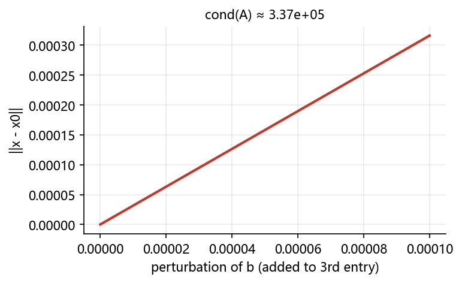

# 03 线性代数：逆、方程组、分解与 SVD

> 本节目标：用 `numpy.linalg` 做逆/伪逆、秩、行列式、范数、解方程组、最小二乘与常用矩阵分解。
> 配套图：`images/cond_sensitivity.png`、`images/svd_compression.png`。

## 本节目标

- 会求逆矩阵、伪逆、秩、行列式、范数；
- 会用 `np.linalg.solve` 解线性方程组，理解条件数（condition number）对数值稳定的影响；
- 会用 `np.linalg.lstsq` 做最小二乘；
- 掌握特征值分解、SVD、Cholesky、QR 分解的基本用法与适用场景；
- 能说出 SVD 的“压缩/降维”思想（见 05 综合案例）。

## 先修

- 01 数组基础、02 数组运算；线性代数的基本概念（矩阵、行列式、特征值）。

---

## 3.1 基本线性代数运算

### 3.1.1 逆矩阵与伪逆

```python
import numpy as np
np.set_printoptions(precision=4, suppress=True)

A = np.array([[3, 1], [1, 2]])
A_inv = np.linalg.inv(A)
print(A_inv)
print(A @ A_inv)      # ≈ 单位矩阵
```

非方阵或奇异矩阵用 `pinv`（伪逆），常用于最小二乘与超定方程组：

```python
B = np.array([[1, 2], [2, 4], [3, 6]])   # 秩亏
print(np.linalg.pinv(B).shape)           # (2,3)
```

### 3.1.2 秩

```python
np.linalg.matrix_rank(np.array([[1, 2], [2, 4]]))   # 1（第二行是第一行的 2 倍）
np.linalg.matrix_rank(np.array([[1, 2], [3, 4]]))   # 2
```

### 3.1.3 行列式

```python
A = np.array([[3, 1], [1, 2]])
print(np.linalg.det(A))    # 5.000000000000001（浮点近似）
```

行列式为 0 等价于矩阵奇异，此时方程组没有唯一解。

### 3.1.4 范数

```python
v = np.array([3, 4])
np.linalg.norm(v)              # 5.0，2-范数
np.linalg.norm(v, ord=1)       # 7.0

M = np.array([[3, 4], [0, 5]])
np.linalg.norm(M)              # Frobenius 范数 ≈ 7.0711
np.linalg.norm(M, ord=2)       # 谱范数（最大奇异值）
np.linalg.norm(M, ord=np.inf)  # 无穷范数（行和最大值）
```

---

## 3.2 线性方程组的求解

### 3.2.1 直接求解：`np.linalg.solve`

```python
A = np.array([[3, 1], [1, 2]])   # 系数矩阵
b = np.array([9, 8])             # 常数向量
x = np.linalg.solve(A, b)
print(x)          # [2. 3.]
print(A @ x)      # ≈ [9. 8.]
```

**适用条件**：`A` 是方阵且非奇异（存在唯一解）。结构更一般的线性方程组用 `lstsq`。

### 3.2.2 最小二乘：`np.linalg.lstsq`

超定（方程多于未知数）或欠定（方程少于未知数）时，求“误差平方和最小”的解：

```python
X = np.array([[1, 1], [1, 2], [1, 3], [1, 4]])
y = np.array([6, 5, 7, 10])
coef, residuals, rank, sv = np.linalg.lstsq(X, y, rcond=None)
print(coef)      # [3.5 1.4] → y ≈ 3.5 + 1.4 x
```

### 3.2.3 条件数与数值稳定性

条件数 `cond(A)` 刻画方程组对扰动的敏感程度：条件数越大，解越“脆弱”。

```python
A = np.array([[1, 2, 3],
              [2, 4.0001, 6],
              [1, 0.9999, 2]])
b = np.array([1, 2, 3])
print(np.linalg.cond(A))   # 这个矩阵近似奇异，cond 很大
x0 = np.linalg.solve(A, b)
```



**结论**：即使 `b` 的扰动非常小（`1e-4` 量级），解的变化也可能很大；工程中应尽量避免病态方程组，或换用更稳定的分解方法。

---

## 3.3 矩阵分解

### 3.3.1 特征值分解（`eig`）

只适用于**方阵**（且通常要求可对角化）：

```python
A = np.array([[2, 1], [1, 2]])
w, v = np.linalg.eig(A)
print(w)          # [3. 1.] 特征值
print(v)          # 列向量为对应特征向量
print(A @ v[:, 0] == w[0] * v[:, 0])   # 验证 Av = λv（近似相等）
```

### 3.3.2 奇异值分解（SVD）

对**任意矩阵**（包括非方阵）适用：

```python
M = np.array([[1, 2], [3, 4], [5, 6]], dtype=float)
U, S, Vt = np.linalg.svd(M, full_matrices=False)
print(U.shape, S.shape, Vt.shape)   # (3,2) (2,) (2,2)
print(S)                            # 奇异值（降序）
print(U @ np.diag(S) @ Vt)          # 重构 ≈ M
```

**为什么重要**：奇异值从大到小排列，只保留前 `k` 个奇异值即可得到“最优低秩近似”，这是数据压缩、降维（PCA）、图像压缩的基础。见 [05 综合案例](./05-综合案例.md)。


### 3.3.3 Cholesky 分解

要求矩阵**对称正定**：

```python
A = np.array([[4., 2.], [2., 3.]])
L = np.linalg.cholesky(A)
print(L)          # [[2. 0. ][1. 1.4142]]
print(L @ L.T)    # ≈ A
```

### 3.3.4 QR 分解

```python
A = np.array([[12., -51.], [6., 167.], [-4., 24.]])
Q, R = np.linalg.qr(A)
print(Q.shape, R.shape)   # (3,2) (2,2)
print(np.allclose(Q @ R, A))   # True
```

QR 在最小二乘、特征值算法稳定实现中广泛使用。

---

## 案例卡 1：解线性方程组——投入产出/电路问题

### 目标

求解下面的二元一次方程组（可看成“两个部门投入产出平衡”或“两环路电流方程”）：

$$
\begin{cases} 2x + y = 5 \\ x + 3y = 10 \end{cases}
$$

用 `np.linalg.solve` 一次性求出 $(x, y)$，并验证 `Ax = b`。

### 代码

```python
import numpy as np
np.set_printoptions(precision=4, suppress=True)

A = np.array([[2.0, 1.0],
              [1.0, 3.0]])
b = np.array([5.0, 10.0])

x = np.linalg.solve(A, b)
print("解:", x)            # x=[1, 3]
print("验证 Ax:", A @ x)
print("det:", np.linalg.det(A))   # 近似 5
```

### 运行结果（已运行核验）

```text
解: [1. 3.]
验证 Ax: [ 5. 10.]
det: 5.000000000000001
```

### 讲解

- 把方程组写成矩阵形式 $Ax = b$：$A$ 是系数矩阵，$b$ 是常数向量，解 $x = A^{-1}b$。
- `np.linalg.solve` 内部用 LU 分解，比直接 `inv(A) @ b` 更稳定、更快。
- `det(A)=5\neq0`，说明有唯一解；若 det 接近 0，说明系数矩阵病态（见 3.2.3）。

### 主要用法 / API

- `np.linalg.solve(A, b)`：方阵且非奇异时解唯一；
- `np.linalg.inv(A)`：求逆（一般不要直接用 `inv@b` 解方程）；
- `np.linalg.det(A)`：行列式；
- `np.linalg.matrix_rank(A)`：秩。

### 常见错误

- 方程个数与未知数个数不相等 → 用 `lstsq` 而不是 `solve`；
- `b` 写成行向量 `[[5,10]]` 而不是列向量 `[5,10]`（1D 会自动处理，但 2D 会报错）；
- 忽略条件数，认为 `solve` 返回成功就一定可靠。

### 拓展

- 若把第 2 个方程改成与第 1 个线性相关，观察 `solve` 报错与 `det=0`；
- 把该问题推广到 3 个未知数，并解释“三个平面交于一点”。

---

## 案例卡 2：最小二乘拟合——身高预测体重

### 目标

用一组（身高，体重）数据拟合线性关系 $y = a x + b$（$x$ 身高，$y$ 体重），用 `np.linalg.lstsq` 求出 $(a, b)$，并与 `np.polyfit` 对照。

### 代码

```python
import numpy as np
np.set_printoptions(precision=4, suppress=True)

rng = np.random.default_rng(7)
height = np.linspace(150, 190, 20)            # 20 个身高样本
weight_true = 0.8 * height - 70               # 真实线性关系
weight = weight_true + rng.normal(0, 3, height.size)  # 加测量噪声

# 设计矩阵：第 1 列全是 1（截距项），第 2 列是身高
X = np.column_stack([np.ones(height.size), height])
coef, res, rank_, sv = np.linalg.lstsq(X, weight, rcond=None)

print("coef (截距, 斜率):", f"{coef[0]:.4f}, {coef[1]:.4f}")
print("残差平方和:", f"{float(res[0]):.4f}")
print("rank:", rank_)
print("来自 np.polyfit 的对照:", np.round(np.polyfit(height, weight, 1), 4))
```

### 运行结果（已运行核验）

```text
coef (截距, 斜率): -60.2551, 0.7371
残差平方和: 92.6892
rank: 2
来自 np.polyfit 的对照: [  0.7371 -60.2551]
```

### 讲解

- 预测模型：$y \approx 0.7371 x - 60.2551$，即身高每高 1 cm，体重平均约增加 0.737 kg。
- `lstsq` 返回 4 个值：系数、残差平方和、矩阵秩、奇异值；`rcond=None` 使用默认截断阈值。
- `np.polyfit(height, weight, 1)` 与 `lstsq` 结果一致（系数顺序不同：`polyfit` 是降幂，所以先斜率后截距）。

### 主要用法 / API

- `np.linalg.lstsq(X, y, rcond=None)`；
- `np.polyfit(x, y, deg)` 是一元多项式最小二乘（本质也是 `lstsq`）；
- 残差越小、且系数在“生物学/物理上说得通”，拟合才可信。

### 常见错误

- 忘记在 `X` 中加“全 1 列” → 截距项被强制为 0；
- 用 1D 线性回归却把 `X` 写成 `(n,)` 而非 `(n,1)`；
- 只看训练集残差，不看测试集（见 04 章过拟合）。

### 拓展

- 加入“年龄”作为第二特征，做多元回归（`X` 加一列）；
- 用 `np.linalg.svd` 手写求解 `lstsq`，理解最小二乘与伪逆的关系。

---

## 常见误区

1. **对非方阵用 `inv`**：应使用 `pinv` 或 `lstsq`。
2. **认为 `eig` 对任意矩阵都可用**：特征值分解只对方阵；非方阵用 SVD。
3. **忽略条件数**：`solve` 计算成功 ≠ 解可靠，先看 `cond`。
4. **SVD 返回的 `S` 不是对角矩阵**：需要 `np.diag(S)` 构造。
5. **`full_matrices=False` 与非默认的区别**：不关心零奇异值/补全正交基时，用 `full_matrices=False` 更省内存。
6. **直接 `np.linalg.inv(A) @ b`**：数值上不如 `np.linalg.solve(A, b)` 稳定，且多一次矩阵求逆。

## 思考题

1. 为什么 `cond(A)` 很大时，`np.linalg.solve(A, b)` 的结果可能仍“看起来正常”？
2. SVD 的 `U`、`Vt` 与 `eig` 的特征向量有什么联系（提示：`A^T A`）？
3. 若只保留前 1 个奇异值做近似，误差如何估计？

## 动手练习（详见 lab）

- 解一个 $4\times4$ 线性方程组 3 组（含病态）并比较解；
- 对 10×5 矩阵做 SVD，比较 rank 1/3/5 重构误差；
- 用 Cholesky 验证正定矩阵的分解唯一性。

## 延伸阅读

- NumPy 官方 linalg 参考：[链接](https://numpy.org/doc/stable/reference/routines.linalg.html)
- NumPy 官方广播与 linalg 教程：[链接](https://numpy.org/doc/stable/reference/routines.linalg.html#module-numpy.linalg)
- SciPy Lecture Notes – 线性代数：[链接](https://scipy-lectures.org/intro/scipy.html#linear-algebra)
