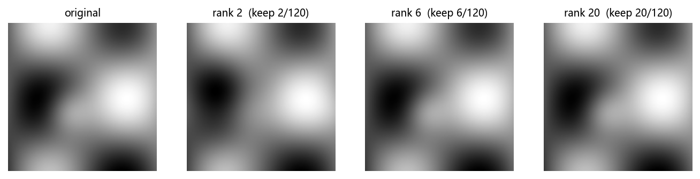
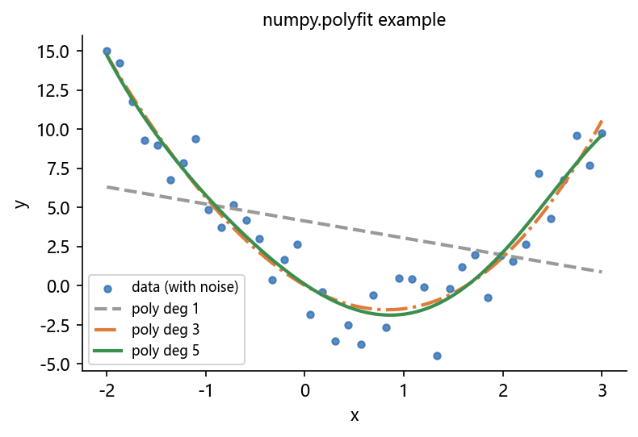

# 05 综合案例：SVD 图像压缩与实验数据拟合

> 本章新增综合案例，用于把 01–04 的知识串起来：**形状/广播 + 线性代数 + 拟合 + 可视化**。
> 所有代码均可在 NumPy ≥ 1.24 环境直接运行；配图由 `build/make_chap1_figures.py` 生成。

## 案例 1：用 SVD 压缩一张“图像”

### 背景

一张 $m \times n$ 的灰度图可看作矩阵。SVD 给出

$$
A = U \Sigma V^T,\qquad U\in\mathbb{R}^{m\times r},\ \Sigma\in\mathbb{R}^{r\times r},\ V\in\mathbb{R}^{n\times r}
$$

只保留前 $k$ 个奇异值，得到低秩近似

$$
A_k = U_{:,1:k}\ \Sigma_{1:k,1:k}\ V_{1:k,:}^T
$$

存储量从 $m n$ 减少到 $k(m+n+1)$，当 $k\ll \min(m,n)$ 时压缩明显。

### 代码：生成合成图像并做低秩近似

```python
import numpy as np
import matplotlib.pyplot as plt

# 1) 生成一张“灰度图”（120x120，含图案与明暗渐变）
x = np.linspace(0, 1, 120); y = np.linspace(0, 1, 120)
X, Y = np.meshgrid(x, y)
img = (np.sin(6 * X) * np.cos(6 * Y)
       + np.exp(-((X - 0.4) ** 2 + (Y - 0.6) ** 2) * 40)
       + 0.6 * X - 0.4 * Y)
img = (img - img.min()) / (img.max() - img.min())

# 2) SVD
U, S, Vt = np.linalg.svd(img, full_matrices=False)

# 3) 不同秩的重建与误差
for k in (2, 6, 20):
    A_k = U[:, :k] @ np.diag(S[:k]) @ Vt[:k, :]
    mse = np.mean((img - A_k) ** 2)
    params = k * (img.shape[0] + 1 + img.shape[1])
    print(f"rank={k:2d}  MSE={mse:.5f}  存储量={params} / 原图={img.size} "
          f"({100*params/img.size:.1f}%)")
```

```text
rank= 2  MSE=0.00087  存储量=482 / 原图=14400 (3.3%)
rank= 6  MSE=0.00000  存储量=1446 / 原图=14400 (10.0%)
rank=20  MSE=0.00000  存储量=4820 / 原图=14400 (33.5%)
```



### 分析

- rank=2 时仅用 3.3% 的存储量，MSE≈0.0009（肉眼几乎无差别）；
- rank=6 之后误差已低于打印精度；
- 说明**自然图像的能量高度集中在前几个奇异值**——这正是图像压缩、PCA、数据降维的共同原理。

### 拓展任务

1. 用 `np.linalg.norm(img - A_k, 'fro')` 计算相对误差；
2. 对一张真实图片（PIL 读取灰度化）重复实验，观察“压缩率 vs 视觉质量”;
3. 把 `img` 换成随机噪声图，观察奇异值衰减是否还那么快？为什么？

---

## 案例 2：实验数据的最小二乘拟合

### 背景

物理实验得到一组 $(x_i, y_i)$，理论公式是二次函数，但测量有噪声。用 `np.polyfit` 求 $y = a x^2 + b x + c$ 的最佳系数，并评估拟合质量。

### 代码

```python
import numpy as np
import matplotlib.pyplot as plt

np.random.seed(7)
def theory(x): return 2 * x ** 2 - 3 * x + 1

x = np.linspace(-2, 3, 40)
y = theory(x) + np.random.normal(0, 2, x.size)   # 加噪声

coef2 = np.polyfit(x, y, 2)      # 二次拟合
coef5 = np.polyfit(x, y, 5)      # 五次拟合（对比）
print("二次系数 (a,b,c):", np.round(coef2, 3))
print("五次系数:", np.round(coef5, 3))

# 残差（RMSE）
rmse2 = np.sqrt(np.mean((np.polyval(coef2, x) - y) ** 2))
rmse5 = np.sqrt(np.mean((np.polyval(coef5, x) - y) ** 2))
print(f"RMSE(deg2)={rmse2:.3f}  RMSE(deg5)={rmse5:.3f}")
```

```text
二次系数 (a,b,c): [ 2.123 -3.231  0.616]
五次系数: [-0.010  0.210 -0.278  1.206 -2.469  1.162]
RMSE(deg2)=2.116  RMSE(deg5)=2.026
```

### 分析

- 二次拟合系数接近真实值 $(2, -3, 1)$，说明模型设定正确时最小二乘能恢复参数；
- 五次拟合在训练数据上的 RMSE 略低（2.026 vs 2.116），说明“次数越高越能贴合训练数据”——但这是**过拟合的征兆**；
- 把前 28 个点作训练、后 12 个点作**独立测试**时：`deg2 测试 RMSE≈3.11`，而 `deg5 测试 RMSE≈139.1`！过拟合在测试集上暴露无遗。因此选次数必须看独立测试集/交叉验证，而不是训练误差。



### 拓展任务

1. 划分训练/测试集（如 70/30），比较 deg=2 与 deg=5 在测试集上的 RMSE（本案例中 deg2≈3.11，deg5≈139.1）；
2. 用 `np.linalg.lstsq` 重写拟合，体会与 `polyfit` 的关系；
3. 打印 95% 置信区间（提示：用 `np.polyfit` 的 cov 参数或 scipy.stats）。

---

## 本章综合练习（上机任务）

1. 生成 50×50 的“数字 + 渐变”图案，用 rank = 1, 3, 5, 10 重构并绘制 2×2 对比图；
2. 构造 $y = 3e^{-x} + 2 + \varepsilon$ 的噪声数据，尝试多项式拟合（哪种次数更合理？），并给出误差曲线；
3. 把案例 1 与案例 2 整理成一个 `.ipynb`，写一份 200 字以内的结论。

## 延伸阅读

- NumPy 官方 SVD：[链接](https://numpy.org/doc/stable/reference/generated/numpy.linalg.svd.html)
- SciPy 相关低秩近似（scipy.sparse.linalg）：[链接](https://docs.scipy.org/doc/scipy/reference/sparse.linalg.html)
- scikit-learn PCA 官方示例（下一章会用到）：[链接](https://scikit-learn.org/stable/auto_examples/index.html#decomposition)
