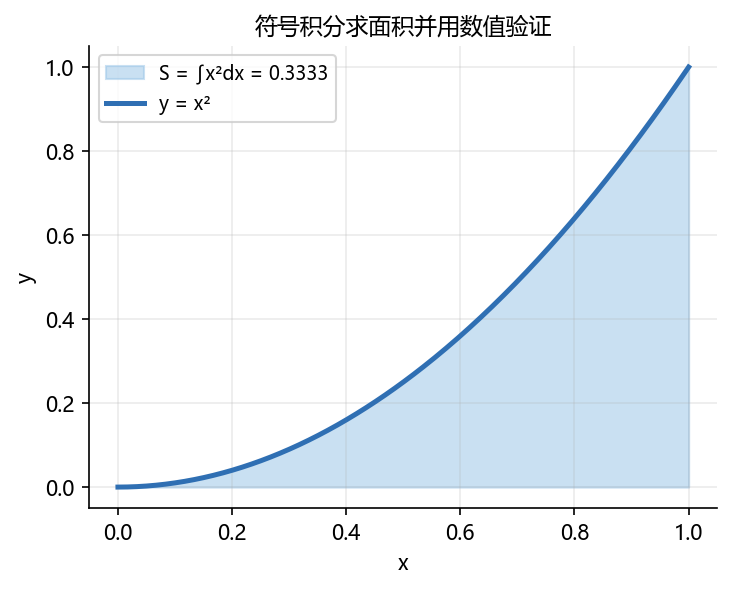
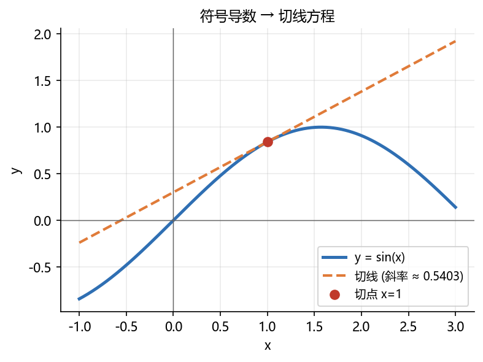
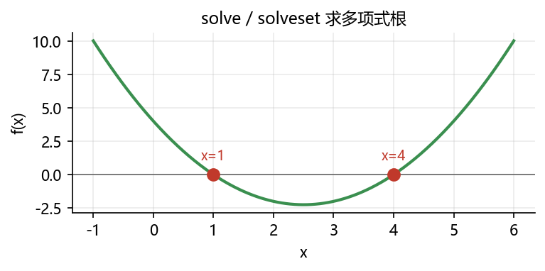

# 03 综合案例：符号推导 → 数值验证 → 可视化

> 本章新增综合案例，把 01–02 的知识串起来：**符号积分 / 符号导数 + lamdify + matplotlib 可视化**。
> 所有代码在 SymPy 1.13.1、NumPy 2.1.2、Matplotlib 3.10.1 环境运行通过；配图由 `build/make_chap2_figures.py` 生成。

## 案例 1：用符号积分求曲线下面积并数值验证

### 背景

求 $y=x^2$ 在 $[0,1]$ 上与 $x$ 轴围成的面积。用 SymPy 可**精确**求得 $\int_0^1 x^2 dx=\frac{1}{3}$，再用数值（`N`/`evalf`）验证，并画出图形。

### 代码

```python
import sympy as sp
x = sp.symbols('x')
f = x**2
area = sp.integrate(f, (x, 0, 1))
print(area)          # 精确结果
print(sp.N(area))    # 数值近似
```

```text
1/3
0.333333333333333
```

### 可视化

```python
import numpy as np
import matplotlib.pyplot as plt

plt.rcParams['font.sans-serif'] = ['Microsoft YaHei', 'SimHei', 'DejaVu Sans']
plt.rcParams['axes.unicode_minus'] = False

xs = np.linspace(0, 1, 300)
ys = xs**2
plt.figure(figsize=(5.4, 4.0))
plt.fill_between(xs, ys, color='#9ec7e8', alpha=0.55, label=f'S = ∫x²dx = {float(area):.4f}')
plt.plot(xs, ys, color='#2f6fb3', lw=2.4, label='y = x²')
plt.xlabel('x'); plt.ylabel('y')
plt.title('符号积分求面积并用数值验证', fontsize=11)
plt.legend(); plt.grid(alpha=0.25)
plt.savefig('images/sympy_area.png', bbox_inches='tight')
plt.show()
```



### 分析

- SymPy 给出精确的 $1/3$，而 NumPy 的 `np.trapz`/数值积分只能给出近似；
- `sp.N(area)` 输出 0.333333333333333，说明符号结果与数值结果一致；
- 这正体现“先符号推导得到公式，再数值计算/可视化”的方法论。

### 拓展任务

1. 改求 $y=e^{-x}$ 在 $[0,1]$ 上的面积，并与 `scipy.integrate.quad` 比较；
2. 求曲线 $y=x^2$ 绕 $x$ 轴旋转一周的旋转体体积：$\pi\int_0^1 x^4 dx$，用 SymPy 验证；
3. 把 $[0,1]$ 换成 $[a,b]$ 符号区间，观察 SymPy 是否保留符号结果。

---

## 案例 2：符号导数 → 切线方程 → 数值验证

### 背景

求 $y=\sin x$ 在 $x=1$ 处的切线方程。先用 SymPy 求导得到 $\cos x$，再求斜率 $\cos(1)$，最后用 `lambdify` 画图，并与数值差商验证。

### 代码

```python
import sympy as sp
import numpy as np
x = sp.symbols('x')
f = sp.sin(x)
df = sp.diff(f, x)
print(df)   # cos(x)

a = 1
slope = sp.N(df.subs(x, a))
print(slope)   # cos(1) ≈ 0.540302305868140

tangent = sp.simplify(df.subs(x, a) * (x - a) + f.subs(x, a))
print(tangent)

# 数值差商验证导数
h = 1e-6
numeric_deriv = (sp.sin(a + h) - sp.sin(a - h)) / (2*h)
print(float(sp.N(numeric_deriv)))
```

```text
cos(x)
0.540302305868140
(x - 1)*cos(1) + sin(1)
0.540302305840346
```

### 可视化

```python
import matplotlib.pyplot as plt

plt.rcParams['font.sans-serif'] = ['Microsoft YaHei', 'SimHei', 'DejaVu Sans']
plt.rcParams['axes.unicode_minus'] = False

def tangent_num(v):
    return float(sp.N(tangent.subs(x, v)))

xn = np.linspace(-1, 3, 400)
plt.figure(figsize=(5.8, 4.0))
plt.plot(xn, np.sin(xn), color='#2f6fb3', lw=2.4, label='y = sin(x)')
plt.plot(xn, [tangent_num(v) for v in xn], color='#e07b39', lw=2, ls='--',
         label=f'切线 (斜率 ≈ {float(slope):.4f})')
plt.plot([a], [np.sin(a)], 'o', color='#c0392b', ms=7, label=f'切点 x={a}')
plt.axhline(0, color='#666', lw=0.7); plt.axvline(0, color='#666', lw=0.7)
plt.xlabel('x'); plt.ylabel('y')
plt.title('符号导数 → 切线方程', fontsize=11)
plt.legend(); plt.grid(alpha=0.25)
plt.savefig('images/sympy_tangent.png', bbox_inches='tight')
plt.show()
```



### 分析

- 符号求导得到 $\cos x$，代入 $x=1$ 得斜率 ≈ 0.5403；
- 数值中心差商（$h=10^{-6}$）与符号导数一致，说明推导正确；
- 切线方程被 `simplify` 整理成 `(x-1)*cos(1) + sin(1)`，可直接用于绘图/插值。

### 拓展任务

1. 用 `lambdify` 把 `tangent` 和 `f` 都转成数值函数，再比较在 $x=0.5,1,1.5$ 处的数值；
2. 求 $y=\ln(x)$ 在 $x=2$ 的法线方程并绘图；
3. 把切线推广到二元函数（用梯度向量/切平面概念）。

---

## 案例 3：解方程并把根画在数轴上

### 背景

用 `solve` 求出多项式 $x^2-5x+4=0$ 的根，并把函数曲线与根标注在同一张图上，直观理解“方程的解”就是“函数与 $x$ 轴交点”。

### 代码与输出

```python
import sympy as sp
x = sp.symbols('x')
p = x**2 - 5*x + 4
roots = sorted(sp.solve(p, x))
print(roots)
print([float(sp.N(r)) for r in roots])
```

```text
[1, 4]
[1.0, 4.0]
```



### 分析

- `solve` 精确返回整数根 1 和 4，无需浮点迭代；
- 根的位置与曲线穿越 $x$ 轴的位置一致，图片直观地体现“解方程=找零点”。

### 拓展任务

1. 改求 $x^3-6x^2+11x-6=0$ 的三个根并画图；
2. 用 `solveset(..., domain=sp.S.Complexes)` 求解 $x^2+1=0$，解释为什么实数域为空；
3. 用 `lambdify` 把 `p` 转成数值函数，用 `np.roots` 验证数值根。

## 本章综合练习（上机任务）

1. 用 SymPy 推导 $y=\sqrt{x}$ 在 $[0,4]$ 上的面积，用 matplotlib 绘制填充区域并标注精确值；
2. 求 $f(x)=x^3-3x$ 的极值点（提示：令 $f'(x)=0$ 用 `solve`），并画函数与极值点图；
3. 把案例 1–3 整理成一个 `.ipynb`，写一份 200 字以内的结论，说明“符号解 vs 数值解”各自的优势。

## 延伸阅读

- SymPy 官方绘图（Plotting）模块：https://docs.sympy.org/latest/modules/plotting.html
- Matplotlib 填充区域：https://matplotlib.org/stable/api/_as_gen/matplotlib.pyplot.fill_between.html
- NumPy 数值求根（np.roots）：https://numpy.org/doc/stable/reference/generated/numpy.roots.html
