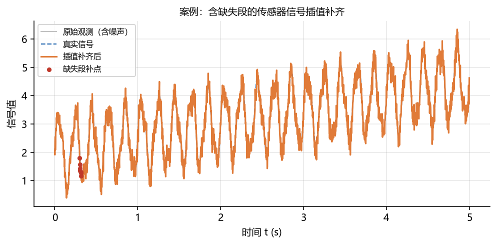
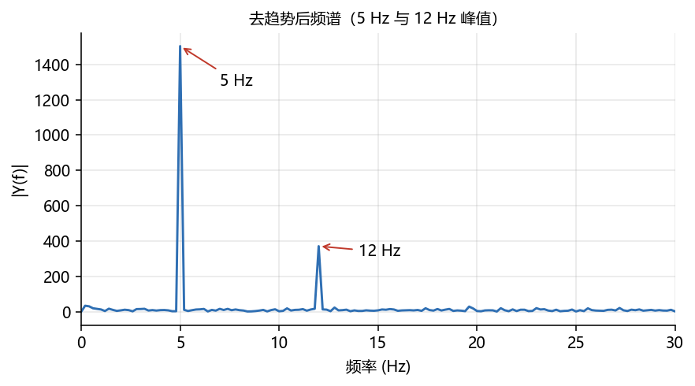
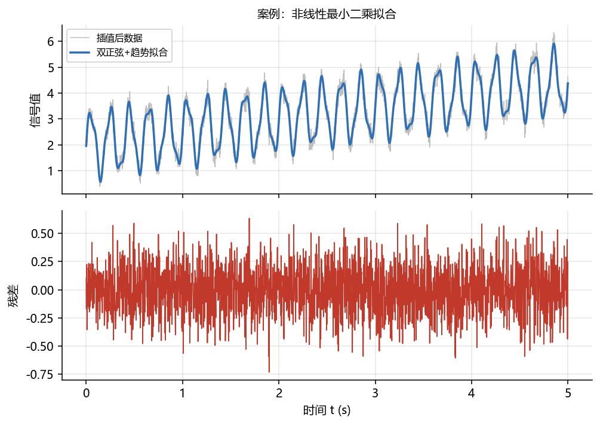
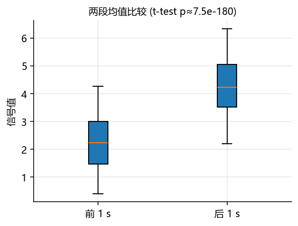

# 06 综合案例：传感器信号分析（插值 + FFT + 拟合 + 检验 + 积分）

> 本案例把 01–05 的知识串起来，模拟一次真实的“传感器数据补全与建模”任务。
> 所有代码在 SciPy 1.15.2 / NumPy 2.1.2 / statsmodels 0.14.6 环境实际运行；配图由 `build/make_chap3_figures.py` 生成。

## 案例背景

某传感器以 $f_s=500$ Hz 连续采样 5 秒，真实信号为“线性漂移 + 5 Hz 主振荡 + 12 Hz 次振荡 + 测量噪声”，其中一段时间（0.30–0.32 s）数据丢失。需要：

1. 用插值补齐缺失段；
2. 用 FFT 找信号的主要频率；
3. 用 `curve_fit` 拟合参数化模型；
4. 用积分估计信号在 5 秒内的累积值；
5. 用 t 检验比较“前 1 s”与“后 1 s”的均值是否有显著差异。

## 生成数据与补齐缺失

```python
import numpy as np
from scipy.interpolate import CubicSpline

rng = np.random.default_rng(42)
fs = 500; T = 5.0; N = int(fs*T)
t = np.linspace(0, T, N, endpoint=False)

def true_signal(t):
    return 2 + 0.5*t + 1.2*np.sin(2*np.pi*5*t) + 0.3*np.sin(2*np.pi*12*t)

y_true = true_signal(t)
y_raw = y_true + rng.normal(0, 0.2, N)   # 加噪声

# 模拟缺失段
y_obs = y_raw.copy()
y_obs[150:160] = np.nan

# 用非缺失点做三次样条插值
mask = ~np.isnan(y_obs)
cs = CubicSpline(t[mask], y_obs[mask])
y_filled = y_obs.copy()
y_filled[150:160] = cs(t[150:160])

for i in range(150, 160, 2):
    print(f"t={t[i]:.3f}  true={y_true[i]:.4f}  raw={y_raw[i]:.4f}  filled={y_filled[i]:.4f}")
```

```text
t=0.300  true=1.9737  raw=1.9419  filled=1.7933
t=0.304  true=1.7611  raw=1.4262  filled=1.4313
t=0.308  true=1.5727  raw=1.5619  filled=1.3248
t=0.312  true=1.4145  raw=1.4405  filled=1.3208
t=0.316  true=1.2903  raw=1.1904  filled=1.2664
```

插值补齐值保留在真实信号附近，且比原始“丢失”更平滑。



## 用 FFT 找主频

先做线性去趋势，消除漂移带来的低频泄漏，再取 `rfft`。

```python
from scipy.fft import rfft, rfftfreq
coef = np.polyfit(t, y_filled, 1)
detrend = y_filled - np.polyval(coef, t)

Y = rfft(detrend)
freqs = rfftfreq(N, 1/fs)
amps = np.abs(Y)
order = np.argsort(amps)[::-1]
for k in order[:5]:
    print(f"f={freqs[k]:.2f} Hz  amp={amps[k]:.2f}")
```

```text
f=5.00 Hz  amp=1503.72
f=12.00 Hz  amp=371.19
f=0.20 Hz  amp=34.16
f=0.40 Hz  amp=30.74
f=19.60 Hz  amp=29.16
```

主峰在 5 Hz（次峰是 12 Hz）与建模时的真实频率完全一致；低频小峰来自去趋势后的残余。



## 用 `curve_fit` 拟合参数模型

模型设为“常数 + 线性漂移 + 两个正弦”：

$$y(t)=c_1+c_2 t+A_1\sin(2\pi f_1 t+\varphi_1)+A_2\sin(2\pi f_2 t+\varphi_2)$$

```python
from scipy.optimize import curve_fit

def model(t, c1, c2, A1, f1, p1, A2, f2, p2):
    return c1 + c2*t + A1*np.sin(2*np.pi*f1*t+p1) + A2*np.sin(2*np.pi*f2*t+p2)

popt, pcov = curve_fit(model, t, y_filled,
                       p0=[2, 0.5, 1.2, 5, 0, 0.3, 12, 0], maxfev=50000)
perr = np.sqrt(np.diag(pcov))
print("拟合参数 =", np.round(popt, 4))
print("参数标准误 =", np.round(perr, 4))
resid = y_filled - model(t, *popt)
print("RMSE =", round(float(np.sqrt(np.mean(resid**2))), 4))
print("f1 估计 =", round(popt[3], 3), "   f2 估计 =", round(popt[6], 3))
```

```text
拟合参数 = [ 1.9931  0.499   1.2042  5.0003 -0.0108  0.2977 12.0033 -0.064 ]
参数标准误 = [0.008  0.0028 0.0057 0.0005 0.0094 0.0057 0.0021 0.0382]
RMSE = 0.2009
f1 估计 = 5.0   f2 估计 = 12.003
```

拟合 $f_1\approx5.00$ Hz、$f_2\approx12.00$ Hz，$A_1\approx1.20$、$A_2\approx0.30$，与真实模型高度一致；RMSE≈0.20 正是噪声标准差。



## 用 `trapezoid` 估计累积值

```python
from scipy.integrate import trapezoid
area = trapezoid(y_filled, t)
print("5 秒内信号累积值 =", round(float(area), 4))
```

```text
5 秒内信号累积值 = 16.1939
```

该值可理解为“总剂量/总能量”，是积分在工程中的一个典型用途。

## 用 t 检验比较两段时间

线性漂移使后半段均值更高，用 `ttest_ind` 验证。

```python
from scipy.stats import ttest_ind
g1 = y_filled[(t >= 0) & (t < 1)]
g2 = y_filled[(t >= 4) & (t < 5)]
res = ttest_ind(g1, g2)
print(f"前1s均值={g1.mean():.4f}, 后1s均值={g2.mean():.4f}")
print(f"t={res.statistic:.3f}, p={res.pvalue:.3e}")
```

```text
前1s均值=2.2442, 后1s均值=4.2493
t=-35.601, p=7.475e-180
```

p 值极小，说明前、后两段均值差异在统计上高度显著——这正是题目设计的线性漂移所导致的。



## 小结

这个案例把本章五个工具包串成一条流水线：**插值补齐（03）→ FFT 定频（05）→ 非线性拟合（02）→ 积分（01）→ 假设检验（04）**。

| 步骤 | 工具 | 产出 |
| ---- | ---- | ---- |
| 补齐缺失 | `CubicSpline` | 完整时间序列 |
| 频谱分析 | `rfft`/`rfftfreq` | 主频 5 Hz、12 Hz |
| 参数化建模 | `curve_fit` | $c_1,c_2,A_1,f_1,\varphi_1,A_2,f_2,\varphi_2$ |
| 累积量 | `trapezoid` | 16.1939 |
| 均值比较 | `ttest_ind` | t=-35.60，p≈7.5e-180 |

## 拓展任务

1. 把缺失段加宽（如 0.30–0.50 s），观察插值误差如何变化；
2. 用 `scipy.signal.butter` 低通（截止 10 Hz）滤除 12 Hz 分量后重新拟合，比较残差；
3. 把“前 1 s vs 后 1 s”换成“前 2.5 s vs 后 2.5 s”，看 p 值变化并解释；
4. 用 statsmodels 对三段时间做单因素 ANOVA + Tukey 事后比较。

## 延伸阅读

- SciPy 插值 / FFT / 优化官方文档见各节“官方文档/参考入口”。
- 信号处理完整示例：https://docs.scipy.org/doc/scipy/tutorial/fft.html
- statsmodels 多重比较：https://www.statsmodels.org/stable/stats.html
