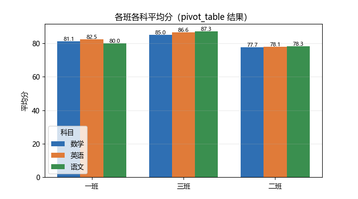
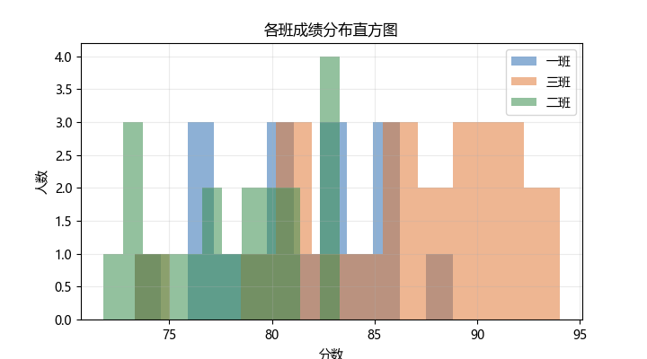
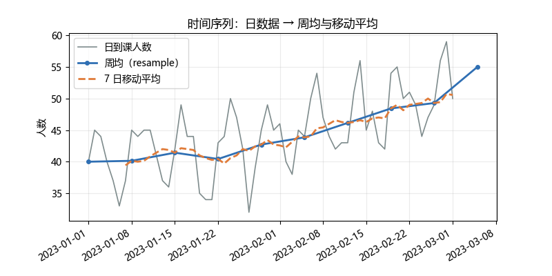

# 03 综合案例：学生成绩分析与可视化

> 本章新增综合案例，用于把 01–02 的知识串起来：**数据构造 → 清洗（缺失/重复/异常）→ 分组/透视 → 可视化**。
> 所有代码均可在 pandas ≥ 2.0 环境直接运行；配图由 build/make_chap4_figures.py 生成（固定随机种子 42）。

## 案例背景

某课程有 20 名学生、3 个班、3 门科目（语文/数学/英语）。原始数据为“长表”：一行表示一名学生在某科目的一次成绩。数据中有缺失值、重复行和个别异常分数，需要先清洗，再按班级统计平均分，并画出图表供老师分析。

统一绘图字体（避免中文缺字）：

```python
import matplotlib
matplotlib.rcParams['font.sans-serif'] = ['Microsoft YaHei', 'SimHei', 'DejaVu Sans']
matplotlib.rcParams['axes.unicode_minus'] = False
```

## 1. 构造数据

```python
import pandas as pd
import numpy as np

rng = np.random.default_rng(42)          # 固定种子，可复现
classes = ['一班', '二班', '三班']
subjects = ['语文', '数学', '英语']
base = {'一班': 82, '二班': 78, '三班': 85}
rows = []
for i in range(1, 21):
    cls = classes[i % 3]
    for sub in subjects:
        score = rng.normal(base[cls], 6)
        rows.append({'学号': f'S{i:02d}', '姓名': f'学生{i:02d}',
                     '班级': cls, '科目': sub, '分数': round(score, 1)})
df = pd.DataFrame(rows)

# 人为制造缺失与重复
df.loc[2, '分数'] = np.nan     # 语文缺失
df.loc[5, '分数'] = np.nan     # 英语缺失
df = pd.concat([df, df.iloc[[1]].copy()], ignore_index=True)

print('原始形状:', df.shape)
print('缺失值个数:', df['分数'].isna().sum())
print('重复行数:', df.duplicated().sum())
```

```text
原始形状: (61, 5)
缺失值个数: 2
重复行数: 1
```

## 2. 清洗

```python
df = df.dropna(subset=['分数'])       # 去掉缺分数的行
df = df.drop_duplicates()             # 去掉重复行
print('清洗后形状:', df.shape)

# 用 IQR 找异常值并替换为全体中位数
Q1 = df['分数'].quantile(0.25)
Q3 = df['分数'].quantile(0.75)
IQR = Q3 - Q1
mask = (df['分数'] < Q1 - 1.5 * IQR) | (df['分数'] > Q3 + 1.5 * IQR)
print('Q1, Q3, IQR:', round(Q1, 3), round(Q3, 3), round(IQR, 3))
print('异常值行数:', mask.sum())
df.loc[mask, '分数'] = df['分数'].median()
print(df['分数'].describe().round(4))
```

```text
清洗后形状: (58, 5)
Q1, Q3, IQR: 77.775 85.625 7.85
异常值行数: 1
count    58.0000
mean     81.8466
std       5.5063
min      71.8000
25%      77.7750
50%      81.9000
75%      85.4000
max      94.0000
Name: 分数, dtype: float64
```

## 3. 分组统计与透视

```python
# 按班级求平均分
print(df.groupby('班级')['分数'].mean().round(1))

# 透视：班级 × 科目 的平均分
piv = df.pivot_table(values='分数', index='班级', columns='科目', aggfunc='mean').round(1)
print(piv)
```

```text
班级
一班    81.2
三班    86.3
二班    78.0
Name: 分数, dtype: float64

科目    数学    英语    语文
班级
一班    81.1    82.5    80.0
三班    85.0    86.6    87.3
二班    77.7    78.1    78.3
```

> 说明：透视表的行按中文 Unicode 排序为 一班、三班、二班；三班（基础分 85）平均最高，二班（基础分 78）最低。

## 4. 可视化

### 4.1 各班各科平均分柱状图



绘图代码：

```python
import matplotlib.pyplot as plt
plt.rcParams['font.sans-serif'] = ['Microsoft YaHei', 'SimHei', 'DejaVu Sans']
plt.rcParams['axes.unicode_minus'] = False

fig, ax = plt.subplots(figsize=(7.2, 4.0))
subjects = piv.columns.tolist()
x = np.arange(len(piv.index))
colors = ['#2f6fb3', '#e07b39', '#3a8f4f']
for j, sub in enumerate(subjects):
    vals = piv[sub].values
    ax.bar(x + (j - 1) * 0.25, vals, width=0.25, label=sub, color=colors[j])
    for xi, v in zip(x + (j - 1) * 0.25, vals):
        ax.text(xi, v + 0.3, f'{v:.1f}', ha='center', fontsize=8)
ax.set_xticks(x)
ax.set_xticklabels(piv.index)
ax.set_ylabel('平均分')
ax.set_title('各班各科平均分（pivot_table 结果）')
ax.legend(title='科目')
ax.grid(axis='y', alpha=0.25)
fig.savefig('images/case_scores.png')
plt.close(fig)
```

### 4.2 各班成绩分布直方图



```python
fig, ax = plt.subplots(figsize=(7.2, 4.0))
for (cls, g), c in zip(df.groupby('班级'), colors):
    ax.hist(g['分数'], bins=12, alpha=0.55, label=cls, color=c)
ax.set_xlabel('分数')
ax.set_ylabel('人数')
ax.set_title('各班成绩分布直方图')
ax.legend()
ax.grid(alpha=0.25)
fig.savefig('images/case_distribution.png')
plt.close(fig)
```

### 4.3 时间序列：日到课人数 → 周均与移动平均



```python
rng = np.random.default_rng(7)
idx = pd.date_range('2023-01-01', periods=60, freq='D')
trend = np.linspace(0, 10, 60)
weekly = 5 * np.sin(2 * np.pi * np.arange(60) / 7)
count = (40 + trend + weekly + rng.normal(0, 3, 60)).round().clip(0, 60).astype(int)
ts = pd.Series(count, index=idx)
weekly_mean = ts.resample('W').mean()
rolling7 = ts.rolling(7).mean()

fig, ax = plt.subplots(figsize=(8.0, 4.0))
ax.plot(ts.index, ts.values, color='#7f8c8d', lw=1.2, label='日到课人数')
ax.plot(weekly_mean.index, weekly_mean.values, color='#2f6fb3', marker='o', ms=4,
        lw=2, label='周均（resample）')
ax.plot(rolling7.index, rolling7.values, color='#e07b39', lw=2, ls='--', label='7 日移动平均')
ax.set_ylabel('人数')
ax.set_title('时间序列：日数据 → 周均与移动平均')
ax.legend()
ax.grid(alpha=0.25)
fig.autofmt_xdate()
fig.savefig('images/case_time_series.png')
plt.close(fig)
```

## 5. 结论

- 清洗后共 58 条有效记录，去掉 2 个缺失、1 行重复，并用 IQR 替换了 1 个异常低分；
- 三班平均分最高（86.3），二班最低（78.0），这与我们设定的“班级基础分”一致；
- 透视表给出“班级 × 科目”的平均分，能快速定位薄弱科目；
- 时间序列图说明：`resample('W')` 把日数据聚合成周均，`rolling(7)` 得到平滑的 7 日移动平均，二者都可用于观察趋势。

## 拓展任务

1. 改用真实 CSV（如某课程成绩表）复现；
2. 把 `groupby('班级')['分数'].agg(['mean', 'std', 'count'])` 的结果也画成条形图；
3. 对透视表加 `margins=True` 显示总计；
4. 给时间序列数据加周末标记，观察周末到课人数是否更低。

## 延伸阅读

- Pandas 分组与聚合文档：https://pandas.pydata.org/docs/user_guide/groupby.html
- Pandas 透视表文档：https://pandas.pydata.org/docs/reference/api/pandas.pivot_table.html
- Pandas 时间序列文档：https://pandas.pydata.org/docs/user_guide/timeseries.html
- Matplotlib 官方入门：https://matplotlib.org/stable/tutorials/introductory/quick_start.html