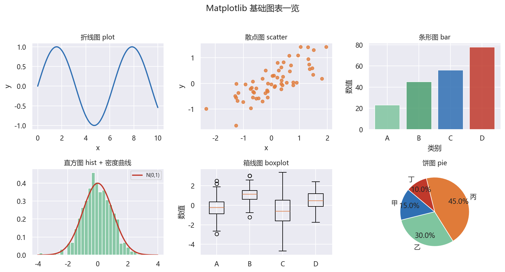
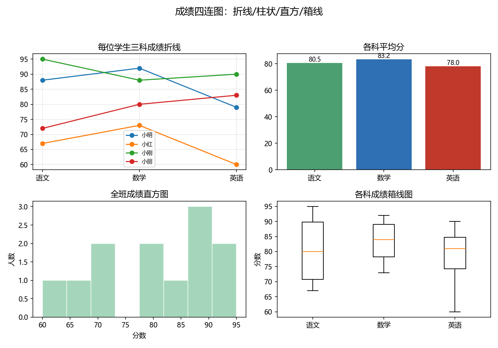

# 01 基本绘图：折线、散点、条形、饼图、直方图、箱线图等

> 本节对应原版 5.1 的内容，并增补学习目标、常见误区、思考题与延伸阅读。
> 配套图：`images/basic_plots.png`（由 `build/make_chap5_figures.py` 生成）。

## 本节目标

- 会用 `matplotlib.pyplot` 绘制 6 种最常用的基础图表；
- 理解面向对象接口（`fig` / `ax`）与“函数式”接口（`plt.plot`）的关系；
- 会为图表添加标题、坐标轴标签、图例；
- 接触热力图、误差棒图、极坐标、3D、等高线等扩展图型。

## 先修

- Python 基础语法；NumPy 数组（`np.linspace`、`np.arange`、随机数）。

## 官方文档/参考入口

- Matplotlib 官方快速开始：[链接](https://matplotlib.org/stable/tutorials/introductory/quick_start.html)
- Matplotlib 图型画廊：[链接](https://matplotlib.org/stable/gallery/index.html)

---

## 1.1 快速开始：`import matplotlib.pyplot as plt`

> Matplotlib 有两种风格：**函数式**（`plt.plot`，自动管理当前图）与**面向对象**（`fig, ax = plt.subplots()`，手动管理 Axes）。本教材优先介绍函数式，第 2 节再切换到面向对象。

```python
import numpy as np
import matplotlib.pyplot as plt

plt.rcParams['font.sans-serif'] = ['Microsoft YaHei', 'SimHei', 'DejaVu Sans']
plt.rcParams['axes.unicode_minus'] = False
np.set_printoptions(precision=4, suppress=True)

x = [1, 2, 3, 4, 5]
y = [1, 4, 9, 16, 25]

plt.plot(x, y)
plt.title('Simple Plot')
plt.xlabel('x axis')
plt.ylabel('y axis')
plt.show()
```

运行后得到一条折线。若在 Jupyter 中，`plt.show()` 会把图形显示在输出区；在脚本中则弹出窗口（无窗口环境请用 `plt.savefig`）。

## 1.2 常见基础图表

### 1.2.1 折线图（`plot`）

```python
import numpy as np
import matplotlib.pyplot as plt

x = [1, 2, 3, 4, 5]
y = [1, 4, 9, 16, 25]
plt.plot(x, y)
plt.title('Simple Plot')
plt.xlabel('x axis')
plt.ylabel('y axis')
print('x:', x)
print('y:', y)
```

```text
x: [1, 2, 3, 4, 5]
y: [1, 4, 9, 16, 25]
```

### 1.2.2 散点图（`scatter`）

```python
import numpy as np
import matplotlib.pyplot as plt

rng = np.random.default_rng(0)
x = rng.normal(0, 1, 60)
y = 0.6 * x + rng.normal(0, 0.4, 60)
plt.scatter(x, y, s=28, c='#e07b39', alpha=0.8)
plt.title('Scatter Plot')
print('x min/max:', round(x.min(), 3), round(x.max(), 3))
print('y mean:', round(y.mean(), 3))
```

```text
x min/max: -2.325 1.96
y mean: 0.08
```

> `s` 控制点面积、`c` 控制颜色、`alpha` 控制透明度；`np.random.default_rng(0)` 保证结果可复现。

### 1.2.3 条形图（`bar`）

```python
import matplotlib.pyplot as plt

cats = ['A', 'B', 'C', 'D']
vals = [23, 45, 56, 78]
plt.bar(cats, vals)
plt.title('Bar Chart')
plt.xlabel('Categories')
plt.ylabel('Values')
print('vals:', vals)
print('total:', sum(vals))
```

```text
vals: [23, 45, 56, 78]
total: 202
```

### 1.2.4 饼图（`pie`）

```python
import matplotlib.pyplot as plt

labels = 'Frogs', 'Hogs', 'Dogs', 'Logs'
sizes = [15, 30, 45, 10]
plt.pie(sizes, labels=labels, autopct='%1.1f%%', startangle=140)
plt.title('Pie Chart')
plt.axis('equal')
print('sizes:', sizes, 'sum:', sum(sizes))
```

```text
sizes: [15, 30, 45, 10] sum: 100
```

> `autopct` 控制百分比格式，`startangle` 控制起始角度，`axis('equal')` 保证饼图是正圆。

### 1.2.5 直方图（`hist`）

```python
import numpy as np
import matplotlib.pyplot as plt

mu, sigma = 0, 0.1
data = np.random.default_rng(5).normal(mu, sigma, 1000)
counts, bins, patches = plt.hist(data, bins=30, density=True)
plt.title('Histogram')
plt.xlabel('Value')
plt.ylabel('Frequency')
print('bin count:', len(patches))
print('first/last bin:', round(bins[0], 3), round(bins[-1], 3))
```

```text
bin count: 30
first/last bin: -0.328 0.311
```

> `density=True` 时纵轴是概率密度（面积归一为 1）；`bins` 为分箱数。

### 1.2.6 箱线图（`boxplot`）

```python
import numpy as np
import matplotlib.pyplot as plt

np.random.seed(10)
data = np.random.normal(0, 1, 200)
data = np.concatenate([data, [10]])   # 加入一个异常值
plt.boxplot(data)
plt.title('Boxplot')
print('outliers > 3:', int((data > 3).sum()))
print('max:', round(data.max(), 2))
```

```text
outliers > 3: 1
max: 10.0
```

> 箱线图用五数概括（Q1、中位数、Q3、上下须）展示分布，异常值以离群点显示。

### 1.2.7 热力图（`imshow`）

```python
import numpy as np
import matplotlib.pyplot as plt

data = np.random.default_rng(7).random((10, 10))
plt.imshow(data, cmap='hot', interpolation='nearest')
plt.colorbar()
plt.title('Heatmap Example')
print('matrix shape:', data.shape)
```

```text
matrix shape: (10, 10)
```

> `imshow` 适合展示 2D 数值矩阵；`cmap` 控制配色，`colorbar` 加色标。

### 1.2.8 误差棒图（`errorbar`）

```python
import numpy as np
import matplotlib.pyplot as plt

x = np.arange(0.1, 4, 0.5)
y = np.exp(-x)
yerr = 0.1 + 0.2 * np.sqrt(x)
xerr = 0.1 * np.ones_like(x)
plt.errorbar(x, y, xerr=xerr, yerr=yerr, fmt='-o')
plt.title('Errorbar Chart Example')
print('n points:', x.size)
```

```text
n points: 8
```

### 1.2.9 扩展图型：极坐标、3D、等高线

```python
import numpy as np
import matplotlib.pyplot as plt
from mpl_toolkits.mplot3d import Axes3D

# 极坐标
r = np.arange(0, 2, 0.01)
theta = 2 * np.pi * r
plt.polar(theta, r)
plt.title('Polar Chart')
print('polar points:', r.size)
plt.close()   # 关闭极坐标图，避免与下面的 3D/等高线共用 Figure

# 3D 曲面
x = np.linspace(-5, 5, 100); y = np.linspace(-5, 5, 100)
X, Y = np.meshgrid(x, y)
Z = np.sin(np.sqrt(X**2 + Y**2))
fig3d = plt.figure()
ax = fig3d.add_subplot(111, projection='3d')
ax.plot_surface(X, Y, Z, cmap='viridis')
print('surface shape:', Z.shape)
plt.close(fig3d)     # 关闭 3D 图，避免与下面的等高线共用 Figure

# 等高线（显式用二维 Axes，避免落在 3D 坐标轴上报错）
fig2, ax2 = plt.subplots()
cs = ax2.contourf(X, Y, Z, cmap='viridis')
ax2.contour(X, Y, Z, colors='k')
fig2.colorbar(cs)
print('X,Y,Z shapes:', X.shape, Y.shape, Z.shape)
```

```text
polar points: 200
surface shape: (100, 100)
X,Y,Z shapes: (100, 100) (100, 100) (100, 100)
```

> 3D 图需要 `from mpl_toolkits.mplot3d import Axes3D`；`add_subplot(111, projection='3d')` 表示 1×1 网格中的第一个子图（详见第 2 节）。



## 案例卡 1：用 subplots 画“成绩四连图”——折线/柱状/直方/箱线

### 目标

把一张 4 名学生 × 3 门课的成绩表，用一张 2×2 的 `subplots` 同时画出四种基础图：折线图、柱状图、直方图、箱线图。学会“先想清楚每格放什么，再往对应的 `ax` 上画”。

### 代码

```python
import numpy as np
import matplotlib.pyplot as plt
import os

os.makedirs('images', exist_ok=True)
plt.rcParams['font.sans-serif'] = ['Microsoft YaHei', 'SimHei', 'DejaVu Sans']
plt.rcParams['axes.unicode_minus'] = False
np.set_printoptions(precision=4, suppress=True)

students = ['小明', '小红', '小刚', '小丽']
subjects = ['语文', '数学', '英语']
scores = np.array([
    [88, 92, 79],
    [67, 73, 60],
    [95, 88, 90],
    [72, 80, 83],
])
print('shape:', scores.shape)

fig, axes = plt.subplots(2, 2, figsize=(10, 7))
for i, name in enumerate(students):
    axes[0, 0].plot(subjects, scores[i], marker='o', label=name)
axes[0, 0].set_title('每位学生三科成绩折线')
axes[0, 0].legend(fontsize=8); axes[0, 0].grid(alpha=0.3)

means = scores.mean(axis=0)
axes[0, 1].bar(subjects, means, color=['#4C9F70', '#2F6FB3', '#C0392B'])
axes[0, 1].set_title('各科平均分')
for j, m in enumerate(means):
    axes[0, 1].text(j, m + 1, f'{m:.1f}', ha='center', fontsize=9)

axes[1, 0].hist(scores.ravel(), bins=8, alpha=0.7, color='#7fc59f', edgecolor='white')
axes[1, 0].set_title('全班成绩直方图')
axes[1, 0].set_xlabel('分数'); axes[1, 0].set_ylabel('人数')

axes[1, 1].boxplot([scores[:, j] for j in range(3)], tick_labels=subjects)
axes[1, 1].set_title('各科成绩箱线图')
axes[1, 1].set_ylabel('分数')

fig.suptitle('成绩四连图：折线/柱状/直方/箱线', fontsize=14)
fig.tight_layout(rect=[0, 0, 1, 0.95])
fig.savefig('images/case1_scores_subplots.png', dpi=150)
print('mean by subject:', np.round(means, 2))
print('max total index:', int(np.argmax(scores.sum(axis=1))))
print('done')
```

### 运行结果（已运行核验）

```text
shape: (4, 3)
mean by subject: [80.5  83.25 78.  ]
max total index: 2
done
```

### 讲解

**一句话人话**：`fig, axes = plt.subplots(2, 2)` 相当于买了一张 2×2 的“画板”并把它分成 4 个小画板，用 `axes[0,0]`、`axes[1,1]` 等分别往里面画，最后 `savefig` 一次性保存。

- `scores` 是 `(4, 3)` 的矩阵：4 行 = 4 名学生，3 列 = 语文/数学/英语。
- `axes[0, 0].plot(subjects, scores[i], ...)` 中 `scores[i]` 是第 i 个学生的三门成绩，所以水平方向是科目、垂直方向是分数。
- `scores.mean(axis=0)` 沿“学生”这一维折叠，得到三门课各自平均分；`axis=0` 口诀：消除第 0 维，保留第 1 维。
- `scores.ravel()` 把 `(4, 3)` 展平成 12 个分数，`hist` 画出这 12 个数的分布。
- `boxplot([scores[:, 0], scores[:, 1], scores[:, 2]])` 把三门课各看成一串数据，画出三个“箱子”，一眼看出哪门课最稳、哪门课波动大。
- 每个子图都有自己的 `set_title/set_xlabel/set_ylabel`；全部画完后 `fig.tight_layout()` 让子图不挤在一起，`fig.savefig(...)` 输出到 `images/`。

### 主要用法 / API

| 需求 | 写法 |
| ---- | ---- |
| 创建 2×2 子图 | `fig, axes = plt.subplots(2, 2)` |
| 访问子图 | `axes[0, 0]` / `axes[1, 1]` |
| 折线图 | `axes[i, j].plot(x, y, marker='o')` |
| 柱状图 | `axes[i, j].bar(x, y)` |
| 直方图 | `axes[i, j].hist(data, bins=n)` |
| 箱线图 | `axes[i, j].boxplot([col1, col2, ...])` |
| 保存 | `fig.savefig('images/x.png', dpi=150)` |

### 常见错误

- 忘记 `axes` 是 2×2 的 ndarray，直接 `axes.plot(...)` 会报 `AttributeError`；
- 把不同图都画到同一个 `axes`（比如一直用 `axes[0, 0]`），导致四个格子只有一个有内容；
- 不调用 `fig.tight_layout()`，子图标题/标签互相重叠；
- 用 `plt.savefig(...)` 但没先创建“当前图”；这里建议始终用 `fig.savefig(...)`。

### 拓展 / 跟练

1. 把子图改为 1×4 或 2×2 之后调换顺序，观察排版差异；
2. 给柱状图每根柱子加上数值标签（参考 `text` 用法）；
3. 把箱线图改成“每个学生”而不是“每门课”；
4. 把这张图保存为 300 DPI 的 PNG，并比较文件大小。



## 常见误区

1. **只调用 `plt.plot` 不调用 `plt.show()` 或 `savefig`**：在脚本中可能不显示也不保存，图形“消失”。
2. **对 `imshow` 不加 `colorbar`**：看不出数值颜色映射。
3. **`plt.hist` 直接打印可以拿到三个返回值**：`counts, bins, patches`，很多同学忽略。
4. **误以为 `pie` 的 `axis('equal')` 可省**：不设会变成椭圆。
5. **随机数不设种子**：每次输出不同，课堂演示/作业请用 `default_rng(seed)`。

## 思考题

1. 为什么 `plt.plot(x, y)` 与 `fig, ax = plt.subplots(); ax.plot(x, y)` 等价？它们分别管理什么状态？
2. `plt.scatter` 与 `plt.plot(..., marker='o')` 对一维数据有何适用场景差异？
3. 直方图 `density=True` 后，纵轴还能不能叫 “Frequency”？为什么？
4. 3D 曲面图绘制时为什么要先 `np.meshgrid`？

## 动手练习（详见 lab）

- 绘制 `y = x^3 - 2x^2 + x` 在 `[-2, 2]` 的折线图，加网格与图例；
- 用 `default_rng(0)` 生成 100 个标准正态数，画 30 箱直方图叠加理论密度曲线；
- 用 `tips` 数据集画 `day` 分组箱线图；
- 画一张 10×10 随机矩阵热力图，并对比两种 `cmap`。

## 延伸阅读

- Matplotlib 官方入门：[链接](https://matplotlib.org/stable/tutorials/introductory/quick_start.html)
- Matplotlib 图型画廊（Gallery）：[链接](https://matplotlib.org/stable/gallery/index.html)
- Seaborn 官方统计图：[链接](https://seaborn.pydata.org/tutorial.html)
