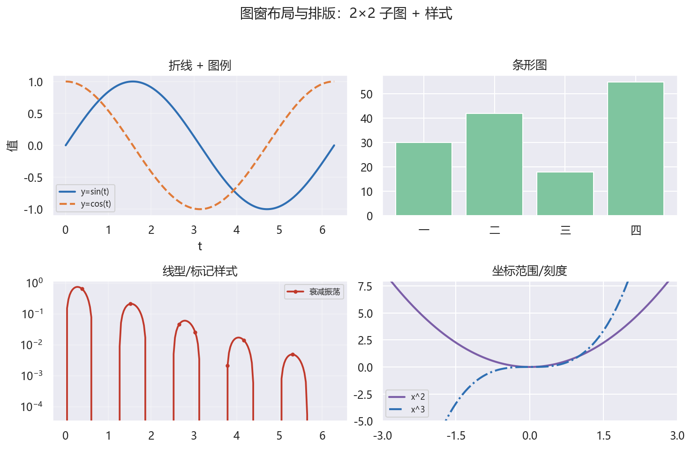
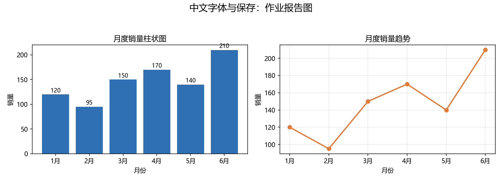

# 02 图窗、布局与排版：Figure/Axes、子图、字体、坐标轴与保存

> 本节对应原版 5.2 的内容，并增补学习目标、常见误区、思考题与延伸阅读。
> 配套图：`images/subplots_layout.png`（由 `build/make_chap5_figures.py` 生成）。

## 本节目标

- 理解 Figure（画布）与 Axes（坐标区）的对象层级；
- 会用 `plt.subplots` 创建多子图并用 `ax` 逐区绘制；
- 会设置 `figsize/dpi`，用 `rcParams` 做全局字体与字号；
- 会设置轴标签、刻度、范围、网格、图例；
- 会使用 `tight_layout` / `subplots_adjust` 排版，并掌握 `savefig` 输出。

## 先修

- 第 1 节的基础图表；NumPy 与 Pandas 基本操作。

## 官方文档/参考入口

- Matplotlib 官方“面向对象接口”：[链接](https://matplotlib.org/stable/tutorials/introductory/usage.html#the-object-oriented-interface)
- Matplotlib 官方“文本/字体”：[链接](https://matplotlib.org/stable/users/explain/text/text_props.html)
- Matplotlib 官方“布局指南”：[链接](https://matplotlib.org/stable/tutorials/intermediate/tight_layout_guide.html)

---

## 2.1 Figure 与 Axes：两张“画布”

> Matplotlib 的核心对象是 **Figure**（整张图）与 **Axes**（图中一个坐标系）。一个 Figure 可以有多个 Axes。

```python
import numpy as np
import matplotlib.pyplot as plt

plt.rcParams['font.sans-serif'] = ['Microsoft YaHei', 'SimHei', 'DejaVu Sans']
plt.rcParams['axes.unicode_minus'] = False
np.set_printoptions(precision=4, suppress=True)

fig = plt.figure(figsize=(10, 4), dpi=100)
ax = fig.add_subplot(111)          # 111 表示 1×1 网格中的第 1 个
print('figsize:', fig.get_figwidth(), 'x', fig.get_figheight())
print('dpi:', fig.get_dpi())
print('axes count:', len(fig.axes))
```

```text
figsize: 10.0 x 4.0
dpi: 100
axes count: 1
```

> `plt.plot(...)` 等价于“在当前 Figure 上自动取一个 Axes 再画”，有复用代码简单、但不易同时画多子的缺点。

## 2.2 子图：`plt.subplots`

```python
import matplotlib.pyplot as plt

fig, axs = plt.subplots(2, 2)
print('axs shape:', axs.shape)
print('n axes:', axs.size)
for ax in axs.flat:
    ax.plot([1, 2], [2, 1])
print('ok')
```

```text
axs shape: (2, 2)
n axes: 4
ok
```

> `axs` 是 ndarray；用 `axs[0, 1]` 访问指定子区，`axs.flat` 可顺序遍历。

## 2.3 图窗大小与分辨率：`figsize` 与 `dpi`

```python
import matplotlib.pyplot as plt

plt.figure(figsize=(8, 6), dpi=100)
plt.plot([1, 2, 3], [4, 3, 2])
# figsize 单位英寸；dpi 为每英寸像素点数
print('figure created')
```

输出：创建一张 8×6 英寸、100 DPI 的图窗（像素 800×600）。

## 2.4 全局字体与字号：`rcParams`

中文标题很常用；若不做设置，可能显示为方块。用 `rcParams` 全局设置即可：

```python
import matplotlib as mpl
import matplotlib.pyplot as plt

mpl.rcParams['font.sans-serif'] = ['Microsoft YaHei', 'SimHei', 'DejaVu Sans']
mpl.rcParams['axes.unicode_minus'] = False   # 让负号正常显示
mpl.rcParams['font.size'] = 12
plt.plot([1, 2, 3], [4, 3, 2])
plt.title('标题')
print('after:', mpl.rcParams['font.size'])
```

```text
after: 12.0
```

> Windows 上 `Microsoft YaHei` / `SimHei` 常见；Linux/macOS 可换成 `Noto Sans CJK SC` 或 `Arial Unicode MS`。

## 2.5 坐标轴：标签、范围、刻度

```python
import matplotlib.pyplot as plt

fig, ax = plt.subplots()
ax.plot([1, 2, 3], [4, 3, 2])
ax.set_xlabel('X Axis Label', fontsize=14)
ax.set_ylabel('Y Axis Label', fontsize=14)
ax.set_xlim(0, 4)
ax.set_ylim(2, 5)
ax.set_xticks([1, 2, 3])
ax.set_yticks([3, 4])
print('xlim:', tuple(float(v) for v in ax.get_xlim()))
print('ylim:', tuple(float(v) for v in ax.get_ylim()))
print('xticks:', [int(v) for v in ax.get_xticks()])
```

```text
xlim: (0.0, 4.0)
ylim: (2.0, 5.0)
xticks: [1, 2, 3]
```

## 2.6 网格与图例

```python
import matplotlib.pyplot as plt

fig, ax = plt.subplots()
ax.plot([1, 2, 3], [4, 3, 2], label='line 1')
ax.plot([1, 2, 3], [2, 3, 4], label='line 2')
ax.grid(color='gray', linestyle='--', linewidth=0.5)
ax.legend()
print('handles:', len(ax.get_legend().get_texts()))
```

```text
handles: 2
```

> 图例 `loc` 可选 `'best'`、`'upper right'`、`'lower left'` 等；`grid` 可设颜色/线型/线宽。

## 2.7 排版：`tight_layout` 与 `subplots_adjust`

`tight_layout` 自动让子图不重叠；`subplots_adjust` 手动控制边界与间距。

```python
import matplotlib.pyplot as plt

fig, axs = plt.subplots(2, 2, figsize=(9, 6))
for ax in axs.flat:
    ax.plot([1, 2, 3], [2, 1, 3])
fig.suptitle('示例', fontsize=14)
fig.tight_layout()                    # 自动排版，推荐
# fig.subplots_adjust(left=0.1, right=0.9, top=0.9, bottom=0.1, wspace=0.3, hspace=0.3)
print('layout ok')
```

输出：`layout ok`，运行后得到整洁的 2×2 子图（见下方示例图）。



## 2.8 保存图像：`savefig`

```python
import matplotlib.pyplot as plt
import os

plt.figure(figsize=(8, 6), dpi=100)
plt.plot([1, 2, 3], [4, 3, 2])
plt.savefig('my_plot.png', dpi=150)
print('exists:', os.path.exists('my_plot.png'))
```

```text
exists: True
```

> `savefig` 的 `dpi` 可单独覆盖图窗 DPI；格式由扩展名决定（`png` / `jpg` / `pdf` / `svg` 等）。

## 案例卡 3：中文字体与保存——做一张可以交作业的报告图

### 目标

配置中文字体与负号显示，做一张包含“柱状图 + 折线图”的报告图，并同时保存为高分辨率 PNG 与 PDF。学会“交作业前最后两步：`tight_layout()` + `savefig`”。

### 代码

```python
import numpy as np
import matplotlib.pyplot as plt
import os

plt.rcParams['font.sans-serif'] = ['Microsoft YaHei', 'SimHei', 'DejaVu Sans']
plt.rcParams['axes.unicode_minus'] = False
np.set_printoptions(precision=4, suppress=True)
os.makedirs('images', exist_ok=True)

months = ['1月', '2月', '3月', '4月', '5月', '6月']
sales = np.array([120, 95, 150, 170, 140, 210])
print('months:', len(months), ' max index:', int(np.argmax(sales)))

fig, axes = plt.subplots(1, 2, figsize=(11, 4))
axes[0].bar(months, sales, color='#2f6fb3')
axes[0].set_title('月度销量柱状图')
axes[0].set_xlabel('月份'); axes[0].set_ylabel('销量')
for i, v in enumerate(sales):
    axes[0].text(i, v + 4, f'{v}', ha='center', fontsize=9)

axes[1].plot(months, sales, marker='o', color='#e07b39', lw=2)
axes[1].set_title('月度销量趋势')
axes[1].set_xlabel('月份'); axes[1].set_ylabel('销量')
axes[1].grid(alpha=0.3)

fig.suptitle('中文字体与保存：作业报告图', fontsize=15)
fig.tight_layout(rect=[0, 0, 1, 0.94])
fig.savefig('images/case3_report.png', dpi=150)
fig.savefig('images/case3_report.pdf')
print('savefig dpi:', 150)
print('done')
```

### 运行结果（已运行核验）

```text
months: 6  max index: 5
savefig dpi: 150
done
```

### 讲解

**一句话解释**：先告诉 Matplotlib“用哪套中文字体、负号怎么显示”，再画图，最后 `tight_layout` 整理排版、`savefig` 存成文件——这就是“可以交作业”的报告图。

- 前两行 `plt.rcParams['font.sans-serif'] = [...]` 让中文标题、坐标轴标签不再显示成方块；`axes.unicode_minus = False` 避免负号变成“横杠”。
- `sales` 是 6 个月的销量；`np.argmax(sales)` 返回最大值的下标（从 0 数），这里 `210` 在下标 5。
- `axes[0].bar(...)` 画柱状图；`axes[0].text(i, v + 4, f'{v}', ...)` 在每个柱子顶上标数字，`v + 4` 是为了把文字稍微抬高、不与柱子重叠。
- `axes[1].plot(...)` 画折线图，用 `marker='o'` 标出每个数据点。
- `fig.tight_layout(rect=[0, 0, 1, 0.94])` 让子图和总标题不重叠；`rect` 给最上方的 `suptitle` 留出空间。
- `fig.savefig('images/case3_report.png', dpi=150)` 输出 PNG；再次 `savefig('images/case3_report.pdf')` 另存一份 PDF，方便打印或插入报告。

### 主要用法 / API

| 需求 | 写法 |
| ---- | ---- |
| 设中文字体 | `plt.rcParams['font.sans-serif'] = ['Microsoft YaHei', ...]` |
| 修复负号 | `plt.rcParams['axes.unicode_minus'] = False` |
| 创建子图 | `fig, axes = plt.subplots(1, 2, figsize=(11, 4))` |
| 子图标题 | `axes[i].set_title('...')` |
| 整理排版 | `fig.tight_layout(rect=[0, 0, 1, 0.94])` |
| 保存 PNG/PDF | `fig.savefig('images/x.png', dpi=150)` / `fig.savefig('images/x.pdf')` |

### 常见错误

- 只在 `set_theme` 之前设置字体，之后被 seaborn 重置（见 03 节）；
- 用 `plt.savefig(...)` 而不是 `fig.savefig(...)`，多子图时可能存错“当前图”；
- 不调用 `tight_layout`，保存出来后标题被裁剪；
- 忘记 `os.makedirs('images', exist_ok=True)`，直接 `savefig('images/...')` 会因目录不存在而报错。

### 拓展 / 跟练

1. 把主题换成 `plt.style.use('seaborn-v0_8-whitegrid')`，再比较字体是否被覆盖；
2. 给折线加上数值标注与数据点 `annotate`；
3. 分别用 100 / 150 / 300 DPI 保存三张 PNG，比较清晰度与文件大小；
4. 把这张图改成 2×2 报告图（增加直方图与箱线图）。



## 常见误区

1. **混用 `plt` 与 `ax` 接口**：在面向对象代码中继续用 `plt.title` 可能作用于“当前”轴，子图多了易错。建议一个图中要么纯函数式、要么纯面向对象。
2. **忘记 `tight_layout`**：子图标题、轴标签互相重叠。
3. **`set_xticks` 与 `set_xticklabels` 混用**：前者设刻度位置，后者改刻度文字。
4. **把 `figsize` 单位当像素**：实际单位是英寸，配合 `dpi` 才得到像素。
5. **`rcParams` 在 `seaborn.set_theme` 之后设置**：否则字体被覆盖回 Arial（见第 3 节）。

## 思考题

1. `fig, axs = plt.subplots(3, 4)` 中 `axs.shape` 是多少？如何访问第 2 行第 3 列子图？
2. 为什么 `plt.show()` 不能在无窗口服务器上显示图形？此时用哪种方法输出？
3. `tight_layout` 和 `subplots_adjust` 的区别是什么？各自适合什么场景？
4. 要在每个子图上画不同内容并共用同一 `x` 轴，`axs.flat` 与显式下标哪种更清晰？

## 动手练习（详见 lab）

- 创建 2×3 子图，分别画 sin、cos、tan、exp、log、x^2；
- 用 `rcParams` 设置全局字号 12，并为每个子图加中文标题；
- 上一题做完后调用 `fig.tight_layout()` 观察差异；
- 用 `savefig` 导出 300 DPI 的 PDF。

## 延伸阅读

- Matplotlib 官方“Pyplot 教程”：[链接](https://matplotlib.org/stable/tutorials/pyplot.html)
- Matplotlib 官方“面向对象 API”：[链接](https://matplotlib.org/stable/tutorials/introductory/usage.html#the-object-oriented-interface)
- Matplotlib 官方“文本/字体”：[链接](https://matplotlib.org/stable/users/explain/text/text_props.html)
