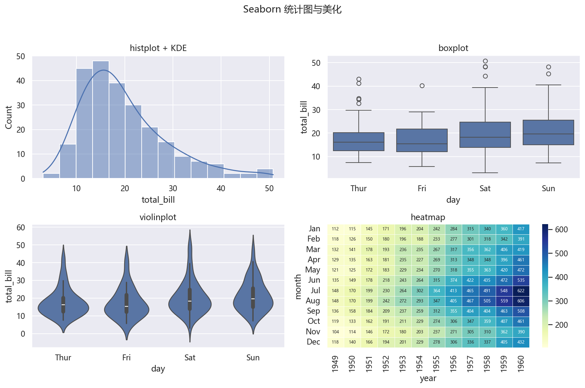

# 03 Seaborn 美化：主题、统计图与分面

> 本节对应原版 5.3 的内容，并增补学习目标、常见误区、思考题与延伸阅读。
> 配套图：`images/seaborn_style.png`（由 `build/make_chap5_figures.py` 生成）。

## 本节目标

- 理解 Seaborn 与 Matplotlib 的关系；
- 会用 `set_theme` / `set_style` 切换全局主题；
- 会用 `histplot`、`kdeplot`、`boxplot`、`violinplot`、`heatmap` 做统计可视化；
- 会用 `FacetGrid` / `pairplot` 做分面与成对图；
- 会与 Matplotlib 的 `subplots` 结合做多子图报告图。

## 先修

- 第 1–2 节的内容；Pandas DataFrame（`load_dataset` 返回的就是 DataFrame）。

## 官方文档/参考入口

- Seaborn 官方教程：[链接](https://seaborn.pydata.org/tutorial.html)
- Seaborn 官方 API：[链接](https://seaborn.pydata.org/api.html)
- Matplotlib 官方图型画廊：[链接](https://matplotlib.org/stable/gallery/index.html)

---

## 3.1 Seaborn 是什么

Seaborn 建立在 Matplotlib 之上，提供：更口语化的函数名、可直接接受 DataFrame 列名、内置统计（如 KDE、分组箱线）、以及一套美观默认主题。

**注意**：`sns.set_theme(style="darkgrid")` 会重置 Matplotlib 的 `rcParams`（包括字体），所以**设置主题后要重新设中文字体**，否则中文标题会变方块。

```python
import seaborn as sns
import matplotlib as mpl
import matplotlib.pyplot as plt

sns.set_theme(style="darkgrid")
mpl.rcParams["font.sans-serif"] = ["Microsoft YaHei", "SimHei", "DejaVu Sans"]
mpl.rcParams["axes.unicode_minus"] = False

tips = sns.load_dataset("tips")
print("tips shape:", tips.shape)
print(tips.head(3).to_string(index=False))
```

```text
tips shape: (244, 7)
 total_bill  tip    sex smoker day   time  size
      16.99 1.01 Female     No Sun Dinner     2
      10.34 1.66   Male     No Sun Dinner     3
      21.01 3.50   Male     No Sun Dinner     3
```

> 常见主题：`darkgrid`（默认）、`whitegrid`、`dark`、`white`、`ticks`。

## 3.2 在子图中使用 Seaborn

```python
import seaborn as sns
import matplotlib.pyplot as plt

tips = sns.load_dataset("tips")
fig, axes = plt.subplots(2, 2, figsize=(10, 8))
sns.lineplot(x="tip", y="total_bill", data=tips, ax=axes[0, 0])
sns.barplot(x="sex", y="total_bill", data=tips, ax=axes[0, 1])
sns.scatterplot(x="total_bill", y="tip", hue="sex", data=tips, ax=axes[1, 0])
sns.histplot(data=tips["total_bill"], ax=axes[1, 1])
plt.tight_layout()
print("subplots ok:", axes.shape)
```

```text
subplots ok: (2, 2)
```

> 把 `data=` 传入 DataFrame，并给 `x`/`y`/`hue` 传列名，Seaborn 自动分组。

## 3.3 常用统计图

### 3.3.1 频率直方图 + 核密度线

```python
import seaborn as sns
import matplotlib.pyplot as plt

tips = sns.load_dataset("tips")
sns.histplot(tips, x="total_bill", kde=True)
plt.show()
```

### 3.3.2 概率密度曲线

```python
sns.kdeplot(tips["total_bill"], fill=True)
plt.show()
```

> 新版 seaborn 用 `fill=True`（旧版 `shade=True` 已弃用）。

### 3.3.3 箱线图与提琴图

```python
import seaborn as sns
import matplotlib.pyplot as plt

tips = sns.load_dataset("tips")
fig, axes = plt.subplots(1, 2, figsize=(9, 3.5))
sns.boxplot(x="day", y="total_bill", data=tips, ax=axes[0])
sns.violinplot(x="day", y="total_bill", data=tips, ax=axes[1])
print("boxes:", len(axes[0].containers), "violins:", len(axes[1].collections))
```

```text
boxes: 1  violins: 4
```

### 3.3.4 热力图

```python
import seaborn as sns
import matplotlib.pyplot as plt

flights = sns.load_dataset("flights")
flights_pivot = flights.pivot_table(index="month", columns="year", values="passengers", observed=False)
sns.heatmap(flights_pivot, annot=True, fmt=".0f")
print("pivot shape:", flights_pivot.shape)
```

```text
pivot shape: (12, 12)
```

### 3.3.5 成对关系图

```python
import seaborn as sns

tips = sns.load_dataset("tips")
g = sns.pairplot(tips, hue="day")
print("pairplot grid shape:", g.axes.shape)
```

```text
pairplot grid shape: (3, 3)
```

## 3.4 分面与多图：`FacetGrid` / `PairGrid`

```python
import seaborn as sns
import matplotlib.pyplot as plt

tips = sns.load_dataset("tips")
g = sns.FacetGrid(tips, col="day", col_wrap=4)
g.map(sns.lineplot, "total_bill", "tip")
g.add_legend()
print("FacetGrid axes:", len(g.axes.flat))
```

```text
FacetGrid axes: 4
```

> `FacetGrid` 按列取值把数据切成多个子图；`col_wrap` 控制每行放几个。`PairGrid` 则用于变量两两成对。



## 常见误区

1. **`set_theme` 之后不重设中文字体**：中文标题变方块。
2. **把旧版 `shade=True` 当新 API**：新版本改为 `fill=True`，旧参数已弃用。
3. **`sns.boxplot` 返回的 `ax` 与 Matplotlib 子图混用 `plt.title`**：多个子图时易错。
4. **`load_dataset` 依赖网络**：若要离线教学，可先用 `pd.DataFrame(...)` 构造样例数据。
5. **给 `heatmap` 的 `fmt="d"` 传浮点数据**：应改用 `fmt=".0f"` 或 `.2f`。

## 思考题

1. `sns.set_theme` 与 `plt.style.use` 有何异同？
2. `boxplot` 与 `violinplot` 分别适合什么场景？
3. 为什么 `FacetGrid` 比手动 `subplots` 循环更适合“按类别分面”？
4. 在 Seaborn 图中能否继续用 Matplotlib 的 `set_xticks`？如何操作？

## 动手练习（详见 lab）

- 用 `tips` 画 `day` 分组的箱线图，并切换 `whitegrid` / `ticks` 主题对比；
- 用 `flights` 透视表画热力图，并自定义 `cmap`；
- 用 `penguins` 数据集做一对 `pairplot`；
- 用 `FacetGrid` 按 `sex` 分面画 `total_bill` 的直方图。

## 延伸阅读

- Seaborn 官方教程：[链接](https://seaborn.pydata.org/tutorial.html)
- Seaborn 官方 API：[链接](https://seaborn.pydata.org/api.html)
- Matplotlib + Seaborn 结合示例：[链接](https://seaborn.pydata.org/examples/index.html)
