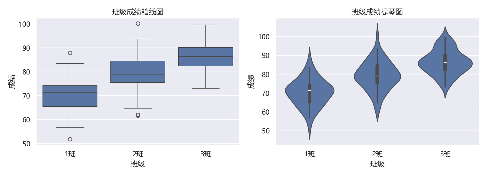
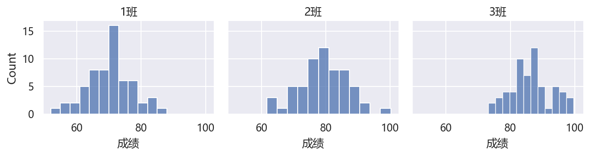

# 03 Seaborn 美化：主题、统计图与分面

> 本节对应原版 5.3 的内容，并增补学习目标、常见误区、思考题与延伸阅读。
> 配套图：`images/seaborn_style.png`（由 `build/make_chap5_figures.py` 生成）。

## 本节目标

- 理解 Seaborn 与 Matplotlib 的关系；
- 会用 `set_theme` / `set_style` 切换全局主题；
- 会用 `histplot`、`kdeplot`、`boxplot`、`violinplot`、`heatmap` 做统计可视化；
- 会用 `FacetGrid` / `pairplot` 做分面与成对图；
- 会与 Matplotlib 的 `subplots` 结合做多子图报告图。

## 先修

- 第 1–2 节的内容；Pandas DataFrame（`load_dataset` 返回的就是 DataFrame）。

## 官方文档/参考入口

- Seaborn 官方教程：[链接](https://seaborn.pydata.org/tutorial.html)
- Seaborn 官方 API：[链接](https://seaborn.pydata.org/api.html)
- Matplotlib 官方图型画廊：[链接](https://matplotlib.org/stable/gallery/index.html)

---

## 3.1 Seaborn 是什么

Seaborn 建立在 Matplotlib 之上，提供：更口语化的函数名、可直接接受 DataFrame 列名、内置统计（如 KDE、分组箱线）、以及一套美观默认主题。

**注意**：`sns.set_theme(style="darkgrid")` 会重置 Matplotlib 的 `rcParams`（包括字体），所以**设置主题后要重新设中文字体**，否则中文标题会变方块。

```python
import numpy as np
import seaborn as sns
import matplotlib as mpl
import matplotlib.pyplot as plt

np.set_printoptions(precision=4, suppress=True)
sns.set_theme(style="darkgrid")
mpl.rcParams["font.sans-serif"] = ["Microsoft YaHei", "SimHei", "DejaVu Sans"]
mpl.rcParams["axes.unicode_minus"] = False

tips = sns.load_dataset("tips")
print("tips shape:", tips.shape)
print(tips.head(3).to_string(index=False))
```

```text
tips shape: (244, 7)
 total_bill  tip    sex smoker day   time  size
      16.99 1.01 Female     No Sun Dinner     2
      10.34 1.66   Male     No Sun Dinner     3
      21.01 3.50   Male     No Sun Dinner     3
```

> 常见主题：`darkgrid`（默认）、`whitegrid`、`dark`、`white`、`ticks`。

## 3.2 在子图中使用 Seaborn

```python
import seaborn as sns
import matplotlib.pyplot as plt

tips = sns.load_dataset("tips")
fig, axes = plt.subplots(2, 2, figsize=(10, 8))
sns.lineplot(x="tip", y="total_bill", data=tips, ax=axes[0, 0])
sns.barplot(x="sex", y="total_bill", data=tips, ax=axes[0, 1])
sns.scatterplot(x="total_bill", y="tip", hue="sex", data=tips, ax=axes[1, 0])
sns.histplot(data=tips["total_bill"], ax=axes[1, 1])
plt.tight_layout()
print("subplots ok:", axes.shape)
```

```text
subplots ok: (2, 2)
```

> 把 `data=` 传入 DataFrame，并给 `x`/`y`/`hue` 传列名，Seaborn 自动分组。

## 3.3 常用统计图

### 3.3.1 频率直方图 + 核密度线

```python
import seaborn as sns
import matplotlib.pyplot as plt

tips = sns.load_dataset("tips")
sns.histplot(tips, x="total_bill", kde=True)
plt.show()
```

### 3.3.2 概率密度曲线

```python
sns.kdeplot(tips["total_bill"], fill=True)
plt.show()
```

> 新版 seaborn 用 `fill=True`（旧版 `shade=True` 已弃用）。

### 3.3.3 箱线图与提琴图

```python
import seaborn as sns
import matplotlib.pyplot as plt

tips = sns.load_dataset("tips")
fig, axes = plt.subplots(1, 2, figsize=(9, 3.5))
sns.boxplot(x="day", y="total_bill", data=tips, ax=axes[0])
sns.violinplot(x="day", y="total_bill", data=tips, ax=axes[1])
print("boxes:", len(axes[0].containers), "violins:", len(axes[1].collections))
```

```text
boxes: 1 violins: 4
```

### 3.3.4 热力图

```python
import seaborn as sns
import matplotlib.pyplot as plt

flights = sns.load_dataset("flights")
flights_pivot = flights.pivot_table(index="month", columns="year", values="passengers", observed=False)
sns.heatmap(flights_pivot, annot=True, fmt=".0f")
print("pivot shape:", flights_pivot.shape)
```

```text
pivot shape: (12, 12)
```

### 3.3.5 成对关系图

```python
import seaborn as sns

tips = sns.load_dataset("tips")
g = sns.pairplot(tips, hue="day")
print("pairplot grid shape:", g.axes.shape)
```

```text
pairplot grid shape: (3, 3)
```

## 3.4 分面与多图：`FacetGrid` / `PairGrid`

```python
import seaborn as sns
import matplotlib.pyplot as plt

tips = sns.load_dataset("tips")
g = sns.FacetGrid(tips, col="day", col_wrap=4)
g.map(sns.lineplot, "total_bill", "tip")
g.add_legend()
print("FacetGrid axes:", len(g.axes.flat))
```

```text
FacetGrid axes: 4
```

> `FacetGrid` 按列取值把数据切成多个子图；`col_wrap` 控制每行放几个。`PairGrid` 则用于变量两两成对。


## 案例卡 2：Seaborn 统计图与分面——用箱线图+提琴图比较班级成绩

### 目标

用一份离线可复现的“班级成绩”DataFrame，画箱线图与提琴图对比三个班的成绩分布，再用 `FacetGrid` 按班级分面画直方图。学会“先构造数据，再用 seaborn 一句画出统计图，最后分面对比”。

### 代码

```python
import numpy as np
import pandas as pd
import matplotlib.pyplot as plt
import seaborn as sns
import os
from matplotlib import rcParams

os.makedirs('images', exist_ok=True)
sns.set_theme(style='darkgrid')
rcParams['font.sans-serif'] = ['Microsoft YaHei', 'SimHei', 'DejaVu Sans']
rcParams['axes.unicode_minus'] = False
np.set_printoptions(precision=4, suppress=True)

rng = np.random.default_rng(7)
n = 60
df = pd.DataFrame({
    '班级': np.repeat(['1班', '2班', '3班'], n),
    '成绩': np.concatenate([
        rng.normal(72, 8, n),
        rng.normal(80, 9, n),
        rng.normal(88, 7, n),
    ]),
})
print('shape:', df.shape)
print('means:', np.round(df.groupby('班级')['成绩'].mean().to_numpy(), 2))

fig, axes = plt.subplots(1, 2, figsize=(11, 4))
sns.boxplot(x='班级', y='成绩', data=df, ax=axes[0])
sns.violinplot(x='班级', y='成绩', data=df, ax=axes[1])
axes[0].set_title('班级成绩箱线图')
axes[1].set_title('班级成绩提琴图')
for ax in axes:
    ax.set_xlabel('班级'); ax.set_ylabel('成绩')
fig.tight_layout()
fig.savefig('images/case2_class_box_violin.png', dpi=150)

g = sns.FacetGrid(df, col='班级', col_wrap=3, height=2.5, aspect=1.2)
g.map(sns.histplot, '成绩', bins=12)
g.set_titles('{col_name}')
g.savefig('images/case2_class_facet.png', dpi=150)
print('facet axes:', len(g.axes.flat))
print('done')
```

### 运行结果（已运行核验）

```text
shape: (180, 2)
means: [70.33 79.25 86.33]
facet axes: 3
done
```

### 讲解

**一句话解释**：`boxplot` 和 `violinplot` 都是“把一组数画成一个形状”来比大小，前者用箱子+须看中位数和异常，后者用“胖瘦”看密度；`FacetGrid` 则是“按班级切开，横着排三个小图”。

- `np.repeat(['1班','2班','3班'], n)` 生成 3 个班、每班 `n=60` 条的“班级”列；三个 `rng.normal(...)` 分别制造不同均值的成绩列，所以三个班天然可分。
- `df.shape` 是 `(180, 2)`：180 行 = 60×3，2 列 = 班级、成绩。
- `df.groupby('班级')['成绩'].mean()` 按班求平均，`to_numpy()` 取成数组后 `np.round(..., 2)` 保证输出两位小数稳定。
- `sns.boxplot(x='班级', y='成绩', data=df, ax=axes[0])`：把 `data` 交给 seaborn，它自己按 `x` 分组，画出 3 个箱子。
- `sns.violinplot(...)` 画提琴图，轮廓越宽表示该分数段的人数越多，能看出“哪个班更集中”。
- `g = sns.FacetGrid(df, col='班级', col_wrap=3)` 按“班级”分成 3 个子图；`g.map(sns.histplot, '成绩', bins=12)` 往每个子图画成绩直方图。

### 主要用法 / API

| 需求 | 写法 |
| ---- | ---- |
| 分组箱线图 | `sns.boxplot(x='班级', y='成绩', data=df, ax=axes[0])` |
| 分组提琴图 | `sns.violinplot(x='班级', y='成绩', data=df, ax=axes[1])` |
| 分面直方图 | `g = sns.FacetGrid(df, col='班级', col_wrap=3); g.map(sns.histplot, '成绩', bins=12)` |
| 设置分面标题 | `g.set_titles('{col_name}')` |
| 保存分面图 | `g.savefig('images/x.png', dpi=150)` |
| 主题 | `sns.set_theme(style='darkgrid')`（之后重设字体） |

### 常见错误

- `set_theme` 之后不重设中文字体，中文标题变方块；
- 把 `data=` 的 DataFrame 与 `x/y` 列名写错，或忘了 `data=` 导致按数组而非按列分组；
- 用旧版 `shade=True`，新版应写 `fill=True`；
- `FacetGrid` 用 `col=` 而不是 `hue=` 时，想加的图例可能不出现，需调用 `g.add_legend()`（本例用 `set_titles`）。

### 拓展 / 跟练

1. 把 `boxplot` 换成 `sns.boxplot(..., hue='...')`，再加一个“性别”列观察副分组；
2. 用 `sns.kdeplot(data=df, x='成绩', hue='班级')` 画三条密度曲线叠加；
3. 给分面图加 `g.savefig(...)` 并调整 `height/aspect`；
4. 把数据换成真实 `tips` 数据集，比较 `day` 分组的箱线/提琴图。





## 常见误区

1. **`set_theme` 之后不重设中文字体**：中文标题变方块。
2. **把旧版 `shade=True` 当新 API**：新版本改为 `fill=True`，旧参数已弃用。
3. **`sns.boxplot` 返回的 `ax` 与 Matplotlib 子图混用 `plt.title`**：多个子图时易错。
4. **`load_dataset` 依赖网络**：若要离线教学，可先用 `pd.DataFrame(...)` 构造样例数据。
5. **给 `heatmap` 的 `fmt="d"` 传浮点数据**：应改用 `fmt=".0f"` 或 `.2f`。

## 思考题

1. `sns.set_theme` 与 `plt.style.use` 有何异同？
2. `boxplot` 与 `violinplot` 分别适合什么场景？
3. 为什么 `FacetGrid` 比手动 `subplots` 循环更适合“按类别分面”？
4. 在 Seaborn 图中能否继续用 Matplotlib 的 `set_xticks`？如何操作？

## 动手练习（详见 lab）

- 用 `tips` 画 `day` 分组的箱线图，并切换 `whitegrid` / `ticks` 主题对比；
- 用 `flights` 透视表画热力图，并自定义 `cmap`；
- 用 `penguins` 数据集做一对 `pairplot`；
- 用 `FacetGrid` 按 `sex` 分面画 `total_bill` 的直方图。

## 延伸阅读

- Seaborn 官方教程：[链接](https://seaborn.pydata.org/tutorial.html)
- Seaborn 官方 API：[链接](https://seaborn.pydata.org/api.html)
- Matplotlib + Seaborn 结合示例：[链接](https://seaborn.pydata.org/examples/index.html)
