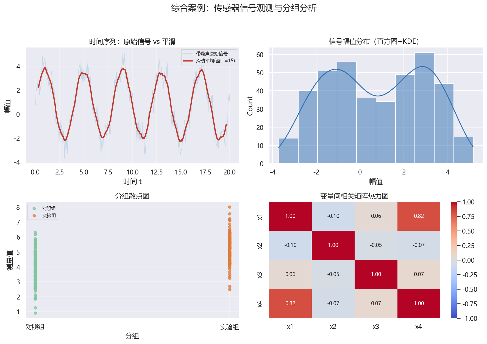

# 04 综合案例：传感器信号分析与分组报告图

> 本章新增综合案例，用于把 01–03 的知识串起来：**基础图表 + 多子图/排版 + Seaborn 统计图**。
> 所有代码均可在 matplotlib ≥ 3.8、seaborn ≥ 0.13 环境运行；配图由 `make_chap5_figures.py` 生成。

## 案例背景

假设你拿到一段“传感器信号”采样（含噪声）与一批分组测量值，需要输出一张**数据分析报告图**：

1. 左上：时间序列折线图，把原始信号与滑动平均后的平滑信号叠在一起；
2. 右上：信号幅值直方图 + 核密度估计（Seaborn）；
3. 左下：对照组 / 实验组的分组散点图；
4. 右下：几个变量之间的相关矩阵热力图。

这正是第 1 章的“数据能画出来” + 第 2 章的“多子图排版” + 第 3 章“Seaborn 统计图”的联合应用。

## 步骤 1：生成合成信号并平滑

```python
import numpy as np
import pandas as pd
import matplotlib.pyplot as plt
import seaborn as sns

rng = np.random.default_rng(2025)   # 固定种子，保证可复现
n = 400
t = np.linspace(0, 20, n)
signal = 3 * np.sin(2 * np.pi * 0.25 * t) + 0.6 * np.cos(2 * np.pi * 1.1 * t) + 0.8
y = signal + rng.normal(0, 0.5, n)
smoothed = pd.Series(y).rolling(window=15, center=True).mean().to_numpy()

print("信号长度 n =", n)
print("原始信号  均值 =", round(float(y.mean()), 3), " 标准差 =", round(float(y.std()), 3))
print("平滑信号  均值 =", round(float(np.nanmean(smoothed)), 3))
print("平滑信号 前 5 个 =", np.round(smoothed[:5], 3))
```

```text
信号长度 n = 400
原始信号  均值 = 0.795  标准差 = 2.244
平滑信号  均值 = 0.797
平滑信号 前 5 个 = [nan nan nan nan nan]
```

> `rolling(window=15, center=True)` 做中心化滑动平均；两端窗口不满时为 NaN，属正常现象。

## 步骤 2：生成分组数据与相关矩阵

```python
rng2 = np.random.default_rng(1)
group = rng2.choice(["对照组", "实验组"], size=250, p=[0.5, 0.5])
val = np.where(group == "实验组", rng2.normal(5.2, 1.1, 250), rng2.normal(4.0, 1.0, 250))

df_corr = pd.DataFrame({
    "x1": rng2.normal(0, 1, 300),
    "x2": rng2.normal(0, 1, 300),
    "x3": rng2.normal(0, 1, 300),
})
df_corr["x4"] = 0.8 * df_corr["x1"] + rng2.normal(0, 0.6, 300)
corr = df_corr.corr()

print("对照组均值 =", round(float(val[group == "对照组"].mean()), 3))
print("实验组均值 =", round(float(val[group == "实验组"].mean()), 3))
print("相关系数 x1-x4 =", round(float(corr.loc["x1", "x4"]), 3))
print("相关系数 x1-x2 =", round(float(corr.loc["x1", "x2"]), 3))
print()
print(corr.round(2).to_string())
```

```text
对照组均值 = 3.874
实验组均值 = 5.274
相关系数 x1-x4 = 0.819
相关系数 x1-x2 = -0.097

      x1    x2    x3    x4
x1  1.00 -0.10  0.06  0.82
x2 -0.10  1.00 -0.05 -0.07
x3  0.06 -0.05  1.00  0.07
x4  0.82 -0.07  0.07  1.00
```

> 因为构造时 `x4` 由 `x1` 主导，所以 `x1–x4` 相关系数约 0.8，热力图一眼可辨。

## 步骤 3：绘制 2×2 报告图

> 本步依赖步骤 1/2 中定义的 `t`、`y`、`smoothed`、`group`、`val`、`corr`，请按顺序运行。

```python
# 中文字体（注意：set_theme 会覆盖，这里放在绘图前重新设置）
import matplotlib as mpl
mpl.rcParams["font.sans-serif"] = ["Microsoft YaHei", "SimHei", "DejaVu Sans"]
mpl.rcParams["axes.unicode_minus"] = False

fig, axes = plt.subplots(2, 2, figsize=(12, 8.5))
fig.suptitle("综合案例：传感器信号观测与分组分析", fontsize=15)

axes[0, 0].plot(t, y, color="#c8d8e8", lw=1, label="原始信号")
axes[0, 0].plot(t, smoothed, color="#c0392b", lw=2.2, label="滑动平均(窗口=15)")
axes[0, 0].set_title("时间序列：原始信号 vs 平滑")
axes[0, 0].set_xlabel("时间 t"); axes[0, 0].set_ylabel("幅值")
axes[0, 0].legend(fontsize=8); axes[0, 0].grid(alpha=0.3)

sns.histplot(x=y, kde=True, color="#2f6fb3", ax=axes[0, 1])
axes[0, 1].set_title("信号幅值分布")
axes[0, 1].set_xlabel("幅值")

axes[1, 0].scatter(group[group == "对照组"], val[group == "对照组"],
                   color="#7fc59f", s=22, alpha=0.75, label="对照组")
axes[1, 0].scatter(group[group == "实验组"], val[group == "实验组"],
                   color="#e07b39", s=22, alpha=0.75, label="实验组")
axes[1, 0].set_title("分组散点图")
axes[1, 0].set_xlabel("分组"); axes[1, 0].set_ylabel("测量值")
axes[1, 0].legend(fontsize=8); axes[1, 0].grid(alpha=0.3)

sns.heatmap(corr, annot=True, fmt=".2f", cmap="coolwarm", vmin=-1, vmax=1,
            ax=axes[1, 1], annot_kws={"fontsize": 9})
axes[1, 1].set_title("变量间相关矩阵热力图")

fig.tight_layout(rect=[0, 0, 1, 0.95])
fig.savefig("case_study.png", dpi=150)
print("已保存 case_study.png")
```

输出：`已保存 case_study.png`，并得到下图。



## 分析与延伸

- **左上**：原始信号噪声明显，滑动平均后波形更平滑——直观体会“平滑窗口”对信噪比的影响；
- **右上**：信号幅值近似正态分布（叠加噪声的多频正弦叠加），KDE 与直方图吻合；
- **左下**：实验组测量值整体高于对照组，散点图可直接看出两组的中心差异；
- **右下**：`x1` 与 `x4` 相关系数约 0.8，热力图让“共线性”一目了然。

### 拓展任务

1. 把平滑窗口从 15 改为 5 / 31，比较左上图平滑程度与失真；
2. 用 `sns.kdeplot` 分开画对照/实验两组的密度曲线，观察重叠区域；
3. 把相关矩阵改用 `sns.clustermap` 展示变量聚类；
4. 将报告图导出为 PDF，并比较不同 `dpi` 的文件大小。

## 延伸阅读

- Matplotlib 多子图：[链接](https://matplotlib.org/stable/tutorials/intermediate/subplots.html)
- Seaborn 分布图：[链接](https://seaborn.pydata.org/generated/seaborn.histplot.html)
- Pandas `rolling`：[链接](https://pandas.pydata.org/docs/reference/api/pandas.DataFrame.rolling.html)
