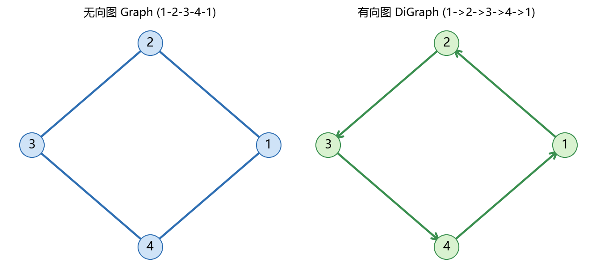
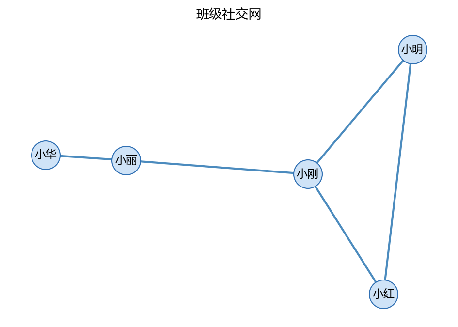

# 01 创建图：无向图、有向图、属性与生成器

> 本节对应原版 6.1 的内容，并增补学习目标、常见误区、思考题与延伸阅读。
> 配套图：images/graph_basic.png（由 build/make_chap6_figures.py 生成）。

## 本节目标

- 理解 NetworkX 中图对象（Graph / DiGraph）的基本概念；
- 会创建空图并添加节点、边；
- 会读取 nodes / edges / degree，访问邻居、前驱、后继与入度/出度；
- 会给节点和边添加属性（权重、标签）；
- 会用常用图生成器（path_graph、cycle_graph、complete_graph、grid_2d_graph、karate_club_graph 等）快速造图；
- 会用 nx.to_numpy_array 把图转成邻接矩阵，供 NumPy 使用。

## 先修

- Python 列表、元组、字典、for 循环；了解函数与类的基本概念。

---

## 1.1 NetworkX 简介与安装

NetworkX 是 Python 生态中创建、操作、分析复杂网络的库。它是一个纯 Python 实现（底层可结合 NumPy/SciPy），接口直观，覆盖图论与网络科学的常用算法。

安装（建议 Python 3.10+）：

~~~bash
pip install networkx
~~~

导入并查看版本：

~~~python
import networkx as nx
print(nx.__version__)
~~~

~~~text
3.3
~~~

> 说明：本章代码在 NetworkX 3.x 下验证；不同小版本的个别函数参数可能变化，遇到不熟悉的接口请以官方文档为准。

---

## 1.2 创建无向图（Graph）

无向图的边没有方向，用 nx.Graph 创建。

~~~python
import networkx as nx

# 创建一个空的无向图
G = nx.Graph()

# 添加节点
G.add_node(1)
G.add_nodes_from([2, 3, 4])

# 添加边
G.add_edge(1, 2)
G.add_edges_from([(2, 3), (3, 4), (4, 1)])

# 查看节点与边
print(G.nodes())
print(G.edges())
~~~

~~~text
[1, 2, 3, 4]
[(1, 2), (1, 4), (2, 3), (3, 4)]
~~~

说明：add_node 加单个节点；add_nodes_from 加一个可迭代集合（列表、元组、range）；add_edge 加单条边；add_edges_from 加多条边。G.nodes() 与 G.edges() 返回的是视图对象，可转成 list / tuple 使用。

### 1.2.1 度（Degree）与邻居

无向图中，节点的度是与它相连的边数。

~~~python
print(G.degree())                 # 所有节点的度
for node, degree in G.degree():
    print(f"Node {node} has degree {degree}")
print(list(G.neighbors(1)))       # 节点 1 的所有邻居
~~~

~~~text
[(1, 2), (2, 2), (3, 2), (4, 2)]
Node 1 has degree 2
Node 2 has degree 2
Node 3 has degree 2
Node 4 has degree 2
[2, 4]
~~~

### 1.2.2 连通性与基本遍历

~~~python
print(nx.is_connected(G))                        # 是否连通
print(list(nx.dfs_preorder_nodes(G, source=1)))  # 深度优先遍历顺序
print(list(nx.bfs_edges(G, source=1)))           # 广度优先遍历的边
~~~

~~~text
True
[1, 2, 3, 4]
[(1, 2), (1, 4), (2, 3)]
~~~

### 1.2.3 绘图

~~~~python
import matplotlib.pyplot as plt
# 使用 matplotlib 绘制图
nx.draw(G, with_labels=True, font_weight="bold")
plt.show()
~~~~

> 运行后得到一张带标签的环形布局图。本章的 images/graph_basic.png 由脚本生成，左图为无向图、右图为有向图。



---

## 1.3 创建有向图（DiGraph）

有向图的边有方向，用 nx.DiGraph 创建。

~~~python
import networkx as nx

DG = nx.DiGraph()
DG.add_node(1)
DG.add_nodes_from([2, 3, 4])
DG.add_edge(1, 2)
DG.add_edges_from([(2, 3), (3, 4), (4, 1)])

print(DG.nodes())
print(DG.edges())
~~~

~~~text
[1, 2, 3, 4]
[(1, 2), (2, 3), (3, 4), (4, 1)]
~~~

### 1.3.1 入度、出度、前驱与后继

~~~python
print(DG.in_degree())
print(DG.out_degree())
for node in DG.nodes():
    print("Node", node, "in-degree", DG.in_degree(node), "out-degree", DG.out_degree(node))
print(list(DG.predecessors(2)))   # 指向 2 的节点
print(list(DG.successors(2)))     # 2 指向的节点
~~~

~~~text
[(1, 1), (2, 1), (3, 1), (4, 1)]
[(1, 1), (2, 1), (3, 1), (4, 1)]
Node 1 in-degree 1 out-degree 1
Node 2 in-degree 1 out-degree 1
Node 3 in-degree 1 out-degree 1
Node 4 in-degree 1 out-degree 1
[1]
[3]
~~~

> 注意：原始资料里用 zip(nodes, in_degree, out_degree) 的写法会把元组拆错（in_degree 返回的是 (节点, 度数) 对）。建议像上面这样用 DG.in_degree(node) 单独取度数，或用 dict(DG.in_degree())。

### 1.3.2 强连通与弱连通

有向图的连通性要区分：

- 强连通：任意两点都互相可达；
- 弱连通：忽略方向后，任意两点可达。

~~~python
print(nx.is_strongly_connected(DG))
print(nx.is_weakly_connected(DG))
~~~

~~~text
True
True
~~~

### 1.3.3 有向图遍历

~~~python
print(list(nx.dfs_preorder_nodes(DG, source=1)))
print(list(nx.bfs_edges(DG, source=1)))
~~~

~~~text
[1, 2, 3, 4]
[(1, 2), (2, 3), (3, 4)]
~~~

绘图时 NetworkX 会根据有向性画箭头：

~~~python
import matplotlib.pyplot as plt
nx.draw(DG, with_labels=True, font_weight="bold", arrowstyle="->", arrowsize=20)
plt.show()
~~~

---

## 1.4 节点与边属性、加权图

### 1.4.1 权重（weight）

~~~python
G = nx.Graph()
G.add_weighted_edges_from([("A", "B", 10), ("A", "C", 6), ("B", "C", 5)])
print(list(G.edges(data=True)))
print(G["A"]["B"])                    # 取出 A-B 边的属性字典
print(G.degree())                     # 普通度
print(G.degree(weight="weight"))      # 加权度（点强度）
~~~

~~~text
[('A', 'B', {'weight': 10}), ('A', 'C', {'weight': 6}), ('B', 'C', {'weight': 5})]
{'weight': 10}
[('A', 2), ('B', 2), ('C', 2)]
[('A', 16), ('B', 15), ('C', 11)]
~~~

> 点强度（weighted degree）是节点所有相连边的权重和：A 连 B(10)、C(6)，所以是 16。加权网络上“重要节点”的衡量常从点强度出发。

### 1.4.2 节点属性

~~~python
G.add_node("A", role="hub", color="red")
print(list(G.nodes(data=True)))
~~~

~~~text
[('A', {'role': 'hub', 'color': 'red'}), ('B', {}), ('C', {})]
~~~

节点/边上可以挂任意字典属性；用 G.nodes(data=True) 与 G.edges(data=True) 一起查看。

---

## 1.5 常用图生成器

NetworkX 自带许多“造图”模板，适合课堂演示与随机网络实验。

~~~python
print(list(nx.path_graph(6).edges()))
print(list(nx.cycle_graph(5).edges()))
print(list(nx.complete_graph(4).edges()))
print(list(nx.star_graph(5).edges()))
print(list(nx.grid_2d_graph(2, 3).nodes()))
print(list(nx.grid_2d_graph(2, 3).edges()))
K = nx.karate_club_graph()
print("karate_club:", K.number_of_nodes(), K.number_of_edges())
~~~

~~~text
[(0, 1), (1, 2), (2, 3), (3, 4), (4, 5)]
[(0, 1), (0, 4), (1, 2), (2, 3), (3, 4)]
[(0, 1), (0, 2), (0, 3), (1, 2), (1, 3), (2, 3)]
[(0, 1), (0, 2), (0, 3), (0, 4), (0, 5)]
[(0, 0), (0, 1), (0, 2), (1, 0), (1, 1), (1, 2)]
[((0, 0), (1, 0)), ((0, 0), (0, 1)), ((0, 1), (1, 1)), ((0, 1), (0, 2)), ((0, 2), (1, 2)), ((1, 0), (1, 1)), ((1, 1), (1, 2))]
karate_club: 34 78
~~~

随机网络生成器通常带 seed 参数，保证结果可复现：

~~~python
er = nx.erdos_renyi_graph(10, 0.3, seed=42)
ws = nx.watts_strogatz_graph(10, 4, 0.1, seed=42)
ba = nx.barabasi_albert_graph(10, 2, seed=42)
print("erdos_renyi:", er.number_of_nodes(), er.number_of_edges())
print("watts_strogatz:", ws.number_of_nodes(), ws.number_of_edges())
print("barabasi_albert:", ba.number_of_nodes(), ba.number_of_edges())
~~~

~~~text
erdos_renyi: 10 17
watts_strogatz: 10 20
barabasi_albert: 10 16
~~~

---

## 1.6 邻接矩阵（与 NumPy 对接）

用 nx.to_numpy_array 可把图转成邻接矩阵，便于交给 NumPy/SciPy 做数值计算。

~~~python
import numpy as np
G = nx.Graph()
G.add_edges_from([(1, 2), (2, 3), (3, 1), (3, 4)])
A = nx.to_numpy_array(G)
print(A)
~~~

~~~text
[[0. 1. 1. 0.]
 [1. 0. 1. 0.]
 [1. 1. 0. 1.]
 [0. 0. 1. 0.]]
~~~

有向图会得到非对称矩阵：

~~~python
D = nx.DiGraph(); D.add_edges_from([(1, 2), (2, 3), (3, 1), (2, 4)])
print(nx.to_numpy_array(D))
~~~

~~~text
[[0. 1. 0. 0.]
 [0. 0. 1. 1.]
 [1. 0. 0. 0.]
 [0. 0. 0. 0.]]
~~~


## 案例卡 1：用 nx.Graph 建“班级社交网”——节点/边/属性/度

### 目标

把 5 位同学当成“节点”，把“一起学习/讨论”当成“边”，用 `nx.Graph` 建一张班级社交网。你会顺带掌握：给节点挂属性、给边加权重（每周讨论次数）、看每个节点的**度**（直接朋友数）与**点强度**（加权度=朋友往来总次数）。

### 代码

```python
import networkx as nx
import matplotlib.pyplot as plt
import numpy as np
import os

plt.rcParams['font.sans-serif'] = ['Microsoft YaHei', 'SimHei', 'DejaVu Sans']
plt.rcParams['axes.unicode_minus'] = False
np.set_printoptions(precision=4, suppress=True)

# 1) 建空图
G = nx.Graph()

# 2) 一次加多个节点，并给每个节点挂属性(班级/兴趣)
students = [
    ('小明', {'cls': '一班', 'interest': '数学'}),
    ('小红', {'cls': '一班', 'interest': '编程'}),
    ('小刚', {'cls': '一班', 'interest': '物理'}),
    ('小丽', {'cls': '二班', 'interest': '语文'}),
    ('小华', {'cls': '二班', 'interest': '美术'}),
]
G.add_nodes_from(students)

# 3) 加边，weight 表示每周一起讨论的次数
G.add_weighted_edges_from([
    ('小明', '小红', 3),
    ('小明', '小刚', 2),
    ('小红', '小刚', 4),
    ('小刚', '小丽', 1),
    ('小丽', '小华', 5),
])

print('节点数:', G.number_of_nodes(), '  边数:', G.number_of_edges())
print('节点及属性:')
for n, data in G.nodes(data=True):
    print(' ', n, data)
print('边及权重:')
for u, v, w in G.edges(data='weight'):
    print(f'  {u} -- {v} : {w}')

# 4) 度 与 点强度(加权度)
print('每个节点的度(降序):', sorted(dict(G.degree()).items(), key=lambda x: (-x[1], x[0])))
print('每个节点的加权度/点强度(降序):',
      sorted(dict(G.degree(weight='weight')).items(), key=lambda x: (-x[1], x[0])))

# 5) 画出来(jupyter 里可直接显示；脚本环境保存到 images/)
os.makedirs('images', exist_ok=True)
pos = nx.spring_layout(G, seed=42, k=0.8)
plt.figure(figsize=(6.4, 4.6))
nx.draw_networkx_nodes(G, pos, node_size=800, node_color='#cfe3f7', edgecolors='#2f6fb3')
nx.draw_networkx_edges(G, pos, width=2.0, edge_color='#4b8bbe')
nx.draw_networkx_labels(G, pos, font_size=11, font_family='Microsoft YaHei')
plt.title('班级社交网')
plt.axis('off')
plt.tight_layout()
plt.savefig('images/case1_class_network.png', dpi=150)
print('已保存 images/case1_class_network.png')
plt.close()
```

### 运行结果(已运行核验)

```text
节点数: 5   边数: 5
节点及属性:
  小明 {'cls': '一班', 'interest': '数学'}
  小红 {'cls': '一班', 'interest': '编程'}
  小刚 {'cls': '一班', 'interest': '物理'}
  小丽 {'cls': '二班', 'interest': '语文'}
  小华 {'cls': '二班', 'interest': '美术'}
边及权重:
  小明 -- 小红 : 3
  小明 -- 小刚 : 2
  小红 -- 小刚 : 4
  小刚 -- 小丽 : 1
  小丽 -- 小华 : 5
每个节点的度(降序): [('小刚', 3), ('小丽', 2), ('小明', 2), ('小红', 2), ('小华', 1)]
每个节点的加权度/点强度(降序): [('小刚', 7), ('小红', 7), ('小丽', 6), ('小华', 5), ('小明', 5)]
已保存 images/case1_class_network.png
```

### 讲解

**一句话人话**：先画一张“人=点、一起学习=连线”的网；每条线还能记一个数（每周讨论几次），这样不但知道“谁朋友多”，还知道“谁和朋友来往最勤”。

1. `G = nx.Graph()` 建一张**无向图**：朋友关系不分方向，A 和 B 是朋友就等于 B 和 A 是朋友。
2. `G.add_nodes_from(students)` 里每个元素是 `(节点名, 属性字典)`，所以一次就能把“班级、兴趣”挂在节点上；查看时用 `G.nodes(data=True)` 会得到 `(节点, 属性字典)` 对。
3. `G.add_weighted_edges_from(...)` 的每个元素是 `(起点, 终点, 权重)`；`weight` 是 NetworkX 约定好的边属性名，后面 `degree(weight='weight')` 才能自动读到它。
4. `G.degree()` 是**直接邻居数**：小明连小红、小刚，所以是 2；小刚连小明、小红、小丽，是 3。
5. `G.degree(weight='weight')` 是把“每条边的权重相加”，等于**点强度**：小刚=2+4+1=7，小红=3+4=7，小丽=1+5=6，小华=5，小明=3+2=5。所以小刚虽然度最高，但“来往总次数”第一的是小刚和小红并列。
6. `nx.spring_layout(G, seed=42)` 给节点随机选初始位置，固定 `seed=42` 才能每次画出同一张布局；保存到 `images/` 前先 `os.makedirs('images', exist_ok=True)`，避免目录不存在报错。



### 主要用法 / API

| 需求 | 写法 | 说明 |
| ---- | ---- | ---- |
| 建空无向图 | `nx.Graph()` | 边无方向 |
| 加单个/多个节点 | `add_node` / `add_nodes_from` | 可带属性 |
| 加单条/多条边 | `add_edge` / `add_edges_from` | 无向图自动补反向 |
| 加带权边 | `add_weighted_edges_from([(u, v, w)])` | 属性名 `weight` |
| 查看节点/边属性 | `G.nodes(data=True)` / `G.edges(data=True)` | 得到 `(节点, dict)` / `(u, v, dict)` |
| 度 | `G.degree()` / `G.degree(node)` | 直接邻居数 |
| 点强度 | `G.degree(weight='weight')` | 加权度 |
| 画图 | `nx.draw_networkx_*` + `plt.savefig` | 需配中文字体 |

### 常见错误

1. 以为 `add_edge(u, v, 10)` 的第三个参数是权重 → 错误；正解是 `add_edge(u, v, weight=10)` 或 `add_weighted_edges_from`。
2. 忘记 `G.degree(weight='weight')` 的 `weight` 参数名要跟边属性名一致；如果边属性叫 `time`，就要写 `weight='time'`。
3. 用 `plt.show()` 在无界面环境会卡住/无反应 → 脚本/作业里用 `plt.savefig(...)`；`spring_layout` 不传 `seed` 每次布局都不同，作业截图容易对不上。
4. `sorted(G.degree())` 返回的是按节点名排列的 `(节点, 度)` 列表；想按度数排序要 `key=lambda x: (-x[1], x[0])`。

### 拓展 / 跟练

1. 新加一位同学 `小强` 与 `小华` 连一条权重 2 的边，再打印度与点强度，看谁变成“朋友最多”。
2. 把每条边的权重改成“共同爱好数”，分别打印度与点强度，观察两者排名是否一致。
3. 用 `nx.to_numpy_array(G, nodelist=sorted(G.nodes()), weight='weight')` 得到邻接矩阵，验证它是对称矩阵。
4. 给每个节点补一个 `age` 属性，然后筛选出“一班”的学生（答案：`[n for n, d in G.nodes(data=True) if d.get('cls')=='一班']`）。

---

## 常见误区

1. **把 nodes/edges 当普通列表**：它们是视图对象，直接判断成员/转 list 均可，但不要对它做破坏性修改（例如 G.nodes() 不能赋值）。
2. **在有向图上误用 neighbors**：有向图有前驱与后继两个方向，要用 predecessors / successors，neighbors 在有向图中返回后继节点。
3. **误用 zip(nodes, in_degree, out_degree)**：in_degree 返回的是 (节点, 度数) 对，直接解包会把元组整体当成“度数”。建议用 DG.in_degree(node) 或 dict(DG.in_degree())。
4. **忘记给加权边指定 weight 关键字**：add_weighted_edges_from 默认用 weight 作为属性名；若用 add_edge 加权重需写成 add_edge(u, v, weight=w)。
5. **随机图不设 seed**：结果每次不同，课堂/作业演示请设 seed（如 seed=42）。
6. **把图当作“可哈希容器”直接比较**：两个结构相同的图不一定相等，判断是否同构要用 nx.is_isomorphic。

## 思考题

1. 无向图 G.nodes() 返回的节点顺序是添加顺序还是自动排序？用循环访问时是否稳定？
2. 为什么强连通要求“互相可达”？给出一个弱连通但不强连通的有向图例子。
3. nx.Graph(G) 与 nx.DiGraph(G) 把一个无向图转成有向图时，边会变成几条？

## 动手练习（详见 lab）

- 创建一个 6 节点的无向环图（cycle_graph），打印每条边与每个节点的度；
- 创建一个包含 5 个节点的星形图（star_graph），找出中心节点并计算其度；
- 给一个加权图添加节点属性，打印 nodes(data=True) 与 edges(data=True)；
- 用 karate_club_graph 生成图并转为邻接矩阵，验证矩阵是 34x34 且对称。

## 延伸阅读

- NetworkX 官方教程（图基础）：[链接](https://networkx.org/documentation/stable/tutorial.html)
- NetworkX 官方图类型参考：[链接](https://networkx.org/documentation/stable/reference/classes/index.html)
- NetworkX 官方生成器列表：[链接](https://networkx.org/documentation/stable/reference/generators.html)
