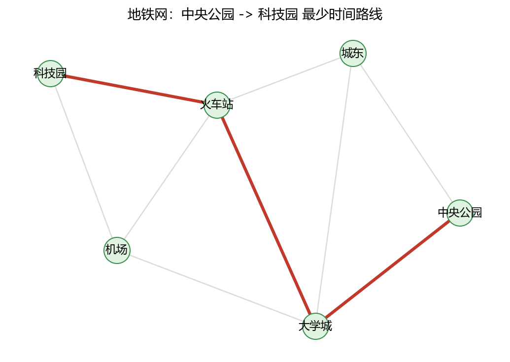

# 03 求解图的基本问题：遍历、最小生成树与最短路径

> 本节对应原版 6.3 的内容。围绕三类经典问题：遍历（DFS/BFS）、最小生成树、最短路径。

## 本节目标

- 会用 DFS / BFS 遍历图并得到节点访问顺序；
- 会用 minimum_spanning_tree 求解最小生成树并计算总权重；
- 会区分并使用 Dijkstra、Bellman-Ford、Floyd-Warshall 求解最短路径；
- 能根据图的特性（有权/无权、有负权/无负权、单源/全源）选择合适的算法。

## 先修

- 第 01 节：创建图、访问节点边；第 02 节：连通性概念。

---

## 3.1 遍历问题（DFS / BFS）

### 3.1.1 深度优先遍历（DFS）

~~~python
import networkx as nx

G = nx.Graph()
edges = [(1, 2), (1, 3), (2, 4), (3, 4), (4, 5)]
G.add_edges_from(edges)

start_node = 1
visited = list(nx.dfs_preorder_nodes(G, start_node))
print("DFS 遍历顺序:", visited)
print("DFS 边:", list(nx.dfs_edges(G, start_node)))
~~~

~~~text
DFS 遍历顺序: [1, 2, 4, 3, 5]
DFS 边: [(1, 2), (2, 4), (4, 3), (4, 5)]
~~~

### 3.1.2 广度优先遍历（BFS）

bfs_edges 返回按广度扩展的边，可由此构建节点访问顺序：

~~~python
print("BFS 边:", list(nx.bfs_edges(G, start_node)))
print("BFS 树边:", list(nx.bfs_tree(G, start_node).edges()))

# 用集合去重 + 列表保持顺序
seen = set()
bfs_order = []
for u, v in nx.bfs_edges(G, start_node):
    if u not in seen:
        seen.add(u); bfs_order.append(u)
    if v not in seen:
        seen.add(v); bfs_order.append(v)
print("BFS 节点顺序:", bfs_order)
~~~

~~~text
BFS 边: [(1, 2), (1, 3), (2, 4), (4, 5)]
BFS 树边: [(1, 2), (1, 3), (2, 4), (4, 5)]
BFS 节点顺序: [1, 2, 3, 4, 5]
~~~

> DFS 优先“一条路走到黑”，BFS 按“层”逐层扩散。在无权图上，BFS 得到的路径就是最短路径（边数最少）。

---

## 3.2 最小生成树（Minimum Spanning Tree, MST）

### 3.2.1 问题

给定一个加权无向连通图，找到一棵边的总权重最小的生成树（连接所有节点且无环）。NetworkX 提供 minimum_spanning_tree，默认用 Kruskal 算法（适合稀疏图）；稠密图可考虑 Prim 思想，但官方没有直接的 Prim 选项，多数场景 Kruskal 已足够。

~~~python
G = nx.Graph()
edges = [
    ("A", "B", 10),
    ("A", "C", 6),
    ("A", "D", 5),
    ("B", "C", 5),
    ("B", "D", 15),
    ("B", "E", 4),
    ("C", "D", 15),
    ("C", "F", 12),
    ("D", "E", 20),
    ("E", "F", 9),
]
G.add_weighted_edges_from(edges)

T = nx.minimum_spanning_tree(G)

print("MST 边：")
for u, v, weight in T.edges(data="weight"):
    print(u, "--", v, "weighted", weight)
print("MST 总权重:", sum(w for _, _, w in T.edges(data="weight")))
print("MST 边数:", T.number_of_edges())
~~~

~~~text
MST 边：
A -- D weighted 5
A -- C weighted 6
B -- E weighted 4
B -- C weighted 5
E -- F weighted 9
MST 总权重: 29
MST 边数: 5
~~~

> 选择边 {B-E(4), A-D(5), B-C(5), A-C(6), E-F(9)}，总权重 29；连通 A、B、C、D、E、F 且无环。

---

## 3.3 最短路径问题

### 3.3.1 Dijkstra 算法（非负权、单源）

适用于边权非负的图。用 dijkstra_path 求路径，dijkstra_path_length 求长度。

~~~python
DG = nx.DiGraph()
DG.add_edge("A", "B", weight=3)
DG.add_edge("A", "C", weight=2)
DG.add_edge("B", "C", weight=1)
DG.add_edge("B", "D", weight=4)
DG.add_edge("C", "D", weight=2)
DG.add_edge("C", "E", weight=1)
DG.add_edge("D", "E", weight=3)

shortest_path = nx.dijkstra_path(DG, "A", "E", weight="weight")
shortest_length = nx.dijkstra_path_length(DG, "A", "E", weight="weight")
print("最短路径:", shortest_path)
print("最短路径长度:", shortest_length)

# 从 A 到所有点的最短距离
print("单源最短路径长度:", nx.single_source_dijkstra_path_length(DG, "A", weight="weight"))
~~~

~~~text
最短路径: ['A', 'C', 'E']
最短路径长度: 3
单源最短路径长度: {'A': 0, 'C': 2, 'B': 3, 'E': 3, 'D': 4}
~~~

注意：从 A 到 E 走 A→C→E 是 2+1=3，比 A→B→C→E（3+1+1=5）和 A→C→D→E（2+2+3=7）都短。

### 3.3.2 Bellman-Ford 算法（可处理负权边、单源）

当图中存在负权边（但没有负权回路）时，Dijkstra 不再适用，可用 Bellman-Ford。时间复杂度 O(VE)。

~~~python
print("Bellman-Ford 路径:", nx.bellman_ford_path(DG, "A", "E", weight="weight"))
print("Bellman-Ford 长度:", nx.bellman_ford_path_length(DG, "A", "E", weight="weight"))
~~~

~~~text
Bellman-Ford 路径: ['A', 'C', 'E']
Bellman-Ford 长度: 3
~~~

### 3.3.3 Floyd-Warshall 算法（全源最短路径）

需要“所有点对之间的最短距离”时用 Floyd-Warshall，O(V^3)。networkx 提供 floyd_warshall / floyd_warshall_numpy。

~~~python
import numpy as np
path_lengths = nx.floyd_warshall_numpy(DG, weight="weight")
print("矩阵形状:", path_lengths.shape)
idx = list(DG.nodes())
iA = idx.index("A"); iE = idx.index("E")
print("A 到 E 的距离:", path_lengths[iA, iE])
print("A 行:", path_lengths[iA, :])
~~~

~~~text
矩阵形状: (5, 5)
A 到 E 的距离: 3.0
A 行: [0. 3. 2. 4. 3.]
~~~

> Floyd-Warshall 不直接返回路径；若需要路径，可结合 shortest_path 逐步重建，或用 nx.shortest_path(G, source, target, weight="weight") 得到一条具体路径。

### 3.3.4 算法选择速查

| 需求 | 图特性 | 推荐函数 | 复杂度 |
| ---- | ---- | ---- | ---- |
| 单源、非负权 | 无负权 | dijkstra_path / dijkstra_path_length | O((V+E) log V) |
| 单源、可能有负权 | 允许负权但无负环 | bellman_ford_path | O(VE) |
| 全源最短距离 | 可含负权（无负环） | floyd_warshall / floyd_warshall_numpy | O(V^3) |
| 无权最短路径 | 边权都为 1 | shortest_path / bfs | O(V+E) |


## 案例卡 3：加权最短路径——地铁换乘总时间最少路线

### 目标

把地铁站当节点、站间行驶时间(分钟)当**边权**，用 `nx.dijkstra_path` 求“从中央公园到科技园”总时间最少的换乘路线，并打印从起点到所有站的最少时间。这是“带权图上找最短路”的典型应用。

### 代码

```python
import networkx as nx
import matplotlib.pyplot as plt
import numpy as np
import os

plt.rcParams['font.sans-serif'] = ['Microsoft YaHei', 'SimHei', 'DejaVu Sans']
plt.rcParams['axes.unicode_minus'] = False
np.set_printoptions(precision=4, suppress=True)

# 1) 地铁网：节点=车站，边的 weight=行驶分钟(双向)
M = nx.Graph()
M.add_weighted_edges_from([
    ('中央公园','城东', 3), ('中央公园','大学城', 2),
    ('城东','大学城', 1), ('城东','火车站', 4), ('大学城','火车站', 2),
    ('大学城','机场', 1), ('火车站','机场', 3), ('火车站','科技园', 2), ('机场','科技园', 4),
])

# 2) Dijkstra：单源最短路径/长度(默认按边权)
path = nx.dijkstra_path(M, '中央公园', '科技园', weight='weight')
length = nx.dijkstra_path_length(M, '中央公园', '科技园', weight='weight')
print('最短路径:', path)
print('最短时间(分钟):', length)

# 3) 从起点到所有站的最少时间(按站名排序保证顺序稳定)
sdd = nx.single_source_dijkstra_path_length(M, '中央公园', weight='weight')
print('单源最短时间(按站名排序):', {k: round(v, 4) for k, v in sorted(sdd.items())})

# 4) 把最短路线画出来
path_edges = list(zip(path[:-1], path[1:]))
pos = nx.spring_layout(M, seed=42, k=0.9)
os.makedirs('images', exist_ok=True)
plt.figure(figsize=(7.0, 5.0))
nx.draw_networkx_nodes(M, pos, node_size=650, node_color='#dff3e0', edgecolors='#3a8f4f')
nx.draw_networkx_edges(M, pos, alpha=0.35, edge_color='#999999', width=1.2)
nx.draw_networkx_edges(M, pos, edgelist=path_edges, edge_color='#c0392b', width=3.0)
nx.draw_networkx_labels(M, pos, font_size=11, font_family='Microsoft YaHei')
plt.title('地铁网：中央公园 -> 科技园 最少时间路线')
plt.axis('off')
plt.tight_layout()
plt.savefig('images/case3_metro.png', dpi=150)
print('已保存 images/case3_metro.png')
plt.close()
```

### 运行结果(已运行核验)

```text
最短路径: ['中央公园', '大学城', '火车站', '科技园']
最短时间(分钟): 6
单源最短时间(按站名排序): {'中央公园': 0, '城东': 3, '大学城': 2, '机场': 3, '火车站': 4, '科技园': 6}
已保存 images/case3_metro.png
```

### 讲解

**一句话人话**：每条地铁线都标上“坐多久”，Dijkstra 就会像贪心一样从起点出发，每次先挑“目前累计时间最少”的站往前扩，最后得到总时间最少的换乘方案。

1. `M.add_weighted_edges_from(...)` 每条边的 `weight` 就是行驶分钟；地铁双向能坐，所以用无向 `nx.Graph` 即可。
2. `nx.dijkstra_path(M, '中央公园', '科技园', weight='weight')` 返回**一条**路径 `['中央公园','大学城','火车站','科技园']`，时间是 2+2+2=6 分钟。
3. `nx.dijkstra_path_length(...)` 只返回总时间 6；`nx.single_source_dijkstra_path_length(...)` 返回从起点到**每个站**的最少时间，例如到机场 3 分钟（经大学城 2+1），到火车站 4 分钟（经大学城 2+2）。
4. 注意 `weight='weight'` 不能漏：如果不传，NetworkX 默认把所有边权当成 1，那就变成“换乘站数最少”，结果会不一样。
5. 为什么走“中央公园→大学城→火车站→科技园”而不是“机场→科技园”那条？因为机场-科技园要 4 分钟，而大学城-机场只要 1+3=4 分钟，两者到科技园都 4 分钟；但走大学城-火车站-科技园是 2+2=4 分钟，所以整体最短是 6 分钟。
6. 绘图用 `spring_layout(..., seed=42)` 固定布局，红色高亮最短路径；`os.makedirs('images', exist_ok=True)` 保证目录存在。



### 主要用法 / API

| 需求 | 写法 | 说明 |
| ---- | ---- | ---- |
| 加带权边 | `add_weighted_edges_from([(u, v, w)])` | 属性名 `weight` |
| 单源最短路 | `nx.dijkstra_path(G, s, t, weight='weight')` | 返回一条路径 |
| 最短距离 | `nx.dijkstra_path_length(G, s, t, weight='weight')` | 返回总权重 |
| 到所有点距离 | `nx.single_source_dijkstra_path_length(G, s, weight='weight')` | 返回 dict |
| 全源距离矩阵 | `nx.floyd_warshall_numpy(G, weight='weight')` | 任意两点距离 |
| 有负权边 | `nx.bellman_ford_path(G, s, t, weight='weight')` | 改用 Bellman-Ford |

### 常见错误

1. 忘了 `weight='weight'`：带权图会被当成无权图，结果变成“换乘/站数最少”而不是“时间最少”。
2. 在含负权边的图上用 Dijkstra：Dijkstra 假设非负权；有负权（无负环）时应改用 `bellman_ford_path` 或 `floyd_warshall`。
3. `single_source_dijkstra_path_length` 返回的 dict 顺序不确定 → 打印前用 `sorted(d.items())` 固定。
4. 以为“总时间最少”等价于“经过站最少”：本例最短时间路线是 4 站 3 段；但若把机场-科技园改成 1 分钟，最短时间路线就变成经机场的 3 段，与少换乘目标不同。

### 拓展 / 跟练

1. 新增一条“机场-城东”直达线(2 分钟)，重新计算最短路与最短时间，看是否变短。
2. 用 `nx.shortest_path(M, '中央公园', '科技园')`(不带 weight)对比“站数最少”与“时间最少”两条路线。
3. 把权重视为“票价”，用 `nx.bellman_ford_path` 重算（本例无负权，结果应一致）。
4. 用 `nx.floyd_warshall_numpy(M, weight='weight')` 输出 6x6 距离矩阵，并验证对角元为 0。

---

## 常见误区

1. **在无权图上用 Dijkstra 还传 weight="weight"**：无权图没有 weight 属性，直接用 shortest_path / bfs 即可，或明确传 weight=None。
2. **在有负权边的图上用 Dijkstra**：Dijkstra 假设非负权，负权会给出错误结果，应改用 Bellman-Ford。
3. **对不连通图调用 diameter / average_shortest_path_length**：会抛错，先检查连通性或用连通分量分别计算。
4. **把 minimum_spanning_tree 的边权当成“路径权重”**：MST 是为了连通所有节点总权重最小，与最短路径目标不同；两者不能混用。
5. **忘记 graph 需要连通才能有 MST**：minimum_spanning_tree 要求输入连通（或每个分量各自生成森林）。

## 思考题

1. BFS 在无权图上求出的路径是最短的吗？为什么？
2. 最小生成树与最短路径有何区别？一个是“连所有点”，一个是“两点之间距离”。
3. 对于含负权边的有向图，Floyd-Warshall 能否给出正确答案？什么情况下会失败？

## 动手练习（详见 lab）

- 构造 path_graph(8)，从节点 0 出发分别用 DFS、BFS 输出顺序，比较差异；
- 构造上面的加权图，用 minimum_spanning_tree 求 MST，并验证总权重=29；
- 构造带负权边的图，比较 Dijkstra 与 Bellman-Ford 的结果差异；
- 用 floyd_warshall_numpy 计算两两距离矩阵，并验证对角元为 0。

## 延伸阅读

- NetworkX 官方最短路算法：[链接](https://networkx.org/documentation/stable/reference/algorithms/shortest_paths.html)
- NetworkX 官方最小生成树：[链接](https://networkx.org/documentation/stable/reference/algorithms/mst.html)
- NetworkX 官方遍历算法：[链接](https://networkx.org/documentation/stable/reference/algorithms/traversal.html)
