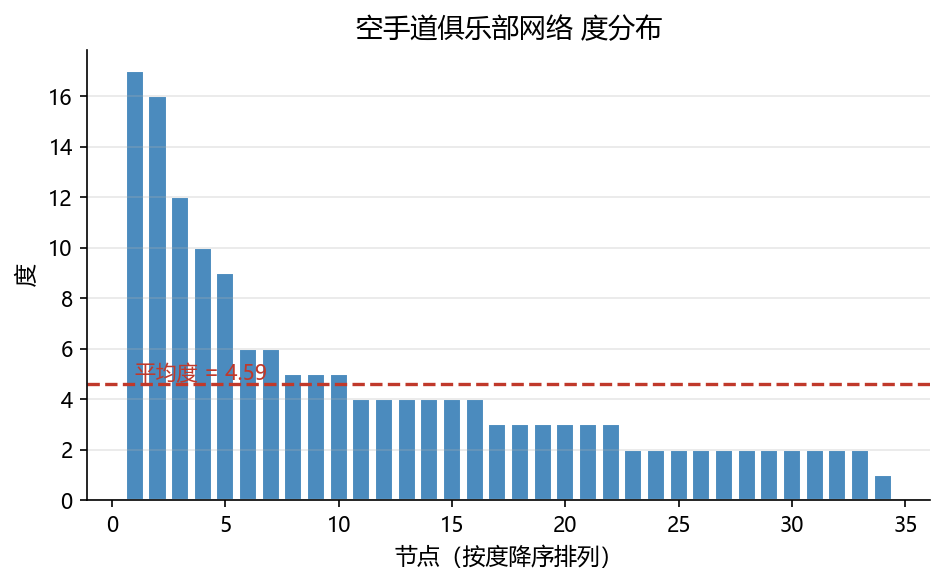
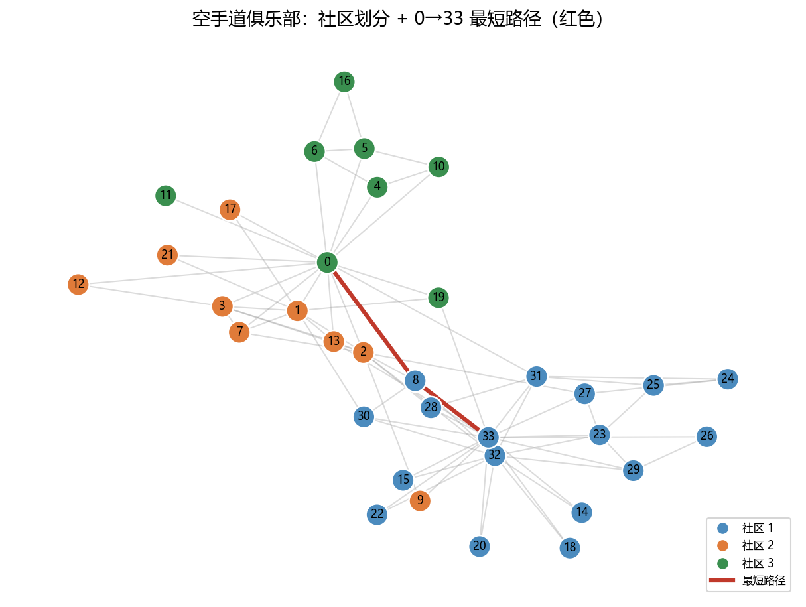

# 04 综合案例：空手道俱乐部网络的度分布、社区划分与最短路径

> 本章新增综合案例，把 01–03 的知识串起来：**创建图 + 分析指标 + 社区检测 + 最短路径 + 可视化**。
> 所有代码均在 NetworkX 3.x 下运行；配图由 build/make_chap6_figures.py 生成。

## 背景

空手道俱乐部网络（karate_club_graph）是 1977 年 Zachary 观察美国一所大学空手道俱乐部成员之间交往得到的 34 人、78 条边的无向网络。后来俱乐部因教练与校长冲突分裂成两派，这个网络成了社区检测的经典数据集。

本案例目标：

1. 载入网络并统计基本规模；
2. 绘制度分布，观察一个“真实社交网络”的度分布形态；
3. 计算聚类系数、传递性、平均路径长度等全局指标；
4. 用贪心模块度算法划分社区，评估划分质量；
5. 找出 0 号成员（教练）到 33 号成员（校长）的最短路径，并可视化社区与路径。

## 案例代码

### 1) 载入网络与基本统计

~~~~python
import networkx as nx
import numpy as np
from networkx.algorithms import community as nxcom
from networkx.algorithms.community.quality import modularity
import matplotlib.pyplot as plt

K = nx.karate_club_graph()
print("节点数:", K.number_of_nodes(), " 边数:", K.number_of_edges())

deg = [d for _, d in K.degree()]
print("度：最小", min(deg), " 最大", max(deg), " 平均", round(sum(deg) / len(deg), 2))
print("度分布（降序前5）:", sorted(deg, reverse=True)[:5])
~~~~

~~~~text
节点数: 34  边数: 78
度：最小 1  最大 17  平均 4.59
度分布（降序前5）: [17, 16, 12, 10, 9]
~~~~

### 2) 度分布可视化

节点 0 的度数高达 17，远高于平均 4.59，说明网络存在少数“超级节点”——这是无标度网络的典型特征。

~~~~python
degree_sequence = sorted(deg, reverse=True)
import os
plt.rcParams["font.sans-serif"] = ["Microsoft YaHei", "SimHei", "DejaVu Sans"]
plt.rcParams["axes.unicode_minus"] = False
plt.figure(figsize=(6.4, 4.0))
os.makedirs("images", exist_ok=True)
plt.bar(range(1, len(degree_sequence) + 1), degree_sequence, color="#4b8bbe", edgecolor="white")
plt.xlabel("节点（按度降序排列）")
plt.ylabel("度")
plt.title("空手道俱乐部网络 度分布")
plt.axhline(np.mean(deg), color="#c0392b", ls="--", lw=1.6)
plt.grid(axis="y", alpha=0.3)
plt.tight_layout(); plt.savefig("images/network_case_degree_dist.png")
print("已保存 degree_dist")
~~~~

### 3) 全局指标

~~~~python
print("平均聚类系数:", round(nx.average_clustering(K), 4))
print("传递性:", round(nx.transitivity(K), 4))
print("平均最短路径长度:", round(nx.average_shortest_path_length(K), 4))
print("直径:", nx.diameter(K), " 半径:", nx.radius(K))
bc = nx.betweenness_centrality(K)
top = sorted(bc.items(), key=lambda x: x[1], reverse=True)[:3]
print("介数中心性最高前3:", top)
~~~~

~~~~text
平均聚类系数: 0.5706
传递性: 0.2557
平均最短路径长度: 2.4082
直径: 5  半径: 3
介数中心性最高前3: [(0, 0.4376), (33, 0.3041), (32, 0.1452)]
~~~~

解读：平均聚类系数较高（0.57），说明“朋友的朋友多是朋友”；但平均最短路径只有 2.41，直径 5，呈现“高聚类 + 短路径”的小世界特征。节点 0 与 33 的介数中心性最高，它们是连接两派之间的“桥梁”。

### 4) 社区划分与模块度

~~~~python
comms = nxcom.greedy_modularity_communities(K)
Q = modularity(K, comms)
print("社区个数:", len(comms))
print("各社区大小:", [len(c) for c in comms])
print("模块度 Q:", round(Q, 4))
~~~~

~~~~text
社区个数: 3
各社区大小: [17, 9, 8]
模块度 Q: 0.411
~~~~

Q≈0.41 表示网络存在较明显的社区结构；社区大小 17、9、8，且第一个社区节点编号整体偏大（8,14,15,…,33），与裁判/教练两派吻合。

### 5) 最短路径

~~~~python
path = nx.shortest_path(K, source=0, target=33)
print("0 号到 33 号的最短路径:", path)
print("路径长度(边数):", nx.shortest_path_length(K, 0, 33))
~~~~

~~~~text
0 号到 33 号的最短路径: [0, 8, 33]
路径长度(边数): 2
~~~~

### 6) 社区 + 路径可视化

~~~~python
node_color = {}
colors = ["#4b8bbe", "#e07b39", "#3a8f4f", "#7f5fb5", "#c0392b"]
for ci, cset in enumerate(comms):
    for n in cset:
        node_color[n] = colors[ci % len(colors)]

path_edges = list(zip(path[:-1], path[1:]))
pos = nx.spring_layout(K, seed=42)

import os
plt.rcParams["font.sans-serif"] = ["Microsoft YaHei", "SimHei", "DejaVu Sans"]
plt.rcParams["axes.unicode_minus"] = False
plt.figure(figsize=(8.2, 6.2))
os.makedirs("images", exist_ok=True)
nx.draw_networkx_edges(K, pos, alpha=0.35, edge_color="#999999", width=1.0)
nx.draw_networkx_edges(K, pos, edgelist=path_edges, edge_color="#c0392b", width=3.0)
nx.draw_networkx_nodes(K, pos, node_size=260,
                       node_color=[node_color[n] for n in K.nodes()],
                       edgecolors="white", linewidths=1.2)
nx.draw_networkx_labels(K, pos, {n: str(n) for n in K.nodes()}, font_size=8)
plt.title("空手道俱乐部：社区划分 + 0→33 最短路径（红色）")
plt.axis("off")
plt.tight_layout(); plt.savefig("images/network_case_communities.png")
print("已保存 communities")
~~~~

---

## 案例结论

- 度分布有明显“长尾”：少数节点度很高（节点 0 度=17），符合社交网络的无标度特征；
- 高聚类系数、短平均路径，说明该网络具有小世界效应；
- 社区检测给出 3 个社区、Q≈0.41，划分质量较好；
- 最短路径 0→8→33 表明两位“领袖”其实只隔一个中间人，再次体现“六度分隔”。

## 拓展任务

1. 分别计算 0 号与 33 号节点的度、介数中心性、接近中心性，比较两者谁更像“中心”；
2. 修改 seed 重新布局，观察社区/路径是否变化（应不变，因为 graph 本身不变，只有节点画的位置变）；
3. 用 nx.connected_components 检查该网络是否连通；若不连通，找出孤立分量；
4. 用 louvain_communities（networkx.algorithms.community.louvain_communities）划分，比较社区个数与 Q 值。

## 本章综合练习（上机任务）

1. 用 erdos_renyi_graph(100, 0.05, seed=1) 生成随机网络，计算平均聚类系数与平均最短路径，与 karate 网络对比，说明“小世界”差异；
2. 在 karate_club_graph 上分别计算 average_clustering 与 transitivity，并解释两者为何不同；
3. 把本案例整理成一个 .ipynb，写出 3 句结论。

## 延伸阅读

- Zachary 空手道俱乐部数据集说明：[链接](https://networkx.org/documentation/stable/reference/generated/networkx.generators.social.karate_club_graph.html)
- NetworkX 社区检测模块：[链接](https://networkx.org/documentation/stable/reference/algorithms/community.html)
- NetworkX 布局算法：[链接](https://networkx.org/documentation/stable/reference/drawing.html)
