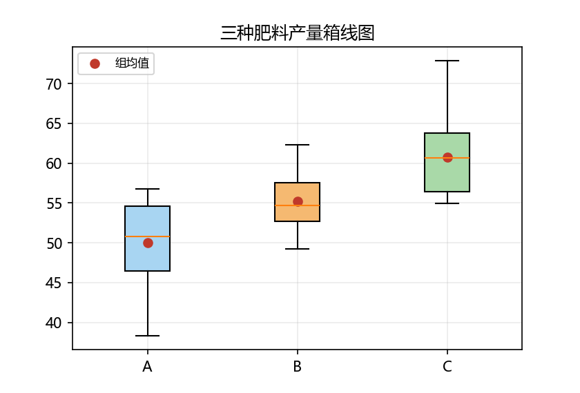
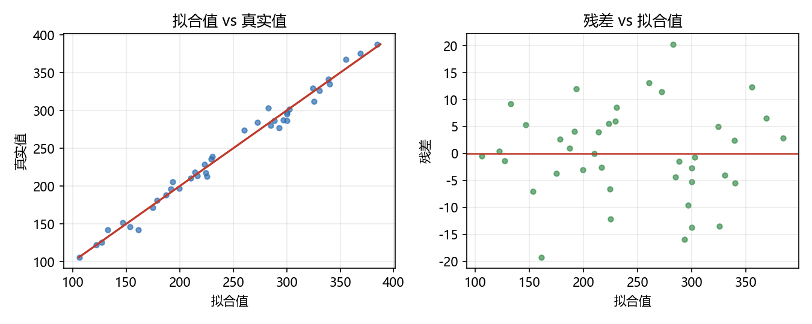

# 01 方差分析与回归

> 本节对应原版 7.1 的内容，并增补目标、诊断、GLM、WLS 与思考题。
> 配套图：<code>images/regression_ols.png</code>、<code>images/anova_boxes.png</code>、<code>images/qq_resid.png</code>（由 <code>build/make_chap7_figures.py</code> 生成）。

## 本节目标

- 会用 <code>statsmodels.api.OLS</code> 与 <code>add_constant</code> 做一元/多元线性回归，并读懂 <code>summary()</code>；
- 会用公式 API <code>ols('y ~ x', data=df)</code>，理解分类变量 <code>C(...)</code> 与交互项写法；
- 会用 <code>anova_lm</code> 做单因素方差分析，解读 F 统计量与 P 值；
- 会用 <code>GLM + Binomial</code> 做二分类 Logit 回归并得到概率；
- 会做基本回归诊断（残差 QQ 图、JB 统计量）与异方差处理（WLS）。

## 先修

- Python 基础、NumPy 数组、Pandas DataFrame；了解最小二乘与回归的统计含义。
- 已安装 statsmodels（见章 README）。

## 官方文档/参考入口

| 内容 | 链接 | 说明 |
| ---- | ---- | ---- |
| OLS（回归模型） | [链接](https://www.statsmodels.org/stable/generated/statsmodels.regression.linear_model.OLS.html) | 最小二乘回归主接口 |
| Regressions 官方教程 | [链接](https://www.statsmodels.org/stable/regression.html) | 回归模型总览 |
| 公式 API | [链接](https://www.statsmodels.org/stable/formula.html) | <code>ols('y ~ x', data=...)</code> 语法 |
| anova_lm | [链接](https://www.statsmodels.org/stable/generated/statsmodels.stats.anova.anova_lm.html) | 对 OLS 结果做方差分析 |
| GLM | [链接](https://www.statsmodels.org/stable/generated/statsmodels.genmod.generalized_linear_model.GLM.html) | 广义线性模型 |
| WLS | [链接](https://www.statsmodels.org/stable/generated/statsmodels.regression.linear_model.WLS.html) | 加权最小二乘 |

---

## 1 方差分析（ANOVA）

### 1.1 概念

方差分析（ANOVA, Analysis of Variance）用来检验**多个组的均值是否显著不同**。其核心思路是把总离差平方和 $SS_{tot}$ 分解为**组间平方和** $SS_{between}$ 与**组内平方和** $SS_{within}$，并构造 F 统计量：

$$
F = \frac{SS_{between}/(k-1)}{SS_{within}/(N-k)}
$$

其中 $k$ 为组数，$N$ 为总样本数。若 $F$ 很大（对应 P 值很小），说明组间差异显著，各组的总体均值不全相等。

Statsmodels 通常先用 OLS 拟合一个“将分组变量视为分类自变量”的模型，再用 <code>anova_lm</code> 输出方差分析表。

### 1.2 单因素方差分析示例

构造三个组（A/B/C），每组均值分别为 0、1、2，并加噪声：

~~~python
import numpy as np
import pandas as pd
import statsmodels.api as sm
from statsmodels.formula.api import ols
import matplotlib.pyplot as plt

plt.rcParams['font.sans-serif'] = ['Microsoft YaHei', 'SimHei', 'DejaVu Sans']
plt.rcParams['axes.unicode_minus'] = False

rng = np.random.default_rng(1)
n = 12
df = pd.DataFrame({
    'group': ['A']*n + ['B']*n + ['C']*n,
    'y': np.r_[rng.normal(0,1,n), rng.normal(1,1,n), rng.normal(2,1,n)]
})
print(df.groupby('group')['y'].mean().round(4))

model = ols('y ~ C(group)', data=df).fit()
anova_res = sm.stats.anova_lm(model, typ=1)
print(anova_res)
~~~

运行结果：

~~~text
group
A    0.2354
B    0.9966
C    1.9345
Name: y, dtype: float64

            df     sum_sq   mean_sq         F    PR(>F)
C(group)   2.0  17.386102  8.693051  9.297656  0.000627
Residual  33.0  30.854088  0.934972       NaN       NaN
~~~


### 1.3 解读

- <code>C(group)</code> 告诉 ols 把 <code>group</code> 当作**分类变量**，展开成虚拟变量；
- <code>PR(>F)</code> 是 F 检验的 P 值，本例 <code>0.000627 < 0.05</code>，说明三组均值**存在显著差异**；
- <code>sum_sq</code> 是平方和，<code>mean_sq = sum_sq / df</code>，<code>F = 组间 mean_sq / 组内 mean_sq</code>。

> 多做几组对比时，<code>anova_lm</code> 的 <code>typ</code> 可切换 I/II/III 型平方和；单因素情形三者等价。

## 案例卡 1：单因素方差分析——三种肥料对产量差异是否显著

### 目标

在田间试验里，把同一作物种在 45 块小地上，分别施 A、B、C 三种肥料，每种肥料 15 块地，记录每块地产量。我们要用**单因素方差分析**（One-Way ANOVA）回答：三种肥料的平均产量差异，究竟是**真实的处理效应**，还是**抽样噪声**造成的巧合。核心统计量是 F 值与其 P 值。

### 代码

```python
import numpy as np
import pandas as pd
import statsmodels.api as sm
from statsmodels.formula.api import ols
import matplotlib.pyplot as plt
import os

plt.rcParams['font.sans-serif'] = ['Microsoft YaHei', 'SimHei', 'DejaVu Sans']
plt.rcParams['axes.unicode_minus'] = False
np.set_printoptions(precision=4, suppress=True)
pd.set_option('display.width', 100)

rng = np.random.default_rng(42)
n = 15
a = rng.normal(50, 6, n)
b = rng.normal(55, 6, n)
c = rng.normal(60, 6, n)
df = pd.DataFrame({'fertilizer': ['A']*n + ['B']*n + ['C']*n,
                   'out': np.r_[a, b, c]})

print(df.groupby('fertilizer')['out'].mean().round(2))

model = ols('out ~ C(fertilizer)', data=df).fit()
anova = sm.stats.anova_lm(model, typ=1)
print('F = %.3f' % anova['F'].iloc[0])
print('P = %.3g' % anova['PR(>F)'].iloc[0])
print('SS_between = %.3f' % anova['sum_sq'].iloc[0])
print('SS_within = %.3f' % anova['sum_sq'].iloc[1])
print('df_between =', anova['df'].iloc[0], ' df_within =', anova['df'].iloc[1])

os.makedirs('images', exist_ok=True)
plt.figure(figsize=(5.6, 3.8))
bp = plt.boxplot([a, b, c], tick_labels=['A', 'B', 'C'], patch_artist=True)
for patch, color in zip(bp['boxes'], ['#a8d5f2', '#f5b971', '#a9d9a8']):
    patch.set_facecolor(color)
plt.plot([1, 2, 3], [a.mean(), b.mean(), c.mean()], marker='o', color='#c0392b',
         ls='', label='组均值')
plt.legend(fontsize=8)
plt.grid(alpha=0.25)
plt.savefig('images/case1_fertilizer_anova.png', dpi=150)
plt.close()
print('saved images/case1_fertilizer_anova.png')
```

### 运行结果（已运行核验）

```text
fertilizer
A    49.98
B    55.22
C    60.80
Name: out, dtype: float64
F = 18.455
P = 1.77e-06
SS_between = 877.288
SS_within = 998.289
df_between = 2.0  df_within = 42.0
saved images/case1_fertilizer_anova.png
```

### 讲解

**一句话解释**：把 45 块地的产量按“肥料”分成三堆，先看每堆平均数，再看堆与堆之间的差距，是否大到不像是“随机抽签运气好/坏”造成的。

1. `rng.normal(50, 6, n)`：生成 15 个“平均 50、标准差 6”的产量，模拟 A 肥；B、C 分别把均值换成 55、60。固定 `seed=42` 保证每次结果一致。
2. `df.groupby('fertilizer')['out'].mean()`：把产量按肥料分组求平均，得到 A≈49.98、B≈55.22、C≈60.80，肉眼能看出递增。
3. `ols('out ~ C(fertilizer)', data=df)`：把“肥料”当分类自变量（`C(...)` 自动转成哑变量），拟合线性模型；这就是 ANOVA 的回归写法。
4. `sm.stats.anova_lm(model, typ=1)`：对该回归结果做方差分析，把总平方和拆成“组间”与“组内”两块，算出 F 与 P 值。
5. `SS_between`（组间）≈877.29、`SS_within`（组内）≈998.29，说明三组之间的差异占总差异的一半左右，不是噪声。
6. `F=18.455`、`P=1.77e-06 < 0.05`：拒绝“三组均值相同”的原假设，即三种肥料对产量的影响**统计显著**。



### 主要用法 / API

| 需求 | 写法 | 说明 |
| ---- | ---- | ---- |
| 生成正态随机数 | `rng.normal(mean, std, n)` | 模拟每组产量 |
| 按组求均值 | `df.groupby('fertilizer')['out'].mean()` | 组间比较第一步 |
| 分类变量进公式 | `ols('out ~ C(fertilizer)', data=df)` | `C()` 把类别变哑变量 |
| 方差分析表 | `sm.stats.anova_lm(model, typ=1)` | 输出 df/平方和/F/P |
| 取 F / P 值 | `anova['F'].iloc[0]` / `anova['PR(>F)'].iloc[0]` | 用 `.iloc[0]` 避免位置弃用警告 |
| 画箱线图 | `plt.boxplot([a, b, c], tick_labels=...)` | 直观展示组分布与均值 |

### 常见错误

1. 误把“组均值看起来不同”当成“显著不同”：还要看组内波动（`SS_within`）够不够小；组内波动大时，均值差异可能不显著。
2. 公式里直接写 `ols('out ~ fertilizer', ...)` 而不加 `C()`：字符串列会被 patsy 当连续变量或报错。
3. 直接用 `anova['F'][0]` 取第一行：新版 pandas 可能给出“按位置取数”的 FutureWarning，应改用 `.iloc[0]`。
4. 忘记在绘图前 `os.makedirs('images', exist_ok=True)`：首次没有 `images/` 目录时 `savefig` 会报错。

### 拓展 / 跟练

1. 把 `n` 改成 30，观察 F 与 P 值如何变化；把种子改成别的值，多次运行看结论是否稳定。
2. 用 `scipy.stats.f_oneway(a, b, c)` 直接计算，和 `anova_lm` 的 F/P 对比是否一致。
3. 给数据再加一个“对照”组（不施肥、均值 45），看 4 组 ANOVA 结论。
4. 用 `statsmodels.stats.multicomp.pairwise_tukeyhsd` 做 Tukey 事后两两比较，找出哪两组差异显著。

---

## 2 线性回归（OLS）

### 2.1 数组接口：sm.OLS

数组接口要求手动加截距列（<code>add_constant</code>），适合已用 NumPy 准备数据的场景。

~~~python
import numpy as np
import statsmodels.api as sm

rng = np.random.default_rng(0)
x = np.linspace(0, 10, 50)
y = 2*x + 1 + rng.normal(0, 1, size=len(x))

X = sm.add_constant(x.reshape(-1, 1))
model = sm.OLS(y, X).fit()
print("params:", model.params)
print("R²:", model.rsquared)
print(model.summary())
~~~

运行结果（<code>Date/Time</code> 随运行时间变化）：

~~~text
params: [0.54884546 2.1160302 ]
R²: 0.9819621414581136

                            OLS Regression Results
==============================================================================
Dep. Variable:                      y   R-squared:                       0.982
Model:                            OLS   Adj. R-squared:                  0.982
Method:                 Least Squares   F-statistic:                     2613.
Date:                Wed, 26 Aug 2026   Prob (F-statistic):           1.63e-43
Time:                        14:08:23   Log-Likelihood:                -62.504
No. Observations:                  50   AIC:                             129.0
Df Residuals:                      48   BIC:                             132.8
Df Model:                           1
Covariance Type:            nonrobust
==============================================================================
                 coef    std err          t      P>|t|      [0.025      0.975]
------------------------------------------------------------------------------
const          0.5488      0.240      2.285      0.027       0.066       1.032
x1             2.1160      0.041     51.118      0.000       2.033       2.199
==============================================================================
Omnibus:                        0.794   Durbin-Watson:                   1.565
Prob(Omnibus):                  0.672   Jarque-Bera (JB):                0.889
Skew:                          -0.229   Prob(JB):                        0.641
Kurtosis:                       2.533   Cond. No.                         11.7
==============================================================================

Notes:
[1] Standard Errors assume that the covariance matrix of the errors is correctly specified.
~~~


**解读要点**：

- 截距 <code>const</code> ≈ 0.549，斜率 <code>x1</code> ≈ 2.116，接近真实值 $(1, 2)$；
- <code>R²=0.982</code>：模型解释了约 98.2% 的方差；<code>Adj. R²</code> 对自变量个数做了惩罚；
- <code>F-statistic</code> 与 <code>Prob(F)</code> 是整体显著性检验；<code>Prob(F) ≈ 1.6e-43</code>，模型整体显著；
- 每个系数的 <code>P>|t|</code> 是该变量是否显著（<code>0.05</code> 为常用阈值）；
- <code>[0.025, 0.975]</code> 是 95% 置信区间。

### 2.2 公式接口：ols

把数据放进 DataFrame，即可用公式写模型：

~~~python
import pandas as pd
from statsmodels.formula.api import ols

x = np.linspace(0, 10, 50)
y = 2*x + 1 + rng.normal(0, 1, size=len(x))
df2 = pd.DataFrame({'x': x, 'y': y})
fm = ols('y ~ x', data=df2).fit()
print(fm.params)
print(fm.summary())
~~~

运行结果：

~~~text
Intercept    0.548845
x            2.116030
dtype: float64
~~~

可见公式接口默认加截距（<code>Intercept</code>），且列名直接用 <code>x</code>。其余统计量与 2.1 完全一致。

### 2.3 多元回归

~~~python
rng = np.random.default_rng(2)
x1 = rng.uniform(0, 10, 60)
x2 = rng.uniform(-3, 3, 60)
y2 = 1 + 2*x1 - 3*x2 + rng.normal(0, 1, 60)
dm = pd.DataFrame({'x1': x1, 'x2': x2, 'y': y2})
mul = ols('y ~ x1 + x2', data=dm).fit()
print(mul.params)
print(mul.pvalues)
print("R² =", mul.rsquared)
~~~

运行结果：

~~~text
Intercept    0.938724
x1           1.994930
x2          -3.056829
dtype: float64
Intercept    4.204720e-04
x1           3.299329e-47
x2           4.863608e-49
dtype: float64
R² = 0.9867366706540099
~~~

说明：两个自变量的 P 值都远小于 0.05，均显著；系数接近真实值 $(2, -3)$。

### 2.4 公式写法小结

| 写法 | 含义 |
| ---- | ---- |
| <code>y ~ x</code> | 一元线性 |
| <code>y ~ x1 + x2</code> | 多元线性（可加性） |
| <code>y ~ C(group)</code> | 把 group 当分类变量（用于 ANOVA） |
| <code>y ~ x1 * x2</code> | 主效应 + 交互项 |
| <code>y ~ x1 + I(x1**2)</code> | 添加二次项 |

## 案例卡 2：OLS 多元回归——用公式接口解读系数与 p 值

### 目标

造一份“房子面积（平方米）、房龄（年）→ 房价（万元）”的模拟数据，用**公式接口** `ols('price ~ area + age', data=df)` 一次估计两个自变量。我们重点关注每个系数的**大小、符号、p 值、95% 置信区间**，并说明“面积每大一平米、房龄每多一年，房价平均怎么变”。

### 代码

```python
import numpy as np
import pandas as pd
from statsmodels.formula.api import ols
import matplotlib.pyplot as plt
import os

plt.rcParams['font.sans-serif'] = ['Microsoft YaHei', 'SimHei', 'DejaVu Sans']
plt.rcParams['axes.unicode_minus'] = False
np.set_printoptions(precision=4, suppress=True)
pd.set_option('display.width', 100)

rng = np.random.default_rng(3)
n = 40
area = rng.uniform(30, 120, n)    # 面积：30~120 平米
age = rng.uniform(0, 30, n)       # 房龄：0~30 年
price = 50 + 3.0*area - 1.5*age + rng.normal(0, 8, n)  # 真实模型

df = pd.DataFrame({'area': area, 'age': age, 'price': price})
model = ols('price ~ area + age', data=df).fit()
ci = model.conf_int()

print('coefficients:')
for name in ['Intercept', 'area', 'age']:
    print(f"{name:9s} coef={model.params[name]:.4f} p={model.pvalues[name]:.2e} CI=[{ci.loc[name,0]:.4f}, {ci.loc[name,1]:.4f}]")
print('R2 =', round(model.rsquared, 4))
print('F =', round(model.fvalue, 3), ' P(F) = %.3g' % model.f_pvalue)
print('AIC =', round(model.aic, 2))

os.makedirs('images', exist_ok=True)
fig, axes = plt.subplots(1, 2, figsize=(9, 3.6))
axes[0].scatter(model.fittedvalues, df['price'], s=16, color='#2f6fb3', alpha=0.7)
axes[0].plot([df['price'].min(), df['price'].max()], [df['price'].min(), df['price'].max()], color='#c0392b', lw=1.6)
axes[0].set_xlabel('拟合值'); axes[0].set_ylabel('真实值'); axes[0].set_title('拟合值 vs 真实值')
axes[1].scatter(model.fittedvalues, model.resid, s=16, color='#3a8f4f', alpha=0.7)
axes[1].axhline(0, color='#c0392b', lw=1.2)
axes[1].set_xlabel('拟合值'); axes[1].set_ylabel('残差'); axes[1].set_title('残差 vs 拟合值')
for ax in axes:
    ax.grid(alpha=0.25)
fig.tight_layout()
fig.savefig('images/case2_ols_multi.png', dpi=150)
plt.close()
print('saved images/case2_ols_multi.png')
```

### 运行结果（已运行核验）

```text
coefficients:
Intercept coef=50.8786 p=2.16e-12 CI=[40.8480, 60.9092]
area      coef=2.9799 p=1.59e-36 CI=[2.8662, 3.0937]
age       coef=-1.4557 p=8.11e-11 CI=[-1.7844, -1.1269]
R2 = 0.9872
F = 1425.282  P(F) = 9.82e-36
AIC = 290.09
saved images/case2_ols_multi.png
```

### 讲解

**一句话解释**：房价 ≈ 一个“起步价” + 每平米单价 × 面积 − 每年折旧 × 房龄；`coef` 就是这些单价，`p` 告诉你“这个单价是不是真的、会不会只是噪声”。

1. `area = rng.uniform(30, 120, n)`：生成 40 套房子的面积；`age` 类似。`price` 用真实系数 `(50, 3, -1.5)` 再加噪声构造，这样我们能“对着答案”检验模型。
2. `ols('price ~ area + age', data=df)`：公式接口自动加截距（`Intercept`），并同时放进 `area` 与 `age` 两个自变量。
3. `model.params`：截距 ≈50.88（接近真实 50），`area` ≈2.98（接近真实 3），`age` ≈−1.46（接近真实 −1.5）。系数就是“在控制另一个变量后，该变量每改变 1 单位，因变量的平均变化”。
4. `model.pvalues`：三个 p 值都远小于 0.05，说明截距、面积、房龄都**统计显著**；房龄系数为负也符合直觉（房子越旧越便宜）。
5. `model.conf_int()`：给出 95% 置信区间。`area` 的区间 `[2.87, 3.09]` 不包含 0，说明面积效应显著为正；`age` 区间 `[-1.78, -1.13]` 不包含 0，说明房龄效应显著为负。
6. `R2=0.9872`：面积+房龄解释了约 98.7% 的房价变动；`F` 与 `p(F)` 说明模型整体显著。`AIC` 可用于与其它模型比较。



### 主要用法 / API

| 需求 | 写法 | 说明 |
| ---- | ---- | ---- |
| 多元回归 | `ols('price ~ area + age', data=df)` | 公式接口，自动加截距 |
| 系数 | `model.params` | 每个变量的边际效应 |
| p 值 | `model.pvalues` | <0.05 视为显著 |
| 置信区间 | `model.conf_int()` | 95% CI，不含 0 一般显著 |
| 拟合优度 | `model.rsquared` / `model.rsquared_adj` | 解释比例 / 调整后 |
| 整体显著性 | `model.fvalue` / `model.f_pvalue` | 所有系数联合是否为 0 |
| 信息准则 | `model.aic` | 越小越好，用于模型选择 |

### 常见错误

1. 只打印 `model.summary()` 而不使用关键字段：跨版本摘要边缘（空格、分隔线、`+/-` 号）不稳定，教学时建议用 `params`/`pvalues`/`conf_int` 打印固定字段。
2. 忘记 `add_constant` 但用了数组接口：公式接口自动加截距，数组接口却要手动加。
3. 把 `p=0.0` 直接打印当“无意义”：应使用 `%.2e` 或 `%.3g` 科学计数法，避免显示成 0。
4. 用 `round(model.pvalues, 4)` 输出时 p 值太小被四舍五入成 0.0000，看不出数量级。

### 拓展 / 跟练

1. 在公式里加交互项 `ols('price ~ area + age + area:age', data=df)`，看交互项是否显著。
2. 把 `age` 换成“新房/二手”分类变量 `C(new_house)`，对比系数含义变化。
3. 用数组接口 `sm.OLS(df['price'], sm.add_constant(df[['area','age']]))` 重跑，确认系数一致。
4. 计算各自变量的标准化系数（`z-score` 后回归），比较“谁的影响更大”。

---

## 3 回归诊断：残差 QQ 图与 JB 统计量

### 3.1 为什么诊断

OLS 的统计推断（t/F/P 值）依赖于**误差项独立同分布、同方差、近似正态**。诊断残差是否偏离这些假设，能及时发现模型设定问题。

~~~python
import matplotlib.pyplot as plt
rng = np.random.default_rng(0)
xd = np.linspace(0, 10, 50)
yd = 3*xd + 2 + rng.normal(0, 1, 50)
Xd = sm.add_constant(xd.reshape(-1, 1))
olsd = sm.OLS(yd, Xd).fit()
sm.qqplot(olsd.resid, line='45')
plt.title("残差 QQ 图")
plt.show()
print(olsd.summary())
~~~

在模型摘要中可找到：

~~~text
Prob(Omnibus):                  0.672   Jarque-Bera (JB):                0.889
Skew:                          -0.229   Prob(JB):                        0.641
~~~


**解读**：

- <code>Jarque-Bera (JB)</code> 检验残差是否为正态分布；<code>Prob(JB)=0.641 > 0.05</code>，不能拒绝正态假设，说明残差近似正态；
- QQ 图中点应落在 45° 直线附近；本例散点基本沿直线，正态性可接受。

---

## 4 广义线性模型（GLM）

### 4.1 概念

当因变量是**二分类**（成功/失败）、计数或比例时，OLS 不再合适。广义线性模型通过**链接函数**把线性预测值映射到合理的取值区间，并用指数族分布建模。二分类最常用 <code>Binomial</code> 家族 + <code>Logit</code> 链接（即逻辑回归）：

$$
\text{logit}(p) = \beta_0 + \beta_1 x_1 + \beta_2 x_2,\qquad
p = \frac{1}{1+e^{-(\beta_0+\beta_1 x_1+\beta_2 x_2)}}
$$

### 4.2 二分类 Logit 示例

~~~python
import numpy as np
import statsmodels.api as sm

rng = np.random.default_rng(0)
X_raw = rng.uniform(0, 1, (200, 2))
lin = 0.5 + 1.2*X_raw[:, 0] - 0.8*X_raw[:, 1]
p = 1/(1+np.exp(-lin))
Y = rng.binomial(1, p)               # 真实概率 p 下的二分类结果

X = sm.add_constant(X_raw)
glm = sm.GLM(Y, X, family=sm.families.Binomial()).fit()
print(glm.params)
X_new = sm.add_constant(np.array([[0.2, 0.3], [0.8, 0.1]]))
print(glm.predict(X_new))
~~~

运行结果：

~~~text
params: [ 0.26505589  1.42126589 -0.87263185]
predict: [0.57138876 0.78831616]
~~~

**解读**：

- 估计系数接近真实值 $(0.5, 1.2, -0.8)$，且符号正确（x1 正、x2 负）；
- <code>predict</code> 返回的是**概率**（经过 Logit 反变换），两个新样本的成功概率约为 0.57 与 0.79；
- 若想得到 0/1 分类，可再对概率设阈值（如 >0.5 判为 1），见 04 常见误区。

---

## 5 加权最小二乘（WLS）处理异方差

当误差方差随自变量变化（异方差）时，OLS 虽无偏但效率低（标准误不准）。WLS 用权重 $w_i$ 加权残差平方和，对异方差更稳健。

~~~python
import numpy as np
import statsmodels.api as sm

rng = np.random.default_rng(1)
xw = np.linspace(0.1, 10, 200)
eps = rng.normal(0, xw)            # 标准差与 x 成正比 -> 方差与 x^2 成正比
yw = 3*xw + eps
Xw = sm.add_constant(xw.reshape(-1, 1))

ols_w = sm.OLS(yw, Xw).fit()
wls_w = sm.WLS(yw, Xw, weights=1/np.square(xw)).fit()
print("OLS:", np.round(ols_w.params, 4), "bse", np.round(ols_w.bse, 4))
print("WLS:", np.round(wls_w.params, 4), "bse", np.round(wls_w.bse, 4))
~~~

运行结果：

~~~text
OLS: [-0.0422  2.9257] bse [0.833  0.1434]
WLS: [ 0.0597  2.8971] bse [0.0641 0.0727]
~~~

**解读**：

- 两者斜率都接近真实值 3；
- 但 WLS 的斜率标准误（0.0727）明显小于 OLS（0.1434），说明在已知异方差形式（$\sigma_i \propto x_i$）时，WLS 估计更有效。

---

## 6 方差分析与回归的统一框架

线性回归与方差分析其实共享同一套**线性模型 + 最小二乘 + F 检验**逻辑：

- 回归用连续/哑变量做**解释**；ANOVA 用分组哑变量做**比较**；
- 都可以写成 $y = X\beta + \varepsilon$，用 <code>ols</code> 拟合；
- 都能用 F 检验判断“若干系数同时为 0”的联合显著性。

因此，ANOVA 可看成**只有分类自变量**的线性回归；回归也可看成含连续+分类变量的“广义”ANOVA。这就是为什么要用 <code>ols + anova_lm</code> 而不是单独的 <code>scipy.stats.f_oneway</code> 来统一步骤。

---

## 常见误区

1. **忘记加截距**：数组接口必须 <code>X = sm.add_constant(X)</code>，否则模型强制过原点。
2. **用 <code>*</code> 表示“与”**：公式里 <code>y ~ x1 * x2</code> 是主效应+交互项，不是数值乘法；要写原生项用 <code>I(x1**2)</code> 且注意加 <code>I(...)</code>。
3. **分类变量直接进公式**：对字符串列，<code>ols('y ~ group')</code> 会当成连续变量或报错，应写成 <code>C(group)</code>。
4. **用 <code>predict</code> 忘记加常数**：数组接口预测新数据也要 <code>sm.add_constant(X_new)</code>。
5. **把 GLM 的 <code>predict</code> 当分类输出**：默认返回概率，需要阈值才能变 0/1。
6. **忽略诊断**：只报 R² 不看不残差与显著性检验，容易过拟合/误设。

## 思考题

1. 为什么数组接口里 <code>add_constant</code> 必须加？如果不加，拟合结果在什么情况下仍“正确”？
2. <code>anova_lm(model, typ=1)</code> 与 <code>typ=3</code> 在单因素时结果是否相同？在多因素时为何可能不同？
3. 给定 <code>y ~ x1 + x2</code>，若想加入 x1 与 x2 的交互，公式应怎么写？系数个数变成几个？
4. 为什么 GLM 不用 OLS 直接拟合二分类因变量？（提示：概率会越界、异方差）

## 动手练习（详见 lab）

- 用 <code>sm.OLS</code> 拟合 <code>y = 1 + 2x</code> 的噪声数据，打印完整 <code>summary()</code>；
- 构造三个组，画出箱线图并做单因素方差分析；
- 用公式 API 拟合 <code>y ~ x1 + x2</code>，说明各系数显著性；
- 用 GLM(Binomial) 拟合二分类数据，并在不同阈值下计算准确率与 F1。

## 延伸阅读

- statsmodels Regressions 官方：[链接](https://www.statsmodels.org/stable/regression.html)
- statsmodels GLM 官方：[链接](https://www.statsmodels.org/stable/glm.html)
- 残差诊断（Statsmodels 图示）：[链接](https://www.statsmodels.org/stable/examples/index.html#regression)
