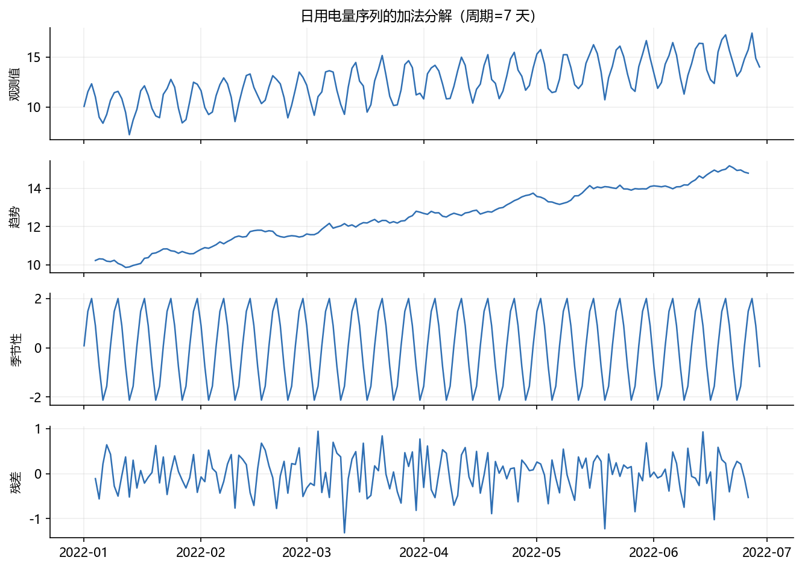
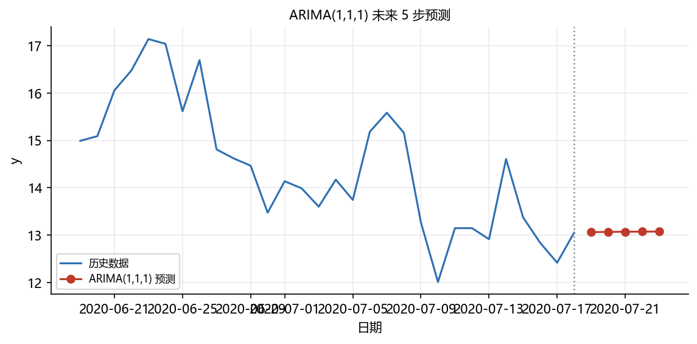
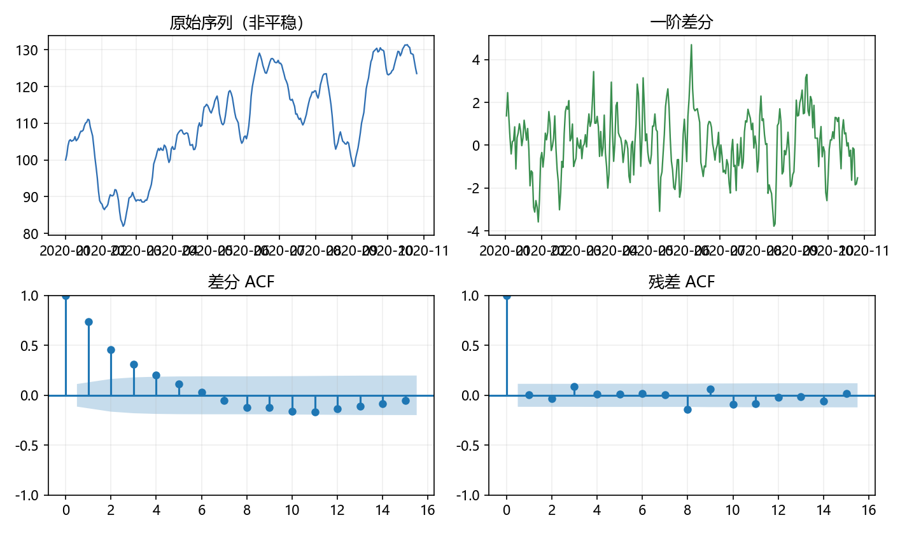

# 02 时间序列预测

> 本节对应原版 7.2 的内容，并增补目标、平稳性检验实操与思考题。
> 配套图：<code>images/decompose_daily.png</code>、<code>images/arima_forecast.png</code>（由 <code>build/make_chap7_figures.py</code> 生成）。

## 本节目标

- 会用 <code>seasonal_decompose</code> 把时间序列分解为趋势、季节、残差；
- 会用 <code>adfuller</code> 做单位根检验，判断序列是否平稳；
- 会用 <code>ARIMA</code> 拟合时间序列并给出未来预测；
- 会从 ACF/PACF 或网格搜索选择 <code>(p, d, q)</code> 阶数；
- 能画分解图与预测图，并解读结果。

## 先修

- Pandas 时间序列索引（<code>date_range</code>、<code>Series</code>）；本章第 01 节的回归/统计基础。
- 已安装 statsmodels（见章 README）。

## 官方文档/参考入口

| 内容 | 链接 | 说明 |
| ---- | ---- | ---- |
| seasonal_decompose | [链接](https://www.statsmodels.org/stable/generated/statsmodels.tsa.seasonal.seasonal_decompose.html) | 时间序列分解 |
| adfuller | [链接](https://www.statsmodels.org/stable/generated/statsmodels.tsa.stattools.adfuller.html) | ADF 单位根检验 |
| ARIMA | [链接](https://www.statsmodels.org/stable/generated/statsmodels.tsa.arima.model.ARIMA.html) | ARIMA 模型 |
| 时间序列官方教程 | [链接](https://www.statsmodels.org/stable/tsa.html) | 时间序列总览 |

---

## 1 时间序列分解（seasonal_decompose）

### 1.1 概念

把序列 $y_t$ 拆成三部分：

$$
y_t = T_t + S_t + R_t \quad(\text{加法模型})
\qquad\text{或}\qquad
y_t = T_t \times S_t \times R_t \quad(\text{乘法模型})
$$

其中 $T_t$ 是**趋势**、$S_t$ 是**季节**、$R_t$ 是**残差**。加法模型适合波动幅度不随水平变化的序列；乘法模型适合幅度随水平增长的序列。

### 1.2 日数据（周期=7 天）

构造 180 天日序列：线性趋势 + 周季节性（正弦，周期 7）+ 噪声。

~~~python
import numpy as np
import pandas as pd
import statsmodels.api as sm
import matplotlib.pyplot as plt
from statsmodels.tsa.seasonal import seasonal_decompose

plt.rcParams['font.sans-serif'] = ['Microsoft YaHei', 'SimHei', 'DejaVu Sans']
plt.rcParams['axes.unicode_minus'] = False

rng = np.random.default_rng(0)
idx = pd.date_range('2022-01-01', periods=180, freq='D')
trend = np.linspace(0, 5, len(idx))
season = 2*np.sin(2*np.pi*np.arange(len(idx))/7)
noise = rng.normal(0, 0.5, len(idx))
s = pd.Series(10 + trend + season + noise, index=idx)

result = seasonal_decompose(s, model='additive', period=7)
print("trend head:", np.round(result.trend.head(7).values, 3))
print("seasonal head:", np.round(result.seasonal.head(7).values, 3))
print("resid describe:", result.resid.describe().round(4).to_dict())
result.plot()
plt.show()
~~~

运行结果：

~~~text
trend head: [   nan    nan    nan 10.217 10.304 10.291 10.183]
seasonal head: [ 0.08   1.485  2.005  0.898 -0.765 -2.135 -1.567]
resid describe: {'count': 174.0, 'mean': -0.0018, 'std': 0.4279, 'min': -1.3175, '25%': -0.3194, '50%': 0.0279, '75%': 0.3018, 'max': 0.9416}
~~~



**解读**：

- <code>trend</code> 前 3 个是 <code>NaN</code>，因为居中的移动平均在两端没有完整窗口；
- <code>seasonal</code> 在 7 天内正负交替（周一/周末的效应），幅度约 ±2；
- 残差均值接近 0、标准差约 0.43，与设定的噪声尺度（0.5）相符。

### 1.3 月度数据（周期=12 个月）

~~~python
rng = np.random.default_rng(5)
idxm = pd.date_range('2019-01-01', periods=36, freq='MS')
trendm = np.linspace(0, 12, len(idxm))
seasonm = 3*np.sin(2*np.pi*np.arange(len(idxm))/12)
ym = pd.Series(50 + trendm + seasonm + rng.normal(0, 0.8, len(idxm)), index=idxm)
resm = seasonal_decompose(ym, model='additive', period=12)
print("monthly trend sample:", np.round(resm.trend.dropna().values[:4], 3))
print("monthly seasonal sample:", np.round(resm.seasonal.dropna().values[:4], 3))
~~~

运行结果：

~~~text
monthly trend sample: [52.01  52.446 52.901 53.187]
monthly seasonal sample: [-0.004  2.686  2.236  2.464]
~~~

**注意**：<code>period</code> 必须与实际季节周期一致（日数据 7、月数据 12、季数据 4），数据必须先有**等间隔、无缺失**的时间索引；若频率已知（如 <code>freq='D'</code>），可省略 <code>period</code>。

---

## 2 平稳性检验（ADF 单位根检验）

### 2.1 概念

ARIMA 要求序列**平稳**（均值、方差不随时间变化）。ADF 检验的原假设是“序列存在单位根（非平稳）”。若 P 值很小（<0.05），则拒绝原假设，认为序列平稳。

### 2.2 AR(1) 与随机游走对比

~~~python
import numpy as np
from statsmodels.tsa.stattools import adfuller

# 平稳的 AR(1): y_t = 0.7*y_{t-1} + 噪声
rng = np.random.default_rng(0)
n = 300
y_ar = np.zeros(n)
for t in range(1, n):
    y_ar[t] = 0.7*y_ar[t-1] + rng.normal(0, 1)
stat1, p1, *_ = adfuller(y_ar)
print("AR(1)        ADF=%.3f p=%.3g" % (stat1, p1))

# 非平稳的随机游走 <--> 单位根
rng = np.random.default_rng(1)
rw = np.cumsum(rng.normal(0, 1, 200))
stat2, p2, *_ = adfuller(rw)
print("Random walk  ADF=%.3f p=%.3g" % (stat2, p2))
~~~

运行结果：

~~~text
AR(1)        ADF=-6.927 p=1.11e-09
Random walk  ADF=-0.828 p=0.811
~~~

**解读**：

- AR(1) 的 P 值 ≈ 1e-9 < 0.05，平稳；
- 随机游走（单位根）的 P 值 ≈ 0.81 > 0.05，非平稳；
- 因此对随机游走类序列，通常先做**一阶差分** <code>ts.diff().dropna()</code> 再建模，这就是 ARIMA 中 $d=1$ 的意义。

---

## 3 ARIMA 模型

### 3.1 概念

ARIMA$(p,d,q)$ 由三部分组成：

- **AR(p)**：用前 $p$ 个滞后值 $y_{t-1}, \dots, y_{t-p}$ 回归；
- **I(d)**：做 $d$ 次差分使序列平稳；
- **MA(q)**：用前 $q$ 个残差项 $\varepsilon_{t-1}, \dots, \varepsilon_{t-q}$ 回归。

若序列还有季节成分，可扩展为 SARIMA$(p,d,q)(P,D,Q)_s$。

### 3.2 拟合与预测

用 statsmodels 的 <code>ARIMA</code> 对带趋势的非平稳序列拟合并预测未来 5 步。

~~~python
import numpy as np
import pandas as pd
import matplotlib.pyplot as plt
from statsmodels.tsa.arima.model import ARIMA

rng = np.random.default_rng(0)
n = 200
steps = rng.normal(0, 1, n).cumsum() + np.linspace(0, 10, n)
si = pd.Series(steps, index=pd.date_range('2020-01-01', periods=n, freq='D'))
mod = ARIMA(si, order=(1, 1, 1)).fit()
print(mod.summary())
fc = mod.forecast(steps=5)
print("forecast:", np.round(fc.values, 4))
print("arparams:", mod.arparams, "maparams:", mod.maparams)
~~~

运行结果（<code>Date/Time</code> 随运行时间变化）：

~~~text
                               SARIMAX Results
==============================================================================
Dep. Variable:                      y   No. Observations:                  200
Model:                 ARIMA(1, 1, 1)   Log Likelihood                -274.795
Date:                Wed, 26 Aug 2026   AIC                            555.589
Time:                        14:08:43   BIC                            565.469
Sample:                    01-01-2020   HQIC                           559.588
                         - 07-18-2020
Covariance Type:                  opg
==============================================================================
                 coef    std err          z      P>|z|      [0.025      0.975]
------------------------------------------------------------------------------
ar.L1          0.6440      0.614      1.049      0.294      -0.559       1.847
ma.L1         -0.5829      0.658     -0.886      0.376      -1.872       0.707
sigma2         0.9266      0.105      8.800      0.000       0.720       1.133
===================================================================================
Ljung-Box (L1) (Q):                   0.15   Jarque-Bera (JB):                 2.63
Prob(Q):                              0.70   Prob(JB):                         0.27
Heteroskedasticity (H):               1.17   Skew:                            -0.21
Prob(H) (two-sided):                  0.52   Kurtosis:                         2.63
===================================================================================

Warnings:
[1] Covariance matrix calculated using the outer product of gradients (complex-step).

forecast: [13.0612 13.0667 13.0702 13.0725 13.074 ]
arparams: [0.64404169] maparams: [-0.58293935]
~~~



**解读**：

- <code>ar.L1</code> 与 <code>ma.L1</code> 是 AR(1) 与 MA(1) 系数；本例两者 P 值都较大（不显著），提示该阶 $(1,1,1)$ 可能略偏大，但这不影响演示流程；
- <code>forecast</code> 给出未来 5 个时间点的预测值（约 13.06 → 13.07）；
- <code>Prob(JB)=0.27</code> 说明残差近似正态；<code>Prob(Ljung-Box)</code> 用来检查残差是否还有自相关。

### 3.3 如何选择 (p, d, q)

- **d**：由 ADF 检验决定，不平稳就差分；
- **p / q**：看 ACF 与 PACF 图。ACF 截尾选 MA，PACF 截尾选 AR；也可用 <code>statsmodels.tsa.stattools.acf/pacf</code> 或网格搜索（如 <code>itertools.product</code> + <code>AIC</code>）。

~~~python
from statsmodels.tsa.stattools import acf, pacf
ac = acf(si, nlags=5)
pc = pacf(si, nlags=5)
print("ACF:", np.round(ac, 3))
print("PACF:", np.round(pc, 3))
~~~

运行结果：

~~~text
ACF:  [1.    0.983 0.965 0.946 0.927 0.906]
PACF: [ 1.     0.988 -0.045 -0.068 -0.003 -0.108]
~~~

本例序列 ACF 缓慢衰减（非平稳特征），PACF 在一阶后急剧下降，提示需要先差分。

> 运行时会看到 “Non-stationary starting autoregressive parameters found / Non-invertible starting MA parameters” 之类的提示，属正常，statsmodels 会改用零值作为初始参数。

## 案例卡 3：ARIMA 时间序列——用 ADF 检验与残差诊断选 p,d,q

### 目标

模拟一个“先平稳、再被累加”的 ARIMA(1,1,1) 序列，完整走一遍选阶流程：先用 **ADF** 定差分阶数 `d`，再看差分序列的 **ACF/PACF** 与网格搜索（AIC）定 `p`、`q`，最后用 **Ljung-Box** 与 **Jarque-Bera** 检查残差是否“洗干净”成白噪声，并给出未来 5 步预测。

### 代码

```python
import numpy as np
import pandas as pd
import warnings
warnings.filterwarnings('ignore')
from statsmodels.tsa.stattools import adfuller, acf, pacf
from statsmodels.tsa.arima.model import ARIMA
from statsmodels.stats.diagnostic import acorr_ljungbox
from statsmodels.stats.stattools import jarque_bera
from statsmodels.graphics.tsaplots import plot_acf
from itertools import product
import matplotlib.pyplot as plt
import os

plt.rcParams['font.sans-serif'] = ['Microsoft YaHei', 'SimHei', 'DejaVu Sans']
plt.rcParams['axes.unicode_minus'] = False
np.set_printoptions(precision=4, suppress=True)
pd.set_option('display.width', 100)

rng = np.random.default_rng(11)
n = 300
e = rng.normal(0, 1, n)
x = np.zeros(n)
for t in range(1, n):
    x[t] = 0.6*x[t-1] + e[t] + 0.3*e[t-1]      # 平稳的 ARMA(1,1)
vals = np.cumsum(x) + 100                      # 累加 => ARIMA(1,1,1)
idx = pd.date_range('2020-01-01', periods=n, freq='D')
ser = pd.Series(vals, index=idx)

adf0 = adfuller(ser)
print('adfuller raw: ADF=%.3f p=%.3g' % (adf0[0], adf0[1]))
d1 = ser.diff().dropna()
adf1 = adfuller(d1)
print('adfuller diff: ADF=%.3f p=%.3g' % (adf1[0], adf1[1]))
print('ACF(diff) lag1-4:', np.round(acf(d1, nlags=4)[1:], 3))
print('PACF(diff) lag1-4:', np.round(pacf(d1, nlags=4)[1:], 3))

best = None
for p in range(3):
    for q in range(3):
        try:
            mod = ARIMA(ser, order=(p, 1, q)).fit()
            aic = mod.aic
            if best is None or aic < best[0]:
                best = (aic, p, q)
        except Exception:
            pass
print('best AIC order (p,d,q):', best[1], 1, best[2], ' AIC=%.3f' % best[0])

final = ARIMA(ser, order=(best[1], 1, best[2])).fit()
print('AR params:', np.round(final.arparams, 4))
print('MA params:', np.round(final.maparams, 4))
resid = final.resid.iloc[10:]
lb = acorr_ljungbox(resid, lags=[10], return_df=True)
jb = jarque_bera(resid)
print('Ljung-Box Q pvalue = %.4f' % lb['lb_pvalue'].iloc[0])
print('Jarque-Bera pvalue = %.4f' % jb[1])
print('forecast 5:', np.round(final.forecast(5).values, 3))

os.makedirs('images', exist_ok=True)
fig, axes = plt.subplots(2, 2, figsize=(9.5, 5.6))
axes[0,0].plot(ser.index, ser.values, lw=1.1, color='#2f6fb3')
axes[0,0].set_title('原始序列（非平稳）')
axes[0,1].plot(d1.index, d1.values, lw=1.1, color='#3a8f4f')
axes[0,1].set_title('一阶差分')
plot_acf(d1, ax=axes[1,0], lags=15, title='差分 ACF')
plot_acf(resid, ax=axes[1,1], lags=15, title='残差 ACF')
for ax in axes.ravel():
    ax.grid(alpha=0.2)
fig.tight_layout()
fig.savefig('images/case3_arima_diag.png', dpi=150)
plt.close()
print('saved images/case3_arima_diag.png')
```

### 运行结果（已运行核验）

```text
adfuller raw: ADF=-2.239 p=0.192
adfuller diff: ADF=-6.094 p=1.02e-07
ACF(diff) lag1-4: [0.738 0.457 0.311 0.202]
PACF(diff) lag1-4: [ 0.741 -0.196  0.119 -0.071]
best AIC order (p,d,q): 1 1 1  AIC=802.817
AR params: [0.5958]
MA params: [0.3302]
Ljung-Box Q pvalue = 0.2587
Jarque-Bera pvalue = 0.4776
forecast 5: [122.494 121.879 121.512 121.294 121.164]
saved images/case3_arima_diag.png
```

### 讲解

**一句话解释**：先问“序列稳不稳”（ADF），不稳就先差分（`d`=1）；再用“多少阶自相关/移动平均”（ACF/PACF + AIC）挑 `p`、`q`；最后看残差是不是“没剩什么信息”（Ljung-Box / JB）来确认模型合格。

1. `x[t]=0.6*x[t-1]+e[t]+0.3*e[t-1]` 造一个**平稳** ARMA(1,1)；再 `np.cumsum(x)` 累加得到 `ARIMA(1,1,1)` 序列（差分后就是原来的 ARMA）。这样做能让我们“知道答案”，方便验证流程。
2. `adfuller(ser)`：原始序列 `p=0.192 > 0.05`，不能拒绝单位根，说明**非平稳** → 决定 `d=1`。
3. `ser.diff().dropna()`：一阶差分后再做 ADF，`p=1.02e-07 < 0.05`，差分序列**平稳**。
4. ACF/PACF 只是“参考图”：差分序列 ACF 在 lag1 就衰减到 0.74，PACF 也是 lag1 最大，说明滞后阶数不需要太大。
5. 网格搜索（`itertools.product`）在 `p,q in {0,1,2}`、固定 `d=1` 下比较 AIC，选出 `(1,1,1)`（AIC=802.817），与真实阶数一致。
6. 结果解读：`AR(1)=0.596`、`MA(1)=0.330` 都接近生成时的 0.6 与 0.3；`Ljung-Box p=0.259`、`Jarque-Bera p=0.478` 都大于 0.05，说明残差**近似白噪声**，模型合格。
7. `forecast(5)` 给出未来 5 天（约 122.5 → 121.2）的预测；画图里“残差 ACF”几乎都在置信带内，也支持“残差已洗净”。



### 主要用法 / API

| 需求 | 写法 | 说明 |
| ---- | ---- | ---- |
| 平稳性检验 | `adfuller(ser)` | 返回 (ADF, p, ...) |
| 差分 | `ser.diff().dropna()` | `diff()` 后首元素为 NaN |
| ACF/PACF | `acf(d1, nlags=4)` / `pacf(...)` | 判断 p/q 参考 |
| 网格选阶 | `itertools.product(range(3), range(3))` + AIC | 在候选 (p,q) 中找 AIC 最小 |
| 拟合 ARIMA | `ARIMA(ser, order=(p,d,q)).fit()` | 返回模型（含预测） |
| 残差自相关 | `acorr_ljungbox(resid, lags=[10])` | p>0.05 视为白噪声 |
| 残差正态性 | `jarque_bera(resid)` | p>0.05 可接受正态 |
| 预测 | `model.forecast(steps=5)` | 返回未来值 |

### 常见错误

1. 拿到序列就拟合 ARIMA，不做 ADF：非平稳序列容易“伪回归”，应先检验、必要时差分。
2. `diff()` 后忘记 `dropna()`：首元素为 NaN，`adfuller` 或 `acf` 会报错。
3. 直接用 `final.resid` 做诊断：模型首期残差可能因初始化偏大，建议 `resid.iloc[10:]` 跳过 burn-in 再检验。
4. 只看 `summary()` 的 AIC/BIC 而不做残差诊断：AIC 低不代表残差是白噪声，仍需 Ljung-Box 与 JB。
5. 网格搜索时把所有阶数都 `fit()`，可能触发“Non-stationary starting...”等提示；用 `warnings.filterwarnings('ignore')` 只影响显示，不影响结果。

### 拓展 / 跟练

1. 把生成模型改成 `ARIMA(2,1,1)`（在 `x[t]` 里加 `x[t-2]` 项），看网格搜索是否选回 `(2,1,1)`。
2. 把 `lags` 换成 `[5, 20]`，分别看 Ljung-Box p 值，理解滞后阶数的影响。
3. 用 `statsmodels.tsa.statespace.SARIMAX` 加入季节项 `(1,1,1)(1,1,1,7)`，比较与普通 ARIMA 的 AIC。
4. 把数据切为训练/测试（前 240 / 后 60），用 RMSE 比较 `ARIMA(1,1,1)`、`ARIMA(2,1,1)` 与 `ARIMA(0,1,0)` 谁的预测误差最小。

---

## 常见误区

1. **忘了先检查平稳性**：直接对非平稳序列拟合 ARIMA 可能得到“伪回归”。
2. **分解前不处理缺失/等间隔**：<code>seasonal_decompose</code> 要求完整、等间隔的时间索引。
3. **<code>period</code> 设错**：日数据应为 7，月数据应为 12；设成 1 会失去季节意义。
4. **预测时不会生成未来索引**：<code>forecast(steps=5)</code> 返回数值，需自己构造 <code>pd.date_range</code> 画图。
5. **只看 AIC 不看病灶**：AIC 低不保证残差是白噪声；应同时看 Ljung-Box 与 JB。
6. **<code>diff()</code> 后不 <code>dropna()</code>**：差分会产生一个 <code>NaN</code>，需 <code>dropna()</code> 或忽略。

## 思考题

1. 加法模型与乘法模型分别适用于什么场景？如何用 <code>result.seasonal</code> 判断该用哪个？
2. 为什么随机游走序列 ADF 检验的 P 值很大？一阶差分后其 ADF P 值会怎样？
3. ARIMA$(2,1,0)$ 与 ARIMA$(0,1,2)$ 分别对应什么模型？画出它们的 ACF/PACF 有何不同？
4. 用 <code>forecast(steps=5)</code> 得到未来 5 步，若数据是月度序列，应如何构造未来时间轴？

## 动手练习（详见 lab）

- 构造 180 天日序列，分解并画图，说明周期；
- 对 AR(1) 与随机游走做 ADF 检验，比较 P 值；
- 用 ARIMA(1,1,1) 拟合，给出未来 5 步预测并画图；
- 对带周季节性的日负荷序列，尝试 <code>SARIMAX</code> 或先差分再 <code>ARIMA</code>。

## 延伸阅读

- statsmodels 时间序列官方：[链接](https://www.statsmodels.org/stable/tsa.html)
- Seasonal-Trend decomposition（STL）：[链接](https://www.statsmodels.org/devel/examples/notebooks/generated/stl_decomposition.html)
- Statsmodels 时间序列官方示例集：[链接](https://www.statsmodels.org/stable/examples/index.html#time-series)
