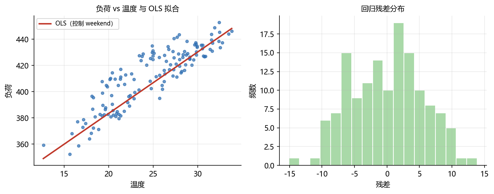
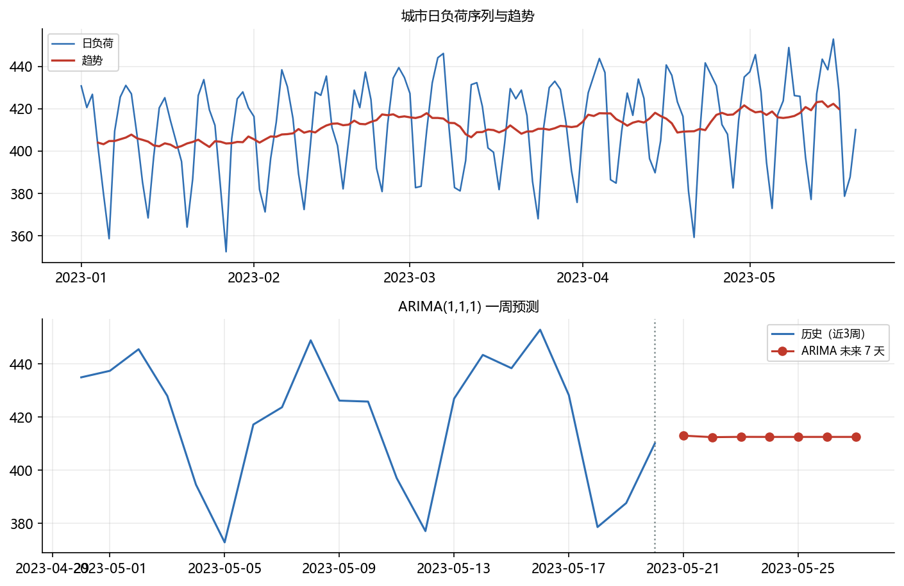

# 03 综合案例：城市日负荷的统计建模与预测

> 本章综合案例，把 **方差分析 + 线性回归 + 时间序列** 串在一份模拟数据上，体会 Statsmodels 的完整工作流。
> 配图：<code>images/case_regression_diag.png</code>、<code>images/case_ts_forecast.png</code>（由 <code>build/make_chap7_figures.py</code> 生成）。

## 背景

某市电网记录了 2023-01-01 起连续 140 天的**日负荷**（负荷越高用电越多）。我们关心三件事：

1. 工作日与周末的日均负荷是否显著不同（**单因素方差分析**）；
2. 负荷多大程度上可由**当日气温**与**是否周末**解释（**多元线性回归**）；
3. 未来的日负荷如何变化（**时间序列分解 + ARIMA 预测**）。

为便于教学，数据是**带趋势、周季节、温度效应、周末效应与噪声**的模拟序列。

## 数据构造

~~~python
import numpy as np
import pandas as pd
import statsmodels.api as sm
from statsmodels.formula.api import ols
from statsmodels.tsa.seasonal import seasonal_decompose
from statsmodels.tsa.arima.model import ARIMA

rng = np.random.default_rng(7)
m = 140
date = pd.date_range('2023-01-01', periods=m, freq='D')
trendc = np.linspace(0, 15, m)                       # 长期增长
seasonc = 5*np.sin(2*np.pi*np.arange(m)/7) + 2*np.cos(2*np.pi*np.arange(m)/7)  # 周季节
noisec = rng.normal(0, 3, m)
weekend = (date.dayofweek >= 5).astype(int)          # 周末=1
temp = 25 + 6*np.sin(2*np.pi*np.arange(m)/7) + rng.normal(0, 2, m)
load = 300 + 4*temp + 20*weekend + trendc + seasonc + noisec
dfc = pd.DataFrame({'date': date, 'load': load, 'weekend': weekend, 'temp': temp})
print("日均负荷 =", round(dfc['load'].mean(), 2), " 标准差 =", round(dfc['load'].std(), 2))
print("分组均值:", dfc.groupby('weekend')['load'].mean().round(2).to_dict())
~~~

运行结果：

~~~text
日均负荷 = 411.63  标准差 = 22.71
分组均值: {0: 408.99, 1: 418.22}
~~~

## 第 1 步：工作日 vs 周末 单因素方差分析

~~~python
dfc['wd'] = np.where(dfc['weekend'] == 1, '周末', '工作日')
ano = ols('load ~ C(wd)', data=dfc).fit()
print(sm.stats.anova_lm(ano, typ=1))
~~~

运行结果：

~~~text
             df        sum_sq      mean_sq         F    PR(>F)
C(wd)       1.0   2434.435479  2434.435479  4.850735  0.029294
Residual  138.0  69257.981299   501.869430       NaN       NaN
~~~

**结论**：工作日均值约 408.99，周末约 418.22，P 值 = 0.029 < 0.05，说明**周末负荷显著更高**。这提示差异化定价/调度应考虑周末。

## 第 2 步：负荷对温度的多元回归

把温度与“是否周末”作为自变量，用 <code>sm.OLS</code> 估计：

~~~python
olm = sm.OLS(dfc['load'], sm.add_constant(dfc[['temp', 'weekend']])).fit()
print("coef:", olm.params)
print("bse :", olm.bse)
print("R²  =", round(olm.rsquared, 4))
~~~

运行结果：

~~~text
coef: const      289.705193
temp         4.687421
weekend     21.022760
dtype: float64
bse: const      2.694195
temp       0.103535
weekend    1.084608
dtype: float64
R²  = 0.9395
~~~

**解读**：

- 每升高 1°C，日负荷平均增加约 **4.69** 单位（控制周末后）；
- 周末比工作日平均高约 **21.0** 单位；
- <code>R²=0.94</code>，温度与周末能解释大部分负荷变化；
- 两个系数的标准误都很小（temp 0.104、weekend 1.085），说明估计较精确。

## 第 3 步：时间序列分解 + ARIMA 预测

对负荷序列做周季节性（<code>period=7</code>）加法分解，再用 ARIMA(1,1,1) 预测未来 7 天：

~~~python
load_s = pd.Series(dfc['load'].values, index=date)
res = seasonal_decompose(load_s, model='additive', period=7)
print("残差标准差 =", round(res.resid.std(), 3))

mod = ARIMA(load_s, order=(1, 1, 1)).fit()
fc = mod.forecast(steps=7)
print("未来 7 天预测:", np.round(fc.values, 2))
print("AR 系数:", mod.arparams, " MA 系数:", mod.maparams)
~~~

运行结果：

~~~text
残差标准差 = 6.587
未来 7 天预测: [413.05 412.49 412.6  412.58 412.58 412.58 412.58]
AR 系数: [-0.19566366] MA 系数: [0.50904563]
~~~

**结论**：

- 残差标准差约 6.6，说明模型已抓住大部分趋势与季节；
- ARIMA(1,1,1) 给出的未来 7 天预测稳定在 412.6 左右（序列已进入较平稳区间）；
- 结合第 2 步：若未来一周气温升高，可直接用回归式估算负荷增量，作为短期调度参考。

## 本章小结

| 方法 | 结论 |
| ---- | ---- |
| ANOVA | 周末负荷显著高于工作日（P=0.029） |
| OLS | 温度每 +1°C 负荷 +4.69；周末 +21.0；R²=0.94 |
| 分解+ARIMA | 残差 σ≈6.6；未来 7 天预测约 412.6 |

**拓展任务**：

1. 用 <code>typ=3</code> 重跑方差分析，比较结果；
2. 在回归中加入 <code>temp*weekend</code> 交互项，判断周末的温度效应是否不同；
3. 用 <code>SARIMAX</code>（含外生温度变量）替代 ARIMA，比较预测误差；
4. 将前 120 天作为训练、后 20 天作为测试，用 RMSE 评估不同模型。
