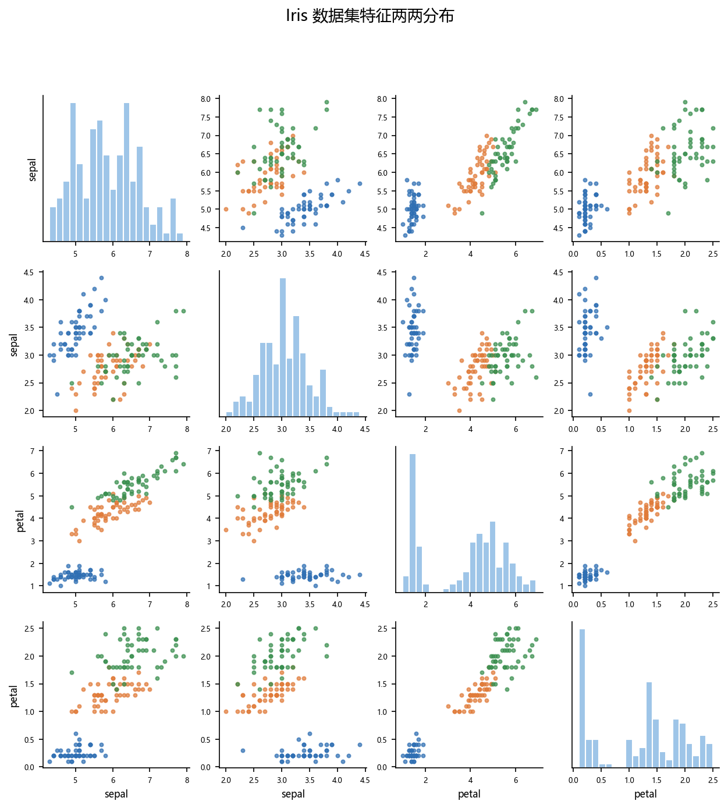
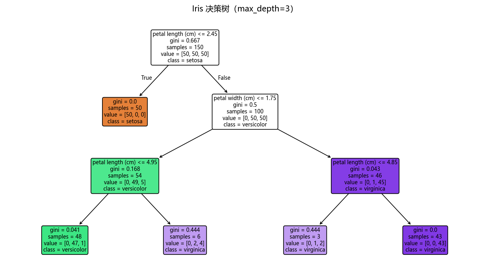
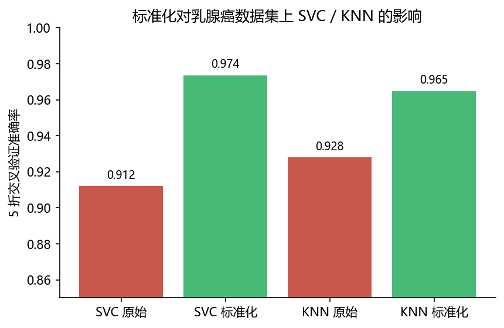

# 02 有监督学习的案例

> 本节在两个经典任务上走一遍“加载数据 → 切分 → 训练 → 评估”：**分类**（Iris 与乳腺癌）与**回归**（Diabetes）。所有代码在 sklearn 1.6.1 下验证。

## 本节目标

1. 用 `train_test_split` + 多个分类器完成 Iris 分类，并读懂混淆矩阵与分类报告。
2. 用 `Pipeline` + `StandardScaler` 训练逻辑回归，在乳腺癌上给出 `roc_auc_score`。
3. 用 `plot_tree` 可视化一棵决策树。
4. 在 Diabetes 数据集上做线性回归，比较 `LinearRegression`、`Ridge`、`Lasso`。
5. 会用 `mean_squared_error`、`mean_absolute_error`、`r2_score` 评估回归。

## 先修

- 01 节的数据预处理（缩放、切分、交叉验证）。
- 基本统计概念（均值、方差、相关系数）。

## 官方文档 / 参考入口

- sklearn 分类器总览：[链接](https://scikit-learn.org/stable/supervised_learning.html)
- sklearn 模型评估：[链接](https://scikit-learn.org/stable/modules/model_evaluation.html)
- sklearn 决策树：[链接](https://scikit-learn.org/stable/modules/tree.html)
- sklearn 线性模型：[链接](https://scikit-learn.org/stable/modules/linear_model.html)

## 正文

### 1. 分类：Iris 鸢尾花

鸢尾花数据集有 150 个样本、4 个特征（花萼长宽、花瓣长宽），标签为 3 类（Setosa / Versicolor / Virginica），每类 50 条。



#### 1.1 加载数据并切分

```python
import numpy as np
import matplotlib.pyplot as plt
from sklearn.datasets import load_iris
from sklearn.model_selection import train_test_split

plt.rcParams['font.sans-serif'] = ['Microsoft YaHei', 'SimHei', 'DejaVu Sans']
plt.rcParams['axes.unicode_minus'] = False
np.set_printoptions(precision=4, suppress=True)

iris = load_iris()
X, y = iris.data, iris.target
print("特征名:", iris.feature_names)
print("标签名:", iris.target_names)
print("数据形状:", X.shape)

Xtr, Xte, ytr, yte = train_test_split(X, y, test_size=0.3, random_state=42, stratify=y)
print("train/test:", Xtr.shape, Xte.shape)
```

```text
特征名: ['sepal length (cm)', 'sepal width (cm)', 'petal length (cm)', 'petal width (cm)']
标签名: ['setosa' 'versicolor' 'virginica']
数据形状: (150, 4)
train/test: (105, 4) (45, 4)
```

#### 1.2 训练多个分类器并比较

```python
from sklearn.neighbors import KNeighborsClassifier
from sklearn.linear_model import LogisticRegression
from sklearn.tree import DecisionTreeClassifier
from sklearn.ensemble import RandomForestClassifier
from sklearn.metrics import accuracy_score

models = {
    "KNN(k=5)": KNeighborsClassifier(n_neighbors=5),
    "LogisticRegression": LogisticRegression(max_iter=1000),
    "DecisionTree": DecisionTreeClassifier(random_state=42),
    "RandomForest(100)": RandomForestClassifier(n_estimators=100, random_state=42),
}
for name, m in models.items():
    m.fit(Xtr, ytr)
    print(f"{name:22s} acc = {accuracy_score(yte, m.predict(Xte)):.4f}")
```

```text
KNN(k=5)               acc = 0.9778
LogisticRegression     acc = 0.9333
DecisionTree           acc = 0.9333
RandomForest(100)      acc = 0.8889
```

> 不同模型在同一数据上表现不同，没有对任何数据集都最优的“万能模型”。随机森林在这份固定切分上反而略低，说明小样本下模型选择要看交叉验证与多次随机切分，而非一次 test 结果。

#### 1.3 混淆矩阵与分类报告

```python
from sklearn.metrics import confusion_matrix, classification_report

rf = models["RandomForest(100)"]
print(confusion_matrix(yte, rf.predict(Xte)))
print(classification_report(yte, rf.predict(Xte), target_names=iris.target_names))
```

```text
[[15  0  0]
 [ 0 14  1]
 [ 0  4 11]]
              precision    recall  f1-score   support

      setosa       1.00      1.00      1.00        15
  versicolor       0.78      0.93      0.85        15
   virginica       0.92      0.73      0.81        15

    accuracy                           0.89        45
   macro avg       0.90      0.89      0.89        45
weighted avg       0.90      0.89      0.89        45
```

> 混淆矩阵第 i 行第 j 列表示“真实为 i、被判为 j”。`classification_report` 给出每类的 precision、recall、f1。对不平衡数据，准确率会误导，要看 f1/recall。

#### 1.4 决策树可视化

```python
import matplotlib.pyplot as plt
plt.rcParams["font.sans-serif"] = ["Microsoft YaHei", "SimHei", "DejaVu Sans"]
plt.rcParams["axes.unicode_minus"] = False
from sklearn.tree import plot_tree

dt = DecisionTreeClassifier(max_depth=3, random_state=42).fit(Xtr, ytr)
fig, ax = plt.subplots(figsize=(13, 7))
plot_tree(dt, feature_names=iris.feature_names,
          class_names=list(iris.target_names), filled=True, rounded=True, ax=ax, fontsize=8)
plt.title("Iris 决策树（max_depth=3）")
```



### 2. 二分类与 ROC-AUC：乳腺癌

乳腺癌数据集是二分类（良性/恶性）。逻辑回归对量纲敏感，因此用 `Pipeline` 先标准化再训练。

```python
from sklearn.datasets import load_breast_cancer
from sklearn.model_selection import train_test_split
from sklearn.pipeline import Pipeline
from sklearn.preprocessing import StandardScaler
from sklearn.linear_model import LogisticRegression
from sklearn.metrics import accuracy_score, roc_auc_score

bc = load_breast_cancer(); Xb, yb = bc.data, bc.target
Xtr, Xte, ytr, yte = train_test_split(Xb, yb, test_size=0.3, random_state=42, stratify=yb)

pipe = Pipeline([("sc", StandardScaler()), ("clf", LogisticRegression(max_iter=1000))])
pipe.fit(Xtr, ytr)
prob = pipe.predict_proba(Xte)[:, 1]
print("ROC-AUC:", round(roc_auc_score(yte, prob), 4))
print("准确率:", round(accuracy_score(yte, pipe.predict(Xte)), 4))
```

```text
ROC-AUC: 0.9981
准确率: 0.9883
```

> `predict_proba` 返回每个样本属于正类的概率；`roc_auc_score` 评估“排序能力”，比单纯准确率更能反映二分类模型质量。

**缩放为什么关键**：SVC/KNN 对量纲很敏感。下图给出乳腺癌 5 折交叉验证，未标准化 vs 标准化的对比：



### 3. 回归：Diabetes 糖尿病

波士顿房价数据集（`load_boston`）已在 sklearn 1.2 被移除，故本节改用内置的 `load_diabetes`（442 个样本、10 个标准化后的特征）。

```python
from sklearn.datasets import load_diabetes
from sklearn.model_selection import train_test_split
from sklearn.linear_model import LinearRegression, Ridge, Lasso
from sklearn.metrics import mean_squared_error, mean_absolute_error, r2_score
import numpy as np

d = load_diabetes(); Xd, yd = d.data, d.target
Xtr, Xte, ytr, yte = train_test_split(Xd, yd, test_size=0.2, random_state=42)

for name, m in [("LinearRegression", LinearRegression()),
                ("Ridge(alpha=1)", Ridge(alpha=1.0)),
                ("Lasso(alpha=0.1)", Lasso(alpha=0.1, max_iter=5000))]:
    m.fit(Xtr, ytr)
    yp = m.predict(Xte)
    print(f"{name:20s} MSE={mean_squared_error(yte, yp):.2f}  "
          f"MAE={mean_absolute_error(yte, yp):.2f}  R2={r2_score(yte, yp):.4f}")

las = Lasso(alpha=0.1, max_iter=5000).fit(Xtr, ytr)
print("Lasso 非零系数个数:", np.count_nonzero(las.coef_))
print("特征名:", d.feature_names)
```

```text
LinearRegression     MSE=2900.19  MAE=42.79  R2=0.4526
Ridge(alpha=1)       MSE=3077.42  MAE=46.14  R2=0.4192
Lasso(alpha=0.1)     MSE=2798.19  MAE=42.85  R2=0.4719
Lasso 非零系数个数: 7
特征名: ['age', 'sex', 'bmi', 'bp', 's1', 's2', 's3', 's4', 's5', 's6']
```

> 回归指标速记：`MSE`/`MAE` 越小越好；`R2` 越接近 1 越好。这里 Lasso 用 L1 正则把部分系数压到 0，既得到不错 R² 又做了特征选择。

## 案例卡 2：分类流水线——Iris 用 KNN+标准化+Pipeline 防数据泄漏

### 目标

把 `StandardScaler` 与 `KNeighborsClassifier` 串成一条 `Pipeline`，在 Iris 上完成训练和 5 折交叉验证；并对比“未缩放直接喂 KNN”，体会缩放对距离类模型的影响，以及为什么 `Pipeline` 能防止数据泄漏。

### 代码

```python
import numpy as np
from sklearn.datasets import load_iris
from sklearn.model_selection import train_test_split, cross_val_score
from sklearn.preprocessing import StandardScaler
from sklearn.pipeline import Pipeline
from sklearn.neighbors import KNeighborsClassifier
from sklearn.metrics import accuracy_score

np.set_printoptions(precision=4, suppress=True)

iris = load_iris(); X, y = iris.data, iris.target
Xtr, Xte, ytr, yte = train_test_split(X, y, test_size=0.3, random_state=42, stratify=y)

pipe = Pipeline([('sc', StandardScaler()), ('knn', KNeighborsClassifier(n_neighbors=5))])
pipe.fit(Xtr, ytr)
print('Pipeline KNN acc:', round(accuracy_score(yte, pipe.predict(Xte)), 4))
print('5折CV:', np.round(cross_val_score(pipe, X, y, cv=5), 4))
print('5折均值:', round(cross_val_score(pipe, X, y, cv=5).mean(), 4))

knn_raw = KNeighborsClassifier(n_neighbors=5).fit(Xtr, ytr)
print('未缩放 KNN acc:', round(accuracy_score(yte, knn_raw.predict(Xte)), 4))

print('pipeline steps:', pipe.named_steps)
print('scaler mean_:', np.round(pipe.named_steps['sc'].mean_, 4))
```

### 运行结果（已运行核验）

```text
Pipeline KNN acc: 0.9111
5折CV: [0.9667 0.9667 0.9333 0.9333 1.    ]
5折均值: 0.96
未缩放 KNN acc: 0.9778
pipeline steps: {'sc': StandardScaler(), 'knn': KNeighborsClassifier()}
scaler mean_: [5.8733 3.0552 3.7848 1.2057]
```

### 讲解

**一句话解释**：`Pipeline` 就像一条自动流水线：先把特征“缩放”，再交给 KNN 分类；每一次交叉验证都会在训练折重新缩放，绝不偷看测试折。

1. `train_test_split(random_state=42, stratify=y)` 把 Iris 按类别等比例分成训练 (105) 与测试 (45)，固定随机种子保证可复现。
2. `Pipeline([('sc', StandardScaler()), ('knn', KNeighborsClassifier(n_neighbors=5))])` 定义两步：`sc` 缩放，`knn` 分类。调用 `pipe.fit(Xtr, ytr)` 时，先 `fit` 缩放器再 `fit` KNN，一步完成。
3. `pipe.predict(Xte)` 会自动用训练集的均值和标准差缩放测试集，再交给 KNN 分类；测试集信息完全没有参与缩放统计量。
4. `cross_val_score(pipe, X, y, cv=5)` 每次折叠都会**重新 fit 整条流水线**，因此不会用整份数据算缩放器；5 折均值为 0.96，比单次测试集更可信。
5. 最后一行 `scaler mean_` 显示的是训练集均值 `[5.8733, 3.0552, 3.7848, 1.2057]`，它与 Case 1 中“只 fit 训练集”的结果一致，说明 `Pipeline` 没有泄漏。
6. 对比“未缩放 KNN acc=0.9778”：在**这次固定切分**上未缩放反而略高；但距离类模型对量纲敏感，单次 test 很随机，因此应看 5 折均值（0.96）或换多组切分，而不是凭一次结果下结论。

### 主要用法 / API

| 需求 | 写法 | 说明 |
| ---- | ---- | ---- |
| 拼接缩放+模型 | `Pipeline([('sc', StandardScaler()), ('knn', KNeighborsClassifier())])` | `fit` 时自动先缩放再训练 |
| 交叉验证 | `cross_val_score(pipe, X, y, cv=5)` | 每折重新 fit 整条流水线 |
| 查看每一步 | `pipe.named_steps` | 返回名字到对象的字典 |
| 取某一步参数 | `pipe.named_steps['sc'].mean_` | 例如看缩放器统计量 |
| 预测概率 | `pipe.predict_proba(X)[:, 1]` | 二分类正类概率在第二列 |

### 常见错误

- 先 `StandardScaler().fit_transform(X)` 再切分 → 数据泄漏；应把缩放放进 `Pipeline` 或只对训练集 `fit`。
- 在 `cross_val_score` 里直接传缩放后的 `X`，而不是传 `Pipeline` → 等价于每折都用全量统计量。
- 认为“缩放一定提升精度”：单次 test 可能相反，但距离类模型通常更稳定；要用 CV 判断。
- 忘记设置 `random_state`：KMeans/KNN 等虽确定，但数据切分与后续调参不设种子会无法复现。

### 拓展 / 跟练

1. 把 KNN 换成 `SVC(kernel='rbf')` 或 `LogisticRegression`，重跑 `Pipeline` 5 折，比较均值。
2. 用 `GridSearchCV` 搜索 `knn__n_neighbors`，注意参数名前缀 `knn__`。
3. 把 `StandardScaler` 换成 `MinMaxScaler`，观察 5 折均值是否变化。
4. 对测试集单独 `fit_transform`，观察 ROC-AUC 或准确率是否被高估，并写下结论。

## 常见误区


1. 用 `r2_score(y_pred, y_test)` 参数顺序写反 → 应为 `r2_score(y_true, y_pred)`；对分类问题更不该用 R²。
2. 在 sklearn 里已经移除 `load_boston`，再用会 `ImportError`。
3. 直接拿未缩放数据喂 `SVC`/`KNN`/`LogisticRegression`，会导致收敛慢或精度差。
4. 把 `predict_proba` 的第一列当作正类概率 → 正类是第 1 列（标签为 1 的类）。
5. 在同一个数据集上反复“调参、看测试集”，相当于把测试集当训练信息用。

## 思考题

1. 为什么 KNN 对缩放特别敏感？树模型为什么相对不敏感？
2. `accuracy_score` 与 `roc_auc_score` 分别衡量什么？在类别不平衡时哪个更可靠？
3. 一次 test 集准确率高，能说明模型泛化好吗？为什么还要交叉验证？

## 动手练习

1. 在 Iris 上把 `RandomForestClassifier(n_estimators=100)` 与 `KNeighborsClassifier` 做 5 折交叉验证比较。
2. 用 `SVC` 分别在不缩放/缩放情况下做乳腺癌 5 折，记录结果（可对照 `scaling_effect.png`）。
3. 在 Diabetes 上试 `Ridge(alpha)` 与 `Lasso(alpha)` 的不同 `alpha` 值，画出“alpha-R²”曲线。

## 延伸阅读

- sklearn 分类指标：[链接](https://scikit-learn.org/stable/modules/model_evaluation.html#classification-metrics)
- sklearn 回归指标：[链接](https://scikit-learn.org/stable/modules/model_evaluation.html#regression-metrics)
- sklearn 用户指南“选择正确的评估器”：[链接](https://scikit-learn.org/stable/modules/preprocessing.html)