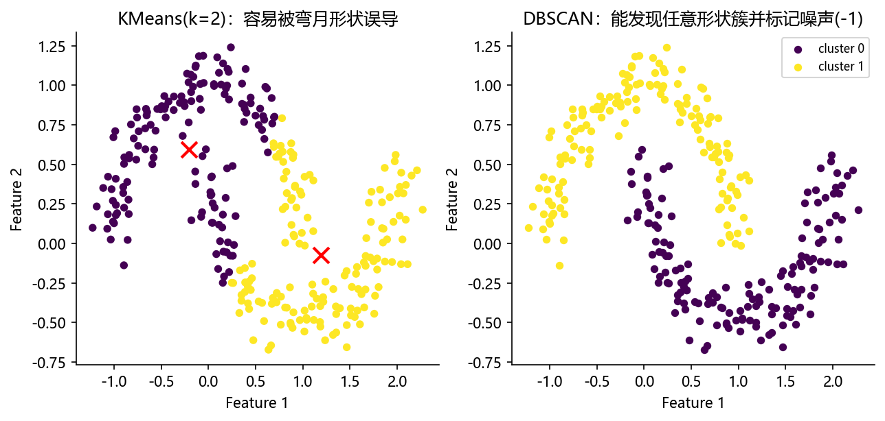

# 03 无监督学习的案例

> 本节讲“没有标签”的任务：**聚类**（KMeans、DBSCAN）与**降维**（PCA、LDA）。所有代码在 sklearn 1.6.1 下验证。

## 本节目标

1. 用 `KMeans` 对 `make_blobs` 聚类，读出 `inertia_`、`cluster_centers_`、`silhouette_score`。
2. 用 `DBSCAN` 对 `make_moons` 聚类，识别噪声（标签 -1），并算 `adjusted_rand_score`。
3. 用 `PCA` 降维并读出 `explained_variance_ratio_`。
4. 用 `LDA` 做有监督降维，理解它与 PCA 的差别。

## 先修

- 01 节特征缩放、02 节分类/回归基础。
- 了解“距离”“方差”“协方差”等概念。

## 官方文档 / 参考入口

- sklearn 聚类：https://scikit-learn.org/stable/modules/clustering.html
- sklearn 降维：https://scikit-learn.org/stable/modules/decomposition.html
- sklearn 聚类评估：https://scikit-learn.org/stable/modules/clustering.html#clustering-performance-evaluation

## 正文

### 1. 聚类：KMeans

KMeans 把数据分成 K 个簇，使“簇内平方和”最小。它需要预先指定 K。

```python
import numpy as np
from sklearn.cluster import KMeans
from sklearn.datasets import make_blobs
from sklearn.metrics import silhouette_score

X, _ = make_blobs(n_samples=300, centers=4, cluster_std=0.60, random_state=0)
km = KMeans(n_clusters=4, random_state=0).fit(X)
labels = km.labels_
print("inertia:", round(km.inertia_, 4))
print("聚类中心形状:", km.cluster_centers_.shape)
print("轮廓系数:", round(silhouette_score(X, labels), 4))
```

```text
inertia: 212.006
聚类中心形状: (4, 2)
轮廓系数: 0.682
```

> `inertia_` 是簇内平方和，越小越好；`silhouette_score` 在 [-1,1] 之间，越接近 1 表示簇内紧凑、簇间分离越好。

### 2. 聚类：DBSCAN

DBSCAN 按密度自动发现簇，能处理任意形状，并能把不属于任何簇的点标为 **-1（噪声）**。

```python
from sklearn.cluster import DBSCAN
from sklearn.datasets import make_moons
from sklearn.metrics import adjusted_rand_score

Xm, ym = make_moons(n_samples=300, noise=0.1, random_state=42)
db = DBSCAN(eps=0.2, min_samples=5).fit(Xm)
labels = db.labels_
print("簇数:", len(set(labels)) - (1 if -1 in labels else 0))
print("噪声比例:", round(np.mean(labels == -1), 4))
print("簇大小:", np.bincount(labels))
print("与真实标签 ARI:", round(adjusted_rand_score(ym, labels), 4))
```

```text
簇数: 2
噪声比例: 0.0
簇大小: [150 150]
与真实标签 ARI: 1.0
```

> `adjusted_rand_score`（ARI）在 [0,1]（随机约 0、完全一致为 1）。这里 DBSCAN 完美分出两个月牙形簇，ARI=1.0。

**KMeans 与 DBSCAN 的对比**：KMeans 假设凸形、球形簇，对“弯月”类数据效果差；DBSCAN 依据密度，可发现任意形状并识别噪声。



### 3. 降维：PCA（无监督）

PCA 找“方差最大的方向”，把高维映射到低维，且不需要标签。

```python
from sklearn.datasets import load_iris
from sklearn.decomposition import PCA

iris = load_iris(); X, y = iris.data, iris.target
pca = PCA(n_components=2)
Xp = pca.fit_transform(X)
print("各主成分解释方差比:", np.round(pca.explained_variance_ratio_, 4))
print("累计解释方差:", np.round(np.cumsum(pca.explained_variance_ratio_), 4))
```

```text
各主成分解释方差比: [0.9246 0.0531]
累计解释方差: [0.9246 0.9777]
```

> 前 2 个主成分已保留约 97.77% 方差，说明 Iris 降到 2 维几乎不丢信息，适合可视化。

### 4. 降维：LDA（有监督）

LDA 在已知类别的情况下，找“类间方差最大、类内方差最小”的投影方向。因此需要同时给出 `X` 与 `y`。

```python
from sklearn.discriminant_analysis import LinearDiscriminantAnalysis as LDA

lda = LDA(n_components=2)
Xl = lda.fit_transform(X, y)
print("LDA 各成分解释方差比:", np.round(lda.explained_variance_ratio_, 4))
```

```text
LDA 各成分解释方差比: [0.9912 0.0088]
```

> 对比：PCA 完全不看类别，LDA 用类别信息，因而投影对分类更有帮助。两者都适用于 Iris 降到 2 维，但语义不同。

## 常见误区

1. KMeans 必须预设 `n_clusters`，且对初始中心敏感（用 `random_state` 固定，或用 `k-means++`）。
2. 以为“降维能提升所有模型精度”——降维会丢失信息，有时反而更差。
3. 把 PCA 与 LDA 混为一谈（前者无监督、后者有监督）。
4. 对 `make_moons` 用 KMeans 期望得到月牙形簇——通常失败。
5. `DBSCAN` 的 `eps`、`min_samples` 必须按数据量纲调，不能“一个参数跑天下”。

## 思考题

1. 为什么 KMeans 需要先缩放？PCA 呢？
2. DBSCAN 的 `eps` 太小/太大会分别出现什么现象？
3. 用什么指标判断“该保留多少个主成分”？（累计解释方差、碎石图等）
4. ARI 与 `silhouette_score` 的适用场景有何不同？

## 动手练习

1. 对 `make_blobs` 用 `KMeans(k=2..6)` 画出“k-轮廓系数”曲线，找最佳 k。
2. 调整 `DBSCAN` 的 `eps`（0.1/0.2/0.5），观察簇数与噪声比例变化。
3. 对 Wine 数据（13 维）用 PCA 降到 2 维并散点着色，给出累计解释方差。

## 延伸阅读

- sklearn 聚类用户指南：https://scikit-learn.org/stable/modules/clustering.html
- sklearn 降维用户指南：https://scikit-learn.org/stable/modules/decomposition.html
- sklearn 聚类评估：https://scikit-learn.org/stable/modules/clustering.html#clustering-performance-evaluation
