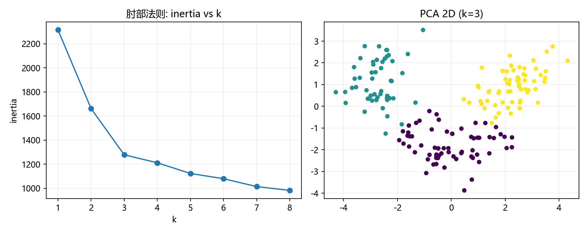

# 03 无监督学习的案例

> 本节讲“没有标签”的任务：**聚类**（KMeans、DBSCAN）与**降维**（PCA、LDA）。所有代码在 sklearn 1.6.1 下验证。

## 本节目标

1. 用 `KMeans` 对 `make_blobs` 聚类，读出 `inertia_`、`cluster_centers_`、`silhouette_score`。
2. 用 `DBSCAN` 对 `make_moons` 聚类，识别噪声（标签 -1），并算 `adjusted_rand_score`。
3. 用 `PCA` 降维并读出 `explained_variance_ratio_`。
4. 用 `LDA` 做有监督降维，理解它与 PCA 的差别。

## 先修

- 01 节特征缩放、02 节分类/回归基础。
- 了解“距离”“方差”“协方差”等概念。

## 官方文档 / 参考入口

- sklearn 聚类：[链接](https://scikit-learn.org/stable/modules/clustering.html)
- sklearn 降维：[链接](https://scikit-learn.org/stable/modules/decomposition.html)
- sklearn 聚类评估：[链接](https://scikit-learn.org/stable/modules/clustering.html#clustering-performance-evaluation)

## 正文

### 1. 聚类：KMeans

KMeans 把数据分成 K 个簇，使“簇内平方和”最小。它需要预先指定 K。

```python
import numpy as np
import matplotlib.pyplot as plt
from sklearn.cluster import KMeans
from sklearn.datasets import make_blobs
from sklearn.metrics import silhouette_score

plt.rcParams['font.sans-serif'] = ['Microsoft YaHei', 'SimHei', 'DejaVu Sans']
plt.rcParams['axes.unicode_minus'] = False
np.set_printoptions(precision=4, suppress=True)

X, _ = make_blobs(n_samples=300, centers=4, cluster_std=0.60, random_state=0)
km = KMeans(n_clusters=4, random_state=0).fit(X)
labels = km.labels_
print("inertia:", round(km.inertia_, 4))
print("聚类中心形状:", km.cluster_centers_.shape)
print("轮廓系数:", round(silhouette_score(X, labels), 4))
```

```text
inertia: 212.006
聚类中心形状: (4, 2)
轮廓系数: 0.682
```

> `inertia_` 是簇内平方和，越小越好；`silhouette_score` 在 [-1,1] 之间，越接近 1 表示簇内紧凑、簇间分离越好。

### 2. 聚类：DBSCAN

DBSCAN 按密度自动发现簇，能处理任意形状，并能把不属于任何簇的点标为 **-1（噪声）**。

```python
from sklearn.cluster import DBSCAN
from sklearn.datasets import make_moons
from sklearn.metrics import adjusted_rand_score

Xm, ym = make_moons(n_samples=300, noise=0.1, random_state=42)
db = DBSCAN(eps=0.2, min_samples=5).fit(Xm)
labels = db.labels_
print("簇数:", len(set(labels)) - (1 if -1 in labels else 0))
print("噪声比例:", round(np.mean(labels == -1), 4))
print("簇大小:", np.bincount(labels))
print("与真实标签 ARI:", round(adjusted_rand_score(ym, labels), 4))
```

```text
簇数: 2
噪声比例: 0.0
簇大小: [150 150]
与真实标签 ARI: 1.0
```

> `adjusted_rand_score`（ARI）在 [0,1]（随机约 0、完全一致为 1）。这里 DBSCAN 完美分出两个月牙形簇，ARI=1.0。

**KMeans 与 DBSCAN 的对比**：KMeans 假设凸形、球形簇，对“弯月”类数据效果差；DBSCAN 依据密度，可发现任意形状并识别噪声。


### 3. 降维：PCA（无监督）

PCA 找“方差最大的方向”，把高维映射到低维，且不需要标签。

```python
from sklearn.datasets import load_iris
from sklearn.decomposition import PCA

iris = load_iris(); X, y = iris.data, iris.target
pca = PCA(n_components=2)
Xp = pca.fit_transform(X)
print("各主成分解释方差比:", np.round(pca.explained_variance_ratio_, 4))
print("累计解释方差:", np.round(np.cumsum(pca.explained_variance_ratio_), 4))
```

```text
各主成分解释方差比: [0.9246 0.0531]
累计解释方差: [0.9246 0.9777]
```

> 前 2 个主成分已保留约 97.77% 方差，说明 Iris 降到 2 维几乎不丢信息，适合可视化。

### 4. 降维：LDA（有监督）

LDA 在已知类别的情况下，找“类间方差最大、类内方差最小”的投影方向。因此需要同时给出 `X` 与 `y`。

```python
from sklearn.discriminant_analysis import LinearDiscriminantAnalysis as LDA

lda = LDA(n_components=2)
Xl = lda.fit_transform(X, y)
print("LDA 各成分解释方差比:", np.round(lda.explained_variance_ratio_, 4))
```

```text
LDA 各成分解释方差比: [0.9912 0.0088]
```

> 对比：PCA 完全不看类别，LDA 用类别信息，因而投影对分类更有帮助。两者都适用于 Iris 降到 2 维，但语义不同。

## 案例卡 3：KMeans 与 PCA——用肘部法则评估聚类数并做 2D 可视化

### 目标

在 Wine 这个 13 维数值数据集上，先标准化，再用**肘部法则**（簇内平方和 inertia 随聚类数 k 变化）评估该选几个簇；最后用 **PCA** 把 13 维压到 2 维，画出 KMeans 聚类结果的 2D 可视化。

### 代码

```python
import numpy as np
import os
import matplotlib.pyplot as plt
from sklearn.datasets import load_wine
from sklearn.preprocessing import StandardScaler
from sklearn.cluster import KMeans
from sklearn.decomposition import PCA
from sklearn.metrics import silhouette_score, adjusted_rand_score

plt.rcParams['font.sans-serif'] = ['Microsoft YaHei', 'SimHei', 'DejaVu Sans']
plt.rcParams['axes.unicode_minus'] = False
np.set_printoptions(precision=4, suppress=True)

wine = load_wine(); X = wine.data; y = wine.target
Xs = StandardScaler().fit_transform(X)
ks = range(1, 9)
inertias = []
for k in ks:
    km = KMeans(n_clusters=k, random_state=42).fit(Xs)
    inertias.append(km.inertia_)
print('inertia:', np.round(np.array(inertias), 2))
for k in [3, 4, 5]:
    km = KMeans(n_clusters=k, random_state=42).fit(Xs)
    print('k=%d silhouette=%.4f ARI=%.4f' % (k, silhouette_score(Xs, km.labels_), adjusted_rand_score(y, km.labels_)))

km3 = KMeans(n_clusters=3, random_state=42).fit(Xs)
pca = PCA(n_components=2)
Xp = pca.fit_transform(Xs)
print('PC1/PC2 var ratio:', np.round(pca.explained_variance_ratio_, 4))

os.makedirs('images', exist_ok=True)
fig, axes = plt.subplots(1, 2, figsize=(10, 4))
axes[0].plot(list(ks), inertias, 'o-')
axes[0].set_title('肘部法则: inertia vs k')
axes[0].set_xlabel('k'); axes[0].set_ylabel('inertia')
axes[1].scatter(Xp[:, 0], Xp[:, 1], c=km3.labels_, cmap='viridis', s=20)
axes[1].set_title('PCA 2D (k=3)')
for ax in axes:
    ax.grid(alpha=0.2)
fig.tight_layout()
fig.savefig('images/case3_elbow_pca.png', dpi=150)
plt.close()
print('saved images/case3_elbow_pca.png')
```

### 运行结果（已运行核验）

```text
inertia: [2314.   1661.68 1277.93 1211.75 1123.16 1079.54 1014.43  982.65]
k=3 silhouette=0.2849 ARI=0.8975
k=4 silhouette=0.2542 ARI=0.8172
k=5 silhouette=0.1836 ARI=0.6264
PC1/PC2 var ratio: [0.362  0.1921]
saved images/case3_elbow_pca.png
```



### 讲解

**一句话解释**：KMeans 要告诉它“分成几堆”，肘部法则看“再分一堆能省多少距离”，省得开始变少时的 k 就是不错的分堆数；PCA 则把 13 维投影到平面上，让我们能“看见”这些堆。

1. `StandardScaler().fit_transform(X)` 先对 13 个特征做 z-score，避免量纲大的特征（如 proline）主导聚类。
2. `KMeans(n_clusters=k, random_state=42)` 用固定随机种子，保证每次结果可复现；`inertia_` 是簇内平方和（WCSS），k 越大通常越小。
3. 肘部法则：观察 `inertia` 序列，k 从 1 到 2、2 到 3 下降很大（2314→1661→1278），3 之后下降明显变缓（1211、1123、1079…），所以“肘”在 k=3 附近。
4. 辅助指标：`silhouette`（越接近 1 越好）在 k=3 时最大（0.2849）；`ARI` 衡量与真实品种标签的一致性，k=3 时 ARI=0.8975，说明分成 3 簇与真实品种高度吻合。
5. `PCA(n_components=2)` 给出前两个主成分解释方差比例 `[0.362, 0.1921]`，两者合计约 0.554，虽不足 100%，但 2D 散点已能看出三团结构。
6. 右图按 KMeans 的簇标签着色，三团颜色基本对应真实的三类 Wine；左图（肘部图）则直观显示“k=3 是下降变缓的拐点”。

### 主要用法 / API

| 需求 | 写法 | 说明 |
| ---- | ---- | ---- |
| 标准化 | `StandardScaler().fit_transform(X)` | 距离/聚类前常用 |
| 聚类 | `KMeans(n_clusters=k, random_state=42)` | 需要固定随机种子 |
| 簇内平方和 | `km.inertia_` | 画肘部曲线 |
| 轮廓系数 | `silhouette_score(Xs, km.labels_)` | 越大越“内紧外分” |
| 与真实标签比对 | `adjusted_rand_score(y, km.labels_)` | 1 为完全一致 |
| 降维到 2 维 | `PCA(n_components=2).fit_transform(Xs)` | 用于可视化 |

### 常见错误

- 不缩放就聚类：量纲大的特征会把其他特征“压扁”，常见结果是簇形状被大数值特征主导。
- 只看 `inertia` 就选 k：`inertia_` 只减不增，若没有明显“肘”，还要结合 silhouette 或业务知识。
- 用一次 KMeans 标签就下结论：KMeans 只是无监督分组，标签顺序与真实类别不一定对应，应结合 ARI/可视化。
- 把 `explained_variance_ratio_` 的累计值当成“模型准确率”：它是投影保留的方差比例，不是分类/聚类精度。

### 拓展 / 跟练

1. 把 `ks` 范围改为 1~10，看 k 更大时 inertia 是否还在“加速下降”。
2. 把标准化后的 Wine 改用 `DBSCAN`，比较它对 Wine 的簇数与 ARI。
3. 用 `PCA` 的 `explained_variance_ratio_` 画“累计解释方差”图，判断保留到 2 维是否够。
4. 对 Iris 也做同样的肘部图 + PCA 2D 可视化，比较 Wine 与 Iris 的最佳 k 是否都为 3。

## 常见误区

1. KMeans 必须预设 `n_clusters`，且对初始中心敏感（用 `random_state` 固定，或用 `k-means++`）。
2. 以为“降维能提升所有模型精度”——降维会丢失信息，有时反而更差。
3. 把 PCA 与 LDA 混为一谈（前者无监督、后者有监督）。
4. 对 `make_moons` 用 KMeans 期望得到月牙形簇——通常失败。
5. `DBSCAN` 的 `eps`、`min_samples` 必须按数据量纲调，不能“一个参数跑天下”。

## 思考题

1. 为什么 KMeans 需要先缩放？PCA 呢？
2. DBSCAN 的 `eps` 太小/太大会分别出现什么现象？
3. 用什么指标判断“该保留多少个主成分”？（累计解释方差、碎石图等）
4. ARI 与 `silhouette_score` 的适用场景有何不同？

## 动手练习

1. 对 `make_blobs` 用 `KMeans(k=2..6)` 画出“k-轮廓系数”曲线，找最佳 k。
2. 调整 `DBSCAN` 的 `eps`（0.1/0.2/0.5），观察簇数与噪声比例变化。
3. 对 Wine 数据（13 维）用 PCA 降到 2 维并散点着色，给出累计解释方差。

## 延伸阅读

- sklearn 聚类用户指南：[链接](https://scikit-learn.org/stable/modules/clustering.html)
- sklearn 降维用户指南：[链接](https://scikit-learn.org/stable/modules/decomposition.html)
- sklearn 聚类评估：[链接](https://scikit-learn.org/stable/modules/clustering.html#clustering-performance-evaluation)
