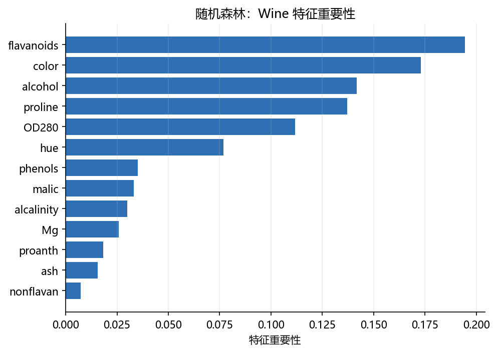
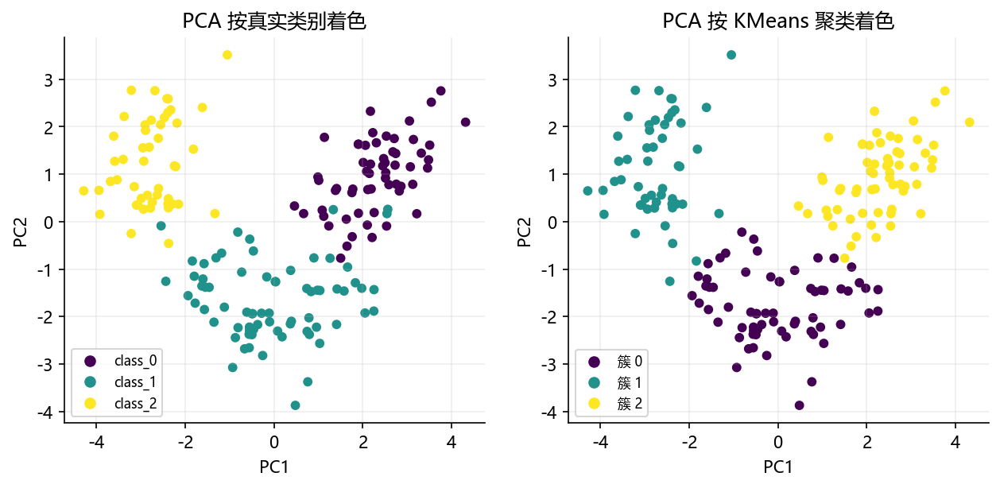

# 04 综合案例：Wine 数据端到端（预处理 → 分类 → 聚类 → 降维）

> 本章新增综合案例，把 01–03 的知识串成一条完整流水线：**特征缩放 → 分类 → 特征重要性 → 聚类 → 降维 → 可视化**。所有代码在 sklearn 1.6.1 下验证；配图由 `build/make_chap8_figures.py` 生成。

## 案例背景

Wine（红酒）数据集有 178 个样本、13 个数值特征（酒精、苹果酸、灰分、总酚、黄酮等），标签为 3 个品种（`class_0/1/2`）。这是一个“数值特征多、量纲不同、类别有结构”的典型数据，非常适合练习本章全部知识。

## 第 1 步：加载数据并观察

```python
import numpy as np
from sklearn.datasets import load_wine

wine = load_wine()
X, y = wine.data, wine.target
print("特征名:", wine.feature_names)
print("数据形状:", X.shape, "类别:", np.unique(y))
```

```text
特征名: ['alcohol', 'malic_acid', 'ash', 'alcalinity_of_ash', 'magnesium', 'total_phenols', 'flavanoids', 'nonflavanoid_phenols', 'proanthocyanins', 'color_intensity', 'hue', 'od280/od315_of_diluted_wines', 'proline']
数据形状: (178, 13) 类别: [0 1 2]
```

## 第 2 步：缩放 + 分类（用 Pipeline 防泄漏）

把“标准化”与“分类器”放进 `Pipeline`，这样 `cross_val_score` 每次都在训练折上拟合缩放器，绝不用测试折的信息。

```python
from sklearn.model_selection import train_test_split, cross_val_score
from sklearn.preprocessing import StandardScaler
from sklearn.pipeline import Pipeline
from sklearn.linear_model import LogisticRegression
from sklearn.ensemble import RandomForestClassifier
from sklearn.metrics import accuracy_score

Xtr, Xte, ytr, yte = train_test_split(X, y, test_size=0.3, random_state=42, stratify=y)
print("train:", Xtr.shape, "test:", Xte.shape)

lr_pipe = Pipeline([("sc", StandardScaler()), ("clf", LogisticRegression(max_iter=1000))])
rf_pipe = Pipeline([("sc", StandardScaler()), ("clf", RandomForestClassifier(n_estimators=100, random_state=42))])

lr_pipe.fit(Xtr, ytr)
rf_pipe.fit(Xtr, ytr)
print("LogisticRegression test acc:", round(accuracy_score(yte, lr_pipe.predict(Xte)), 4))
print("RandomForest      test acc:", round(accuracy_score(yte, rf_pipe.predict(Xte)), 4))
print("LogisticRegression 5 折均值:", round(cross_val_score(lr_pipe, X, y, cv=5).mean(), 4))
print("RandomForest      5 折均值:", round(cross_val_score(rf_pipe, X, y, cv=5).mean(), 4))
```

```text
train: (124, 13) test: (54, 13)
LogisticRegression test acc: 0.9815
RandomForest      test acc: 1.0
LogisticRegression 5 折均值: 0.9832
RandomForest      5 折均值: 0.9778
```

> 真实项目里，一组固定的 test 集被反复调参会导致“测试集过拟合”；所以更稳的是看 5 折平均（这里 LogisticRegression 与 RandomForest 均约 0.98）。

## 第 3 步：特征重要性（RandomForest）

用随机森林的 `feature_importances_` 看哪些特征更重要。

```python
from sklearn.preprocessing import StandardScaler
from sklearn.ensemble import RandomForestClassifier

Xs = StandardScaler().fit_transform(X)
rf = RandomForestClassifier(n_estimators=100, random_state=42).fit(Xs, y)
imp = rf.feature_importances_
order = np.argsort(imp)[::-1]
for i in order[:6]:
    print(f"{wine.feature_names[i]:30s} {imp[i]:.4f}")
```

```text
flavanoids                     0.1945
color_intensity                0.1730
alcohol                        0.1416
proline                        0.1370
od280/od315_of_diluted_wines   0.1118
hue                            0.0769
```



> 黄酮（flavanoids）、颜色强度（color_intensity）、酒精含量（alcohol）、脯氨酸（proline）等对品种区分贡献最大。这有助于我们“读懂”模型而不仅是得到一个分数。

## 第 4 步：无监督聚类（KMeans）

把“没有标签”的思路也用上：对标准化后的 Wine 做 KMeans，看能否大致还原真实品种。

```python
from sklearn.cluster import KMeans
from sklearn.metrics import adjusted_rand_score, silhouette_score

km = KMeans(n_clusters=3, random_state=42).fit(Xs)
print("轮廓系数:", round(silhouette_score(Xs, km.labels_), 4))
print("ARI vs 真实标签:", round(adjusted_rand_score(y, km.labels_), 4))
print("各簇大小:", np.bincount(km.labels_))
```

```text
轮廓系数: 0.2849
ARI vs 真实标签: 0.8975
各簇大小: [65 51 62]
```

> `adjusted_rand_score=0.8975` 表示无监督聚类与真实品种高度一致（1 为完全一致），说明 Wine 数据确有明显的类结构。

## 第 5 步：PCA 降维并可视化

用 PCA 把 13 维压到 2 维，分别按真实类别与 KMeans 簇着色：

```python
import matplotlib.pyplot as plt
plt.rcParams["font.sans-serif"] = ["Microsoft YaHei", "SimHei", "DejaVu Sans"]
plt.rcParams["axes.unicode_minus"] = False
from sklearn.decomposition import PCA

pca = PCA(n_components=2)
Xp = pca.fit_transform(Xs)
print("前两个主成分解释方差:", np.round(pca.explained_variance_ratio_, 4))
print("累计解释方差:", np.round(np.cumsum(pca.explained_variance_ratio_), 4))

fig, axes = plt.subplots(1, 2, figsize=(10, 4))
axes[0].scatter(Xp[:, 0], Xp[:, 1], c=y, cmap="viridis", s=22)
axes[0].set_title("PCA 按真实类别着色")
axes[1].scatter(Xp[:, 0], Xp[:, 1], c=km.labels_, cmap="viridis", s=22)
axes[1].set_title("PCA 按 KMeans 簇着色")
for ax in axes:
    ax.set_xlabel("PC1"); ax.set_ylabel("PC2"); ax.grid(alpha=0.2)
fig.tight_layout()
# 图见 images/wine_pca_true_vs_kmeans.png
```

```text
前两个主成分解释方差: [0.362  0.1921]
累计解释方差: [0.362  0.5541]
```



> 前两个主成分只保留约 55% 方差，说明 13 维信息没有完全集中在 2 维，但散点已能看出三团结构；KMeans 簇与真实类别在 PCA 平面上也基本重合。

## 本章综合练习（上机任务）

1. 把本案例中的分类器换成 `SVC`、`GradientBoostingClassifier`，比较 5 折均值。
2. 用 `SelectKBest` 只保留前 5 个特征再分类，观察精度是否下降。
3. 把 KMeans 的 `n_clusters` 改为 2、4、5，画出“k-ARI”曲线，解释最佳 k。
4. 把 PCA 画成 2×2 子图（PC1-PC2、PC1-PC3、PC2-PC3），观察哪个组合最易分。

## 延伸阅读

- sklearn 组合与 Pipeline：https://scikit-learn.org/stable/modules/compose.html
- sklearn 特征重要性：https://scikit-learn.org/stable/modules/ensemble.html#feature-importance
- sklearn 聚类评估（ARI/silhouette）：https://scikit-learn.org/stable/modules/clustering.html#clustering-performance-evaluation
