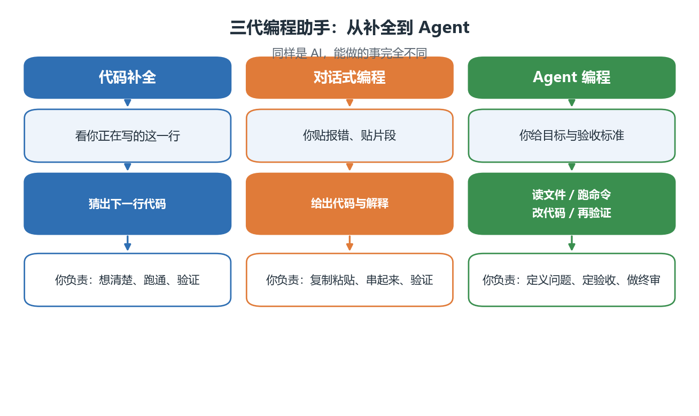
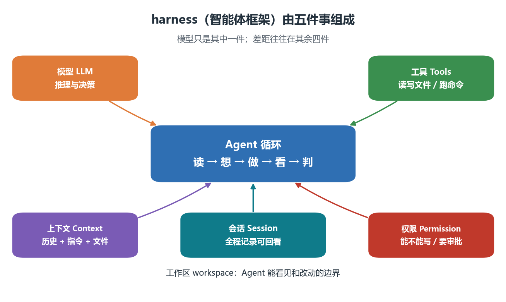
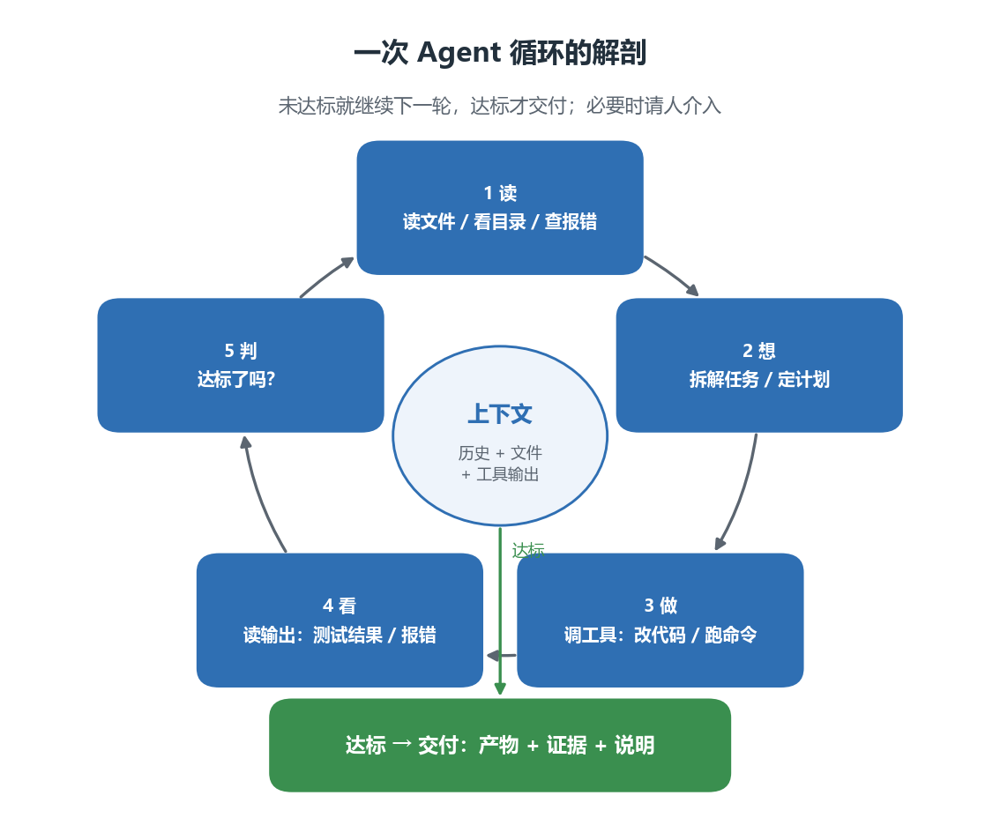
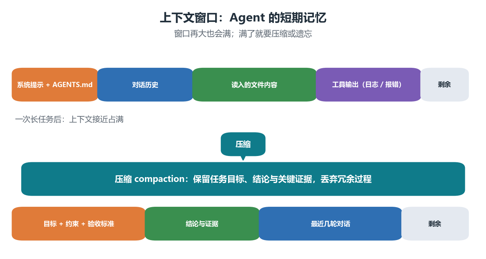
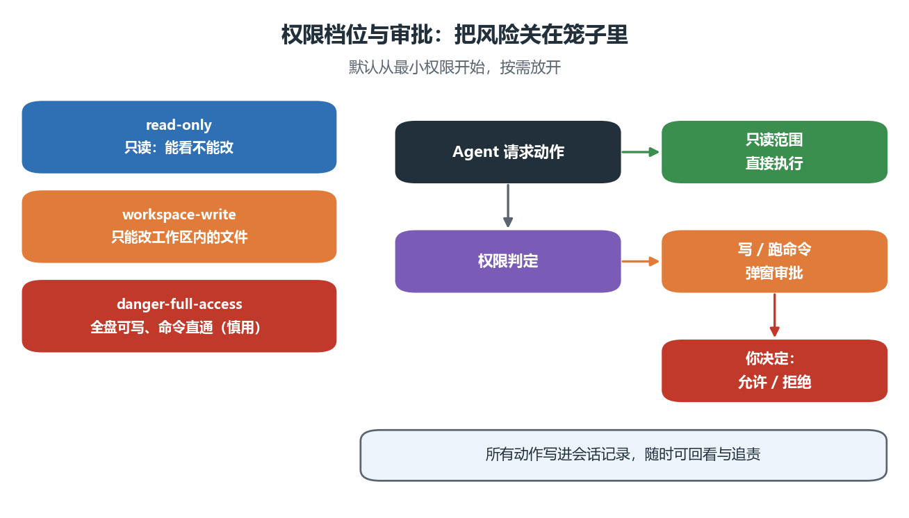

# 01 AI 编程与 Agent 基础

> 本节回答三个问题：Agent 编程与"AI 帮我写代码"到底差在哪？一个 Agent 内部做了什么？哪些事必须自己管？
> 阅读约 25 分钟；配套图 4 张，可直接运行的代码 1 段。

## 本节目标

1. 说清**代码补全、对话式编程、Agent 编程**三者的差别，并解释"闭环"为什么是关键。
2. 用**五件套**描述一个 agent harness（智能体框架）：模型、工具、上下文、权限、会话。
3. 复述**一次 Agent 循环**的五个动作，并能把一个小任务拆成循环。
4. 解释**上下文窗口与压缩**，知道怎么"省上下文"。
5. 说出**权限三档**与审批机制，记住数据红线在哪里。
6. 识别**四种典型失败模式**，并给出至少一条对策。

## 先修

- 完成第 0 章的环境安装：会用终端（PowerShell / Bash）、会运行 python 脚本；
- 学完第 1 章 NumPy：本节的演示案例用到 axis 与广播；
- 不需要任何机器学习或大模型背景。

## 术语速查（中英对照）

后续章节会反复用到这些词，先混个脸熟即可：

| 术语 | 英文 | 一句话解释 |
| ---- | ---- | ---- |
| 智能体 | Agent | 能自己调用工具、执行多步任务来完成目标的 AI 程序 |
| 智能体框架 | Agent harness | 把模型、工具、上下文、权限、会话组装起来跑循环的软件 |
| 工具调用 | Tool call | 模型请求执行一个动作（读文件、跑命令、搜索）并拿到结果 |
| 上下文 | Context | 模型这一次能看到的全部内容：指令、历史、文件片段、工具输出 |
| 压缩 | Compaction | 上下文快满时，把过程压缩成"目标 + 结论 + 证据" |
| 权限 | Permission | 决定 Agent 能做什么、哪些动作需要你点头 |
| 沙箱 | Sandbox | 限制 Agent 只能访问指定范围的机制 |
| 技能 | Skill | 预先写好的领域工作流，按需加载进上下文 |
| 子代理 | Subagent | 由主代理派生、专门做一件事的独立 Agent |
| 计划模式 | Plan mode | 先产出计划、经你确认后再动手的工作方式 |
| 会话 | Session | 一次持续的对话上下文，可保存、继续、回看 |
| 工作区 | Workspace | Agent 默认能读写的项目目录 |

## 正文

### 1. 三代编程助手：从"猜下一行"到"自己动手"



| | 代码补全 | 对话式编程 | Agent 编程 |
| ---- | ---- | ---- | ---- |
| 你给它 | 正在写的这一行 | 报错、代码片段、问题 | 目标 + 约束 + **验收标准** |
| 它给你 | 猜出的下一行 | 代码与解释 | 读文件、跑命令、改代码、再验证的**完整过程** |
| 你负责 | 想清楚、跑通、验证 | 复制粘贴、串起来、验证 | 定义问题、定验收、做终审 |
| 出错时 | 你改 | 你改 | 它自己看报错再改（直到你设的验收标准满足） |

三者的分水岭是**闭环**：前两代的输出是"文本"，你拿到文本后还要自己去运行、观察、判断、再回来描述问题；Agent 的输出是"完成的动作"——它有眼睛（读文件、看报错）和手（改文件、跑命令），能在这个循环里自我修正。

一句话记住：**补全帮你写一行，对话帮你写一段，Agent 帮你把事情做完——但"做对"的定义仍然由你给出。**

### 2. harness：模型之外的四件事



很多人以为"用了同一个模型，效果应该差不多"。实际上，同一个模型在不同 harness 里的表现可以差很远，因为决定体验的是另外四件事：

| 组成 | 作用 | 少了它会怎样 |
| ---- | ---- | ---- |
| 模型 LLM | 推理与决策 | 没有大脑，什么也做不了 |
| 工具 Tools | 读写文件、跑命令、搜索 | 只能说不能做，等于聊天机器人 |
| 上下文 Context | 把项目指令、历史、文件内容喂给模型 | 它不知道你的项目规范，反复问同样的问题 |
| 权限 Permission | 决定能不能写、要不要审批 | 要么什么都不敢做，要么风险失控 |
| 会话 Session | 记录全部动作，可继续、可回看 | 每次从零开始，出了问题无法追责 |

> 类比：模型是发动机，harness 是底盘、变速箱、刹车和仪表盘。发动机再好，没有刹车也不敢上路。

### 3. 一次 Agent 循环的解剖



循环只有五个动作，但每一步都有讲究：

1. **读**：看目录、读文件、看报错。它看到什么，取决于你给的工作区与上下文。
2. **想**：拆解任务、定计划。复杂任务建议先进入**计划模式**，让你确认后再动手。
3. **做**：调用工具——改代码、跑脚本、装依赖、查文档。
4. **看**：读回执行结果。这一步是 Agent 与"聊天"最大的区别：它必须面对真实输出。
5. **判**：达标了吗？达标的判据**不是"代码跑起来了"，而是你事先给的验收标准**。

用一个具体任务走一遍。假设你有一份成绩矩阵，想算"每个学生的平均分"，但代码写成了按列求平均：

- 读：Agent 打开脚本，看到 scores 的形状是 (4, 3)、代码里写着 mean(axis=0)。
- 想：它需要判断你的**意图**——"每个学生"对应行还是列。
- 做：它写出最小复现，分别打印两种 axis 的结果和形状。
- 看：形状一个 (3,) 一个 (4,)，它意识到意图与实现不一致。
- 判：按你给的验收标准（形状必须是 (4,)、数值与手算一致）给出结论与修复。

> 关键认识：**循环的终止条件由你定义。** 没有验收标准，Agent 就会以"看起来能跑"作为终点。

### 4. 上下文：Agent 的短期记忆



上下文窗口再大也会满。一次长任务里，系统提示、对话历史、读入的文件、工具输出会迅速堆积；快满时 harness 会做**压缩（compaction）**，把过程浓缩成目标、结论与关键证据。

三条实用建议：

1. **给最小可复现**：一段 20 行的复现脚本，比 2000 行项目源码更有用。
2. **让它自己读文件**：说"读 src/clean.py 里 load_data 函数"比把代码整段贴进对话更省上下文，也更准确。
3. **长任务主动收口**：阶段结束时让它总结"已确认的结论 + 未解决的问题 + 下一步"，这既是压缩，也是你检查方向的时机。

#### 案例卡 1：一个"看起来都对"的错误——axis 用反了

**目标**：认识"静默数值错误"——代码能跑、数字看着合理，但结论是错的。

**代码**

```python
import numpy as np
np.set_printoptions(precision=2, suppress=True)

scores = np.array([[82, 90, 78],
                   [60, 65, 70],
                   [95, 88, 92],
                   [70, 72, 68]], dtype=float)

by_exam = scores.mean(axis=0)
by_student = scores.mean(axis=1)

print("by_exam   :", by_exam, "shape", by_exam.shape)
print("by_student:", by_student, "shape", by_student.shape)
print("mean of all:", round(float(scores.mean()), 3))
print("sum check :", round(float(by_exam.sum()), 3), round(float(by_student.sum()), 3))
```

**运行结果（已运行核验）**

```text
by_exam   : [76.75 78.75 77.  ] shape (3,)
by_student: [83.33 65.   91.67 70.  ] shape (4,)
mean of all: 77.5
sum check : 232.5 310.0
```

**讲解**

- 两个结果都是"合理的分数"，粗看都像平均分——这正是静默错误可怕的地方；
- 形状是第一个判据：想算"每个学生"就该得到 4 个数，得到 3 个说明方向错了；
- 总和是第二个判据：by_exam 的均值之和 232.5 只是总分 930 的三分之一，by_student 的 310.0 才是"每人平均分之和"；
- 只打印数字、不做判据检查，这类错误可以躲过一整天。

**主要用法 / API**

| 用法 | 说明 |
| ---- | ---- |
| array.mean(axis=k) | 沿第 k 维求平均：k=0 消掉行、k=1 消掉列 |
| array.shape | 判断结果方向是否符合意图的第一判据 |
| np.set_printoptions | 控制打印精度，避免误以为"数不一样" |

**常见错误**

1. 只把结果打印出来看一眼"像不像"，不用形状与守恒量检查；
2. 把 axis=0 记成"对每一行"（其实是沿行方向压缩，得到每列的值）；
3. 让 Agent 修 bug 时只说"结果不对"，不说**期望的形状与判据**，它只能猜。

**拓展**

- 把 scores 换成 (3, 4, 5) 的三维数组，先说出 mean(axis=1) 的形状，再运行验证；
- 让 Agent 写一个 3 行的断言函数，把"形状必须是 (4,)"固化成测试；
- 思考：如果这份数据是某次实验的唯一结果，这个错误会怎样影响结论？

### 5. 人机分工：什么交给它，什么必须自己管

| 任务类型 | 建议 | 原因 |
| ---- | ---- | ---- |
| 样板代码、格式转换、批量重命名 | 交给 Agent | 规则明确、易验证 |
| 写测试、补边界条件、重构 | 交给 Agent（你审 diff） | 有客观判据 |
| 查文档、读陌生代码库、写注释 | 交给 Agent | 信息检索型工作 |
| 问题定义与建模 | **人主导** | 决定"做什么"，Agent 无法替你决定 |
| 验收标准与数据判据 | **人主导** | 决定"什么叫做对" |
| 结论与解释 | **人主导**（Agent 只能起草） | 涉及因果、局限与责任 |

三条铁律：**问题定义归人、验收标准归人、结论归人。** Agent 可以在这三件事上给建议，但不能替你签字。

### 6. 权限与安全：让 Agent 在笼子里干活



主流 harness 都提供分档权限，常见三档：

| 档位 | 含义 | 适用场景 |
| ---- | ---- | ---- |
| read-only | 只能读，不能改 | 第一次接触陌生项目、只想让它解释代码 |
| workspace-write | 只能改工作区内的文件 | 日常开发、课程作业（**推荐默认**） |
| danger-full-access | 全盘可写、命令直通 | 受控环境下的高级用法，慎用 |

配套机制是**审批**：涉及写文件、跑命令、装依赖时，界面会先问你；你的每一次允许或拒绝都会写进会话记录，可回看、可追责。

数据红线（请直接记住）：

- 不要把隐私数据（身份证、手机号、成绩单、医疗记录）贴进对话；
- 不要把涉密或未发表的数据交给云端模型；
- 不要把别人的 API Key、密码、令牌放进提示词或代码；
- 处理真实数据前，先想清楚"这份数据能不能离开这台机器"。

### 7. 四种典型失败模式与对策

| 失败模式 | 长什么样 | 对策 |
| ---- | ---- | ---- |
| 幻觉 API | 编出不存在的函数、参数、配置项 | 要求它运行验证；自己查一眼官方文档 |
| 静默数值错误 | 能跑、数字合理，其实方向或单位错了 | 事先给判据：形状、量纲、守恒量、解析解对照 |
| 过度自信的结论 | 把相关说成因果、不给不确定性 | 要求给证据、给区间、给反例，结论自己写 |
| 改坏别处 | 顺手重构、动了不该动的文件 | 小步提交、看清 diff、跑测试再接受 |

> 这四种失败都不是"模型不够聪明"，而是**缺验证**。第 03 节会给出一个固定的验收工作流。

### 8. 上手体验（5 分钟）

如果你已经按第 02 节装好了 DeepSeek Harness，现在就可以试一次。任务：让它解释本节的 axis 案例。

```text
我在做课程第 1 章的练习题，这段代码想算"每个学生的平均分"，但我不确定对不对：

scores = np.array([[82, 90, 78], [60, 65, 70], [95, 88, 92], [70, 72, 68]], dtype=float)
by_exam = scores.mean(axis=0)

请你：
1) 指出这段代码算出来的到底是什么（给出形状）；
2) 写出正确写法，并给出一个最小复现脚本；
3) 加一条断言，保证结果形状符合"每个学生"的意图。
不要修改我工作区里的其他文件。
```

观察三个点：

1. 它有没有**先读文件、先运行**，还是直接给答案；
2. 它给出的断言是不是可执行、可验证；
3. 它有没有解释"为什么 axis=0 得到的是每列"，而不是只给结论。

## 本节小结

1. 三代工具的分水岭是**闭环**：能否自己执行、观察、修正。
2. harness = 模型 + 工具 + 上下文 + 权限 + 会话，后四件决定体验。
3. 循环五步：读、想、做、看、判；**终止条件由你的验收标准定义**。
4. 上下文是最稀缺资源：给最小复现、让它自己读文件、长任务主动收口。
5. 权限三档 + 审批 + 数据红线；问题定义、验收标准、结论永远归人。

## 思考题

1. 同一段代码，让"对话式助手"和"Agent"分别修一个 bug，你能观察到哪些行为差异？
2. 为什么"代码能跑通"不能作为验收标准？请举一个本课程里的例子。
3. 如果上下文快满了，你会保留哪三类信息？
4. 什么情况下应该主动把权限降到 read-only？
5. 同学说"Agent 写的报告结论和我们实验一致，所以没问题"。请指出这句话的逻辑漏洞。

## 练习与延伸阅读

- 练习：第 11 章 `exercises/` 第 1–4 题（概念题）；
- 延伸：DeepSeek Harness 官方仓库与文档（见 `references.md`）；
- 下一节：`02-安装与配置.md`（三条安装路径 + API Key 申请与付费）。
