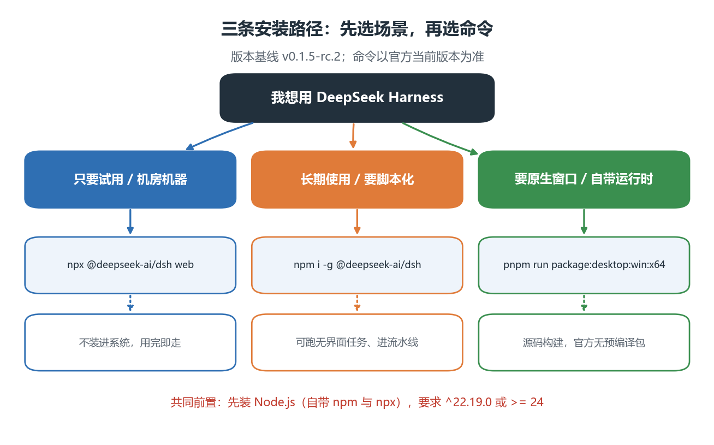
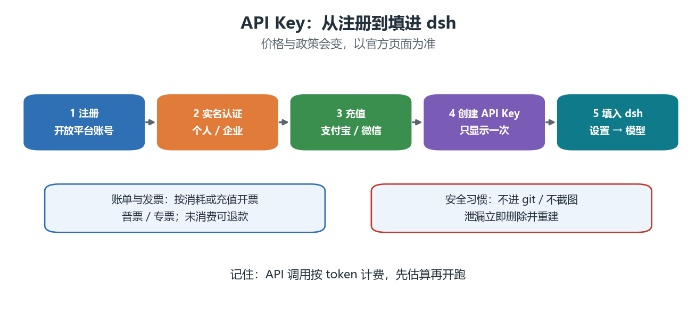

# 02 安装与配置

> **时效内容（基线 v0.1.5-rc.2 / 2026-09-19）**：本节涉及版本号、命令、界面与价格，是全书最容易过期的部分。遇到不一致时以官方文档为准；更新流程见 docs/build/dsh_更新SOP.md。

## 本节目标

1. 按自己的场景选对安装路径：**免安装 Web 版 / 全局 CLI 版 / 桌面版**。
2. 独立完成 **API Key** 的注册、实名、充值、创建与填入。
3. 配置模型并跑通**第一个任务**，知道怎么验收。
4. 说清 dsh 的**版本状态**，会自查版本与升级。
5. 会用价格表**估算一次任务的花费**。

## 先修

- 第 0 章的终端使用与 Python 环境；
- 会看命令行输出、会复制粘贴命令即可，不需要前端或运维经验。

## 0. 安装前的准备（先读 2 分钟）

### 0.1 dsh 的版本状态与时效

DeepSeek Harness（dsh）目前处于官方所说的 **开发者预览（Developer Preview）** 阶段，迭代很快：

- **教材基线**：0.1.5-rc.2（npm 的 latest 标签，2026-09-10 发布；教材核对日期 2026-09-19）；
- **官方最新**：撰写时 GitHub Releases 上所有 tag 都标记为 prerelease，没有传统意义的"稳定版"；
- 也就是说：**npm latest 就是官方当前推荐的安装版本**，名字里的 rc 不代表"不能用于教学"。

三条自查命令（建议收藏）：

```sh
dsh --version                          # 本机已装版本
npm view @deepseek-ai/dsh dist-tags    # 官方各渠道最新版本（latest / next / alpha）
npm view @deepseek-ai/dsh version      # latest 渠道的具体版本号
```

官方入口（完整清单见 references.md）：

- 仓库：https://github.com/deepseek-ai/deepseek-harness
- 文档站：https://deepseek-harness.github.io/deepseek-harness/
- 版本记录：仓库 Releases 页（每个版本都有中文更新说明）

### 0.2 Node.js、npm、npx 是什么

dsh 本身是用 JavaScript / TypeScript 写的，所以需要一个 JavaScript 运行时；它的安装包发布在 npm 仓库里，所以还需要一个包管理器。三者关系一句话：

**Node.js 提供运行环境 → npm 负责从仓库取包、装包 → dsh 是 npm 上的一个包。**

| 名词 | 全称 | 作用 | 本节里第一次用到 |
| ---- | ---- | ---- | ---- |
| Node.js | —— | 让 JavaScript 脱离浏览器运行的运行时 | 运行 dsh |
| npm | Node Package Manager | Node 的官方包管理器：装包、升级、卸载 | `npm i -g @deepseek-ai/dsh` |
| npx | npm exec | npm 自带的"临时执行器"：不永久安装，直接下载并运行 | `npx @deepseek-ai/dsh web` |

> 关键点：**安装 Node.js 时会自动装上 npm 与 npx**，不需要（也不应该）单独去装 npm。网上"先装 node 再装 npm"的教程是过时说法。

### 0.3 安装 Node.js（三平台 + 两种风格）

版本要求：`^22.19.0` 或 `>= 24.0.0`。推荐装 **Node 24 LTS**（当前 LTS 代号 Krypton，24.x）；**Node 22 LTS**（Jod，22.19 以上）也满足要求。

| 平台 | 方式 | 步骤 / 命令 | 适合谁 |
| ---- | ---- | ---- | ---- |
| Windows | 官网安装包（推荐） | 打开 nodejs.org → 下载 LTS 版 .msi → 双击安装（保持默认勾选 Add to PATH）→ 重开终端 | 绝大多数同学 |
| Windows | winget | `winget install OpenJS.NodeJS.LTS` | 已用 winget 管理软件的同学 |
| Windows / macOS | 版本管理器 fnm | `winget install Schniz.fnm` 或 `brew install fnm`，再执行 `fnm install 24` 与 `fnm use 24` | 需要多个 Node 版本共存 |
| macOS | Homebrew | `brew install node@24` | 已装 Homebrew |
| macOS / Linux | nvm | 按 nvm 官方 README 提供的脚本安装，然后 `nvm install --lts` | 服务器、多版本场景 |
| Linux | 发行版包管理器 / NodeSource | apt、dnf 等；**注意仓库里的版本可能偏旧**，装完务必按 0.4 自查 | 有 root 权限的服务器 |

两条经验：

1. 装完**一定要重开终端**（环境变量 PATH 才会生效），否则会一直提示找不到命令；
2. 有版本管理器时优先用它——将来 dsh 要求更高版本时，一条命令就能切换。

### 0.4 装完自查

```sh
node -v          # 期望 v24.x 或 v22.19 以上
npm -v           # 能打印版本号即可
npx --version    # npx 随 npm 一起安装
npm config get registry   # 默认 https://registry.npmjs.org/
```

如果 `npm config get registry` 显示的是公司内网地址，说明这台机器配置了私有仓库，安装 dsh 前请先确认该仓库能拉到公开包（否则改用个人电脑，或按管理员要求配置代理）。

### 0.5 装不上怎么办

| 现象 | 可能原因 | 处理 |
| ---- | ---- | ---- |
| node 不是内部或外部命令 / command not found | 没装成功，或 PATH 未生效 | 重开终端；仍不行则重装（Windows 安装时保持勾选 Add to PATH） |
| npm 报 EACCES / EPERM 权限错误 | 用管理员或 root 装了全局包 | 不要用 sudo / 管理员装全局包；用普通用户重装 Node 后再试 |
| 下载很慢或超时 | 网络问题 | 临时换镜像：`npm config set registry https://registry.npmmirror.com`；或按校网要求配置代理 |
| 版本太低（例如 v20） | 系统包管理器里的版本旧 | 用 fnm / nvm 安装 24 LTS，或从官网重装 |
| 公司电脑装不了 | 安装策略限制 | 用官网 zip 免安装版解压后手动加 PATH，或改用学校机器 |
| 卸载后旧版本还在 | 多个 Node 共存 | 先查来源：`where node` / `which -a node`，再清理 |

## 1. 三条路径怎么选



| 路径 | 适合谁 | 需要准备 | 升级方式 |
| ---- | ---- | ---- | ---- |
| A 免安装 Web 版 | 第一次用、机房机器、不想改系统 | Node.js | 每次运行自动取最新（也可锁定版本） |
| B 全局 CLI 版 | 长期使用、要写脚本、要无界面跑任务 | Node.js + npm | npm i -g @deepseek-ai/dsh@latest |
| C 桌面版 | 想要原生窗口与自带运行时 | Node.js + pnpm + 源码构建 | 重新拉源码构建 |

共同前置只有一个：**Node.js**（npm 与 npx 随它一起安装，见 0.2 与 0.3）。官方仓库要求的版本是 ^22.19.0 或 >= 24.0.0。

```sh
node -v     # 例如 v24.19.0
npm -v      # 例如 11.x
```

如果 Node 版本过低，先升级：官网下载 LTS 版，或用 fnm / nvm 等版本管理器（第 0 章介绍过管理多个工具链的思路）。

> 提示：npm 下载慢时，可以临时用国内镜像（npm config set registry https://registry.npmmirror.com）；企业网络或校园网如有代理，请按网络管理员要求配置。

## 2. 路径 A：免安装 Web 版（推荐先试）

不安装任何全局命令，直接用 npx 拉起浏览器界面：

```sh
npx @deepseek-ai/dsh web
```

会发生什么：

1. 首次运行会下载依赖包（视网络情况可能需要几分钟），请耐心等待；
2. 服务默认在 http://127.0.0.1:3080 启动，本机运行时会自动打开浏览器；
3. **启动命令时所在的目录，就是默认工作区**，建议在一个专门的项目目录里执行；
4. 关闭：回到终端按 Ctrl+C。

常用参数：

```sh
npx @deepseek-ai/dsh web --port 8080    # 换端口（被占用时很有用）
npx @deepseek-ai/dsh web --no-open      # 只启动服务，不开浏览器
npx @deepseek-ai/dsh web --help         # 查看当前版本支持的全部参数
```

> 说明：如果通过 SSH 在服务器上启动，终端只会打印地址，需要你在本地做端口转发（进阶用法，本节不展开）。

## 3. 路径 B：全局 CLI 版（长期使用）

装一次，长期用：

```sh
npm i -g @deepseek-ai/dsh      # 全局安装
dsh --version                  # 确认版本
dsh web                        # 等价于 npx 的浏览器界面
```

本地版真正多出来的能力是**无界面（headless）任务**——让 Agent 跑完一件事直接打印结果，适合写进脚本：

```sh
dsh --profile headless "统计当前目录下所有 Python 文件的行数，输出一个表格"
```

其他自查入口：

```sh
dsh --help                          # 启动器自身的参数
dsh web --help                      # Web 应用的参数
dsh --dump-config                   # 查看合并后的配置树（不启动）
```

首次运行会在用户目录下创建配置与数据目录（Windows 为 C:/Users/你的用户名/.dsh，macOS 与 Linux 为 ~/.dsh），里面包括设置、会话记录与凭据文件。**凭据文件不要提交到 git，也不要截图外发。**

升级与卸载：

```sh
npm i -g @deepseek-ai/dsh@latest    # 升级到最新
npm rm -g @deepseek-ai/dsh          # 卸载
```

| 对比项 | npx 免安装 | 全局 CLI | headless |
| ---- | ---- | ---- | ---- |
| 是否改系统 | 否 | 是（全局包） | 是 |
| 界面 | 浏览器 | 浏览器 | 无（打印结果） |
| 适合 | 试用、机房 | 日常使用 | 批处理、自动化 |
| 升级 | 每次运行自动解析 | 手动升级 | 跟随全局 |

## 4. 路径 C：桌面版（进阶，官方暂无预编译安装包）

先说结论：**官方目前没有发布桌面端安装包**，桌面端需要从源码构建，工程量偏大。课堂上了解它的定位与取舍即可，不要求真的构建。

桌面端是什么：它是完整 Web 应用外面的一层 Electron 壳——同一套界面与能力，多了原生窗口、菜单与系统通知，并**自带 Python / Node.js / pnpm 运行时**（对不想自己配环境的用户友好）。它默认使用 19387 端口，与 Web 版的 3080 分开。

源码构建（需要 Node 与 pnpm，命令以仓库当前版本为准）：

```sh
git clone https://github.com/deepseek-ai/deepseek-harness.git
cd deepseek-harness
pnpm install
pnpm run build
pnpm run package:desktop:win:x64        # Windows
# macOS Apple 芯片：pnpm run package:desktop:mac:arm64
# macOS Intel：pnpm run package:desktop:mac:x64
```

只想先看看界面，可以用开发模式启动：pnpm run dev:desktop。

> 社区项目：有第三方开发者为 Windows 打包了桌面版分发（例如 GitHub 上的 DeepSeek-Harness-Desktop）。它**不是官方发布**，无法审计构建过程，安装前请自行评估供应链风险；课程不把它作为推荐路径。

## 5. 配置模型与 API Key（重点）

### 5.1 为什么需要 API Key

dsh 本身是免费开源软件，但它在运行时需要调用大模型，而模型调用按用量计费。因此你需要一个 DeepSeek 开放平台账号与 API Key——可以理解为"给 Agent 用的加油卡"。

### 5.2 五步拿到 API Key



| 步骤 | 在哪里做 | 关键细节 |
| ---- | ---- | ---- |
| 1 注册 | platform.deepseek.com | 支持手机号 / 邮箱 / Google 登录 |
| 2 实名认证 | 平台「实名认证」 | 分个人认证与企业认证；**决定后面发票抬头** |
| 3 充值 | 平台「充值」页 | 支付宝 / 微信在线充值；对公汇款仅企业用户 |
| 4 创建 API Key | 平台「API keys」页 | **Key 只显示一次**，当场复制保存 |
| 5 填入 dsh | Web 界面「设置 → 模型 → DeepSeek」 | 粘贴 Key 并保存，立即生效，无需重启 |

关于余额与发票（来自官方常见问题，2026-09 核对）：

- **充值余额永久有效**，未消费金额支持退款；
- 若同时存在赠送余额与充值余额，优先扣减赠送余额；
- 发票：在「账单 → 发票管理」申请，可按**消耗金额**或**充值金额**开票；支持增值税普通发票与专用发票；个人认证可开个人或公司抬头，企业认证只能开企业认证主体的抬头；已开票金额需先作废才能退款。

### 5.3 价格快照（2026-09-18 公布口径）

价格以"每百万 tokens"计，且**分高峰与空闲两档**（空闲时段为高峰的一半）。

| 模型 | 输入（缓存命中） | 输入（未命中） | 输出 | 备注 |
| ---- | ---- | ---- | ---- | ---- |
| deepseek-flash | 空闲 0.02 元 / 高峰 0.04 元 | 空闲 1 元 / 高峰 2 元 | 空闲 4 元 / 高峰 8 元 | 支持图片；上下文 1M |
| deepseek-v4-pro | 空闲 0.15 元 / 高峰 0.30 元 | 空闲 4.5 元 / 高峰 9.0 元 | 空闲 13.5 元 / 高峰 27.0 元 | 纯文本 |

> 高峰时段：北京时间周一至周五 9:00–12:00、14:00–18:00；其余时间为空闲时段（半价）。价格与政策会调整，**以官方定价页为准**。
> 课程建议：练习与作业用 deepseek-flash；把重跑安排在空闲时段，能省一半。

### 5.4 估算一次任务花多少钱

下面这个脚本用一组"典型参数"估算费用：20K 未命中输入 + 60K 命中输入 + 15K 输出。

```python
price = {"flash": {"in_miss": 1.0, "in_hit": 0.02, "out": 4.0},
         "v4-pro": {"in_miss": 4.5, "in_hit": 0.15, "out": 13.5}}

def cost(model, in_miss_k, in_hit_k, out_k, peak=False):
    p = price[model]
    factor = 2.0 if peak else 1.0
    return factor * (p["in_miss"] * in_miss_k + p["in_hit"] * in_hit_k + p["out"] * out_k) / 1000.0

print("flash  off-peak:", round(cost("flash", 20, 60, 15), 4), "CNY")
print("flash  peak    :", round(cost("flash", 20, 60, 15, peak=True), 4), "CNY")
print("v4-pro off-peak:", round(cost("v4-pro", 20, 60, 15), 4), "CNY")
```

```text
flash  off-peak: 0.0812 CNY
flash  peak    : 0.1624 CNY
v4-pro off-peak: 0.3015 CNY
```

结论：一次"读代码 + 改代码 + 跑测试 + 写说明"的中等任务，用 deepseek-flash 大约几分钱到几角钱；换成 deepseek-v4-pro 会贵 3 到 4 倍。

## 6. 第一个任务（5 分钟验收）

1. 在浏览器界面点「选择工作区」，添加你的课程项目目录；
2. 新建会话，把下面这段提示词发给它：

```text
请阅读当前工作区，回答三个问题：
1) 这个项目是做什么的？列出主要目录及用途；
2) 有哪些 Python 脚本？各自的作用是什么？
3) 如果我要新增一个数据分析脚本，应该放在哪里、遵循什么命名习惯？
只读不改：不要修改任何文件。
```

3. 观察它调用了哪些工具（读文件、列目录、搜索），以及它给出的结论有没有**证据**（引用了具体文件与行）。

验收清单：

- 它确实读了文件，而不是凭空描述；
- 它引用的文件名与目录结构能在你的项目里对上；
- 整个过程没有修改任何文件（因为你在提示词里要求了只读）。

## 7. 常见故障排查

| 现象 | 可能原因 | 处理 |
| ---- | ---- | ---- |
| npm: command not found | 没装 Node.js | 安装 Node LTS 后重开终端 |
| npx 卡住不动 | 网络慢或代理 | 换网络、配置镜像或代理；耐心等待首次下载 |
| 端口 3080 被占用 | 已有实例在跑 | 用 --port 8080 换端口，或先关闭旧实例 |
| 浏览器打不开页面 | 服务没起来或防火墙拦截 | 看终端是否打印了地址、有没有报错 |
| 输入框灰色不可用 | 没有选择工作区 | 先「选择工作区」并选中 |
| 模型报鉴权错误 | Key 填错或已被删除 | 重新在「设置 → 模型」粘贴 Key |
| dsh 全局命令找不到 | 全局 bin 目录不在 PATH | 重开终端；或改回用 npx |
| PowerShell 执行策略报错 | 脚本被策略拦截 | 改用 npx 直接运行，或按学校要求调整策略 |
| 任务跑很久没结果 | 任务过大或网络慢 | 缩小任务范围，先给最小复现 |

## 8. 升级与版本自查

```sh
npm view @deepseek-ai/dsh dist-tags      # 看官方最新
dsh --version                            # 看本机版本
npm i -g @deepseek-ai/dsh@latest         # 升级
```

升级前建议读一眼 Releases 页的更新说明（官方每个版本都有中文条目），重点关注三类变化：**命令与参数**、**界面位置**、**模型名称**。这三类正是本节内容的来源。

> 本部分的维护机制：docs/build/dsh_version.yaml 记录基线版本，docs/build/check_dsh_release.py 定期比对官方版本，双周自动提醒（见 docs/build/dsh_更新SOP.md）。

## 本节小结

1. 三条路径：npx 免安装（先试）、全局 CLI（长期与脚本化）、桌面版（源码构建，进阶）。
2. 共同前置是 Node.js（^22.19.0 或 >= 24.0.0）。
3. API Key 五步：注册、实名、充值、创建、填入「设置 → 模型」。
4. 计费按 token、分高峰与空闲；练习用 deepseek-flash，重跑放空闲时段。
5. Key 与凭据文件是资产：不进 git、不截图、泄漏立即删除重建。

## 思考题

1. 同学说"我用 npx 跑起来了，所以不用装 Node"——这句话哪里不对？
2. 为什么教材不推荐学生用第三方打包的桌面版？请列出两条风险。
3. 同样的任务，在高峰时段与空闲时段跑，费用差多少？请用 5.4 的脚本算一个例子。
4. 如果 API Key 不小心提交到了 git 仓库，你应该按什么顺序处理？
5. 你想让 Agent 每天晚上自动跑一次数据检查，应该选哪条路径、用什么入口？

## 练习与延伸阅读

- 练习：exercises/quiz.ipynb 第 5–6 题；
- 上机：lab/lab.ipynb Part A（环境自检，可无网络完成）；
- 参考：官方 README、Web UI 指南、模型配置指南（见 references.md）。
