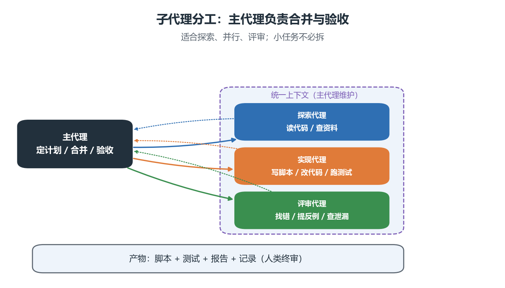

# 01 Agent 工作流与核心能力

> 本节把 01 节的原理变成**可重复的操作习惯**：项目怎么给指令、任务怎么开场、权限怎么放、结果怎么验收。
> 配套图：子代理分工图（./images/subagent_split.png）；本节含一段可直接运行的 Python 代码。

## 本节目标

1. 会写一份最小可用的 AGENTS.md，让 Agent 不用每次重复问规范。
2. 会用"计划先行 + 小步执行"的方式推进复杂任务。
3. 掌握权限与审批的实践顺序：先只读、再放开、高风险动作单独确认。
4. 会用**任务卡六件套**把一个模糊需求写成可验收的任务。
5. 知道什么时候该派子代理、什么时候纯属浪费。

## 先修

- 01 节（Agent 循环、上下文、权限、失败模式）；
- 02 节（已经装好 dsh，并能跑通第一个任务）。

## 1.1 项目级指令：AGENTS.md

`AGENTS.md` 是放在项目里的"常驻说明"，Agent 每次工作都会先读它。它解决的是**重复解释**问题：与其每次都说"读 CSV 要指定 UTF-8、图存到 output/、随机种子固定 42"，不如写进文件。

最小可用模板（复制到你的项目根目录即可）：

```text
# 项目说明
本项目是《Python 科学计算》课程的数据分析练习。

# 环境
- Python 3.12，依赖见 environment.yml（numpy / pandas / scipy / statsmodels / scikit-learn / matplotlib）
- 运行命令统一用 python <脚本名>

# 约定
- 读 CSV 一律显式指定编码 utf-8-sig，并先打印列名
- 随机过程必须固定种子：np.random.default_rng(42)
- 输出文件放 output/，不覆盖 data/ 里的原始数据
- 中文图必须设置字体：Microsoft YaHei 或 SimHei

# 质量要求
- 每个脚本末尾要有 assert 自检；改动后必须运行一次并贴出输出
- 不确定的地方先问我，不要擅自扩大改动范围
```

三条经验：

1. **只写"会被违反"的约定**：写得越长越没人看，Agent 也一样；
2. **写清验收方式**：能让它自查的约定，比形容词有用；
3. **把 AGENTS.md 提交到 git**：它是项目的一部分，不是个人偏好。

## 1.2 计划先行：复杂任务先要计划

任务超过"改一个文件"的量级时，先让它进入**计划模式（Plan mode）**，产出：要动哪些文件、分几步、每步怎么验证、有什么风险。你确认后再动手。

| 任务规模 | 建议做法 |
| ---- | ---- |
| 一行改动、明确的小修 | 直接做，人审 diff |
| 单文件重构、补测试 | 先说明要做什么，再执行 |
| 多文件、跨目录、动数据 | **必须计划模式** + 你确认 |
| 涉及删除、覆盖、联网安装 | 计划 + 逐条确认 |

> 计划模式的价值不是"礼貌"，而是把**返工成本**从"改完发现方向错"降到"看计划发现方向错"。

## 1.3 会话与上下文管理

- **一次会话只做一件事**：上下文里塞太多目标，它就容易抓错重点；
- 长任务定期收口，让它输出"已确认的结论 / 未解决的问题 / 下一步"——这三行就是压缩后的上下文；
- 换任务就开新会话，把上一轮结论作为开场信息带过去；
- 会话记录是**证据链**：提交作业时把关键会话导出或截图留档。

## 1.4 权限与审批：从小权限开始

推荐的实践顺序（写进课程作业要求）：

1. 第一次接触项目：用 read-only，只让它解释；
2. 确认它读懂了：切到 workspace-write，只在工作区内改；
3. 涉及删除、批量重命名、装依赖、联网、访问工作区外目录：**逐条确认**；
4. 任何情况下：不给它真实隐私数据，不让它接触你的 API Key 文件。

高风险动作清单（看到就该停下来确认）：删除或覆盖文件、git reset、批量替换、安装系统级软件、把数据上传到网络、修改环境变量。

## 1.5 技能（skills）与工具（tools）

- **工具**是原子动作：读文件、写文件、跑命令、搜索；
- **技能**是把"一组动作 + 领域知识"打包好的工作流，例如"按模板生成实验报告""批量处理 Excel"。

判断标准：如果某套流程你会重复做三遍以上、且步骤固定，就值得写成技能（或一份模板文件 + AGENTS.md 说明）。

## 1.6 子代理：什么时候值得拆



| 场景 | 是否拆 | 原因 |
| ---- | ---- | ---- |
| 先摸清陌生代码库，再决定怎么改 | 拆（探索代理） | 大量阅读会污染主上下文 |
| 三个互不依赖的模块同时改 | 拆（并行） | 省时间 |
| 关键结论需要第二双眼睛 | 拆（评审代理） | 专职找错，避免自我确认 |
| 改一个函数、加一行日志 | 不拆 | 派发与合并的开销比任务本身还大 |

> 记住：子代理不是"更强的模型"，而是**上下文隔离 + 角色分工**；每个子代理都会单独消耗 token。

## 1.7 验证驱动工作流（本节核心）

把任何任务写成**任务卡六件套**：

| 要素 | 写什么 | 例 |
| ---- | ---- | ---- |
| 目标 | 一句话说清要达成什么 | 算出每个学生的平均分 |
| 约束 | 不许动什么、用什么环境 | 只新增 scores_fixed.py，不动 data/ |
| 验收标准 | **可执行**的判据 | 长度 8、形状 (8,)、与手算一致 |
| 证据 | 要它给出什么证明 | 运行输出 + 断言结果 |
| 复核 | 人要检查哪几点 | 归一化是否逐列、排名是否带姓名 |
| 提交 | 交付形态 | 文件 + 说明 + 会话记录 |

**验收标准写法的正反例**：

| 差的写法 | 好的写法 |
| ---- | ---- |
| 结果要正确 | 平均分长度必须是 8，且与手算 [83.33, 65.0, ...] 一致 |
| 图画得好看点 | 图保存到 output/trend.png；x 轴为小时、y 轴为温度（摄氏度）；标题含"传感器温度" |
| 检查有没有问题 | 用 assert 检查：行数守恒（清洗前后差值等于删除的重复行数）、缺失值策略已记录 |

**为什么必须可执行**：只有可执行的判据才能被反复验证。看一个最小例子——同一段代码，两种 axis，只有一种能通过断言：

```python
import numpy as np
np.set_printoptions(precision=2, suppress=True)
scores = np.array([[82, 90, 78], [60, 65, 70], [95, 88, 92], [70, 72, 68]], dtype=float)

def check_student_mean(m):
    m = np.asarray(m)
    assert m.shape == (4,), "形状必须是 (4,)，每个学生一个平均分"
    assert np.allclose(m, scores.mean(axis=1)), "数值必须与手算一致"
    return True

for axis in (0, 1):
    try:
        check_student_mean(scores.mean(axis=axis))
        print("axis=%d -> 断言通过" % axis)
    except AssertionError as e:
        print("axis=%d -> 断言不通过：%s" % (axis, e))
```

```text
axis=0 -> 断言不通过：形状必须是 (4,)，每个学生一个平均分
axis=1 -> 断言通过
```

## 1.8 提示词写法清单

1. **说清目标与判据**，不要只说"帮我看看"；
2. **给最小复现**：能跑的 20 行，胜过 2000 行项目；
3. **限定范围**：明确"只改 X、不动 Y"；
4. **要求自证**：让它跑一次并贴输出，而不是"我觉得对"；
5. **要求打印中间量**：形状、量纲、前几行、统计量；
6. **一次只做一件事**：多个目标拆成多轮；
7. **不确定就问**：明确告诉它"信息不足时先提问，不要猜"。

## 1.9 一个完整示例：把"帮我改改"变成任务卡

```text
【目标】修复 data/scores_buggy.py 中"每个学生平均分"和"归一化"两处错误，产出 data/scores_fixed.py。
【约束】只新增 scores_fixed.py，不修改 data/scores.csv 与 scores_buggy.py；使用现有 scicomp 环境。
【验收标准】
  1) student_mean 的形状是 (8,)；
  2) 归一化逐列进行：norm.min(axis=0) 全为 0、norm.max(axis=0) 全为 1；
  3) 加权总分第一名是王五（91.4 分），且打印时带姓名。
【证据】贴出 python data/scores_fixed.py 的完整输出，并给出三条 assert 的通过结果。
【复核】我会检查：是否动了原始数据、归一化是否逐列、排名是否真的排序（而不是取前三个）。
【提交】scores_fixed.py + 运行输出 + 本次会话记录。
```

这份任务卡就是第 11 章四个案例的统一模板。

## 本节小结

1. AGENTS.md 把"每次都要说的规范"变成项目文件；
2. 复杂任务先计划、后执行、小步验证；
3. 权限从小往大放，高风险动作逐条确认；
4. 任务卡六件套：目标、约束、验收标准、证据、复核、提交；
5. 验收标准必须**可执行**，否则等于没有。

## 思考题

1. 为什么"结果要正确"不算验收标准？请把它改写成两条可执行判据。
2. 什么情况下应该派评审代理？它能替代你自己的复核吗？
3. 上下文里放 AGENTS.md 有什么代价？什么时候该精简它？
4. 你打算怎么把"会话记录"变成作业的一部分？

## 练习与延伸阅读

- 练习：第 11 章 `exercises/` 第 6–8 题（审查题与任务卡题）；
- 上机：第 11 章 `lab/` Part A（审查预置产出物）；
- 下一章：第 11 章 01 案例一（读懂并修复 NumPy 代码）。
